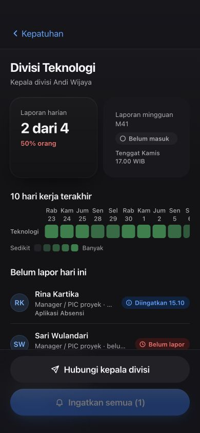
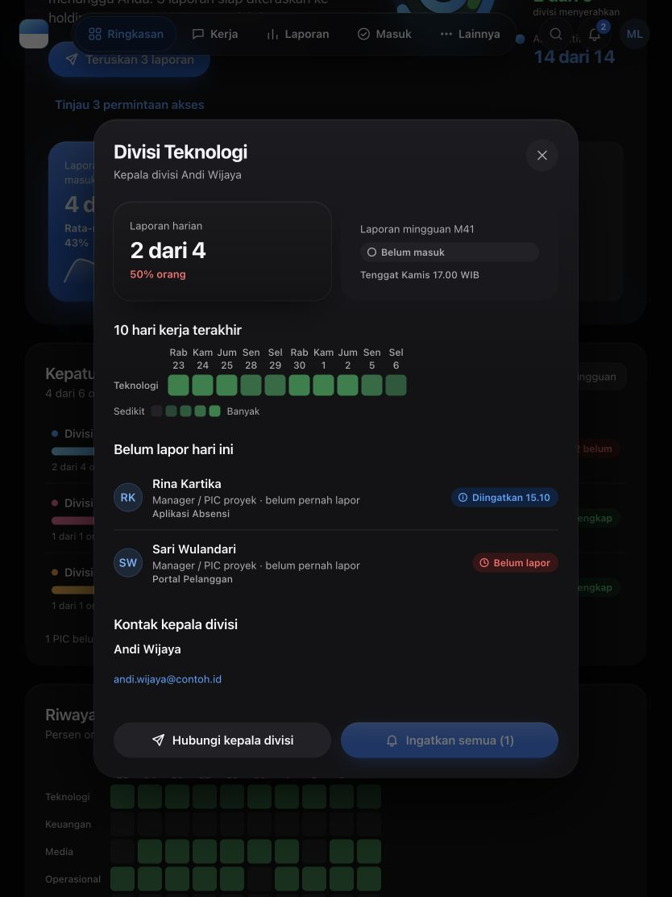

# CX 10 — Aksesibilitas dan sistem desain

Sheet kembali ke pemicu aktif yang terlihat; pemicu hilang/tersembunyi memakai
cadangan fokus pada main. ChoiceGroup radiogroup memakai panah/Home/End dan
melewati pilihan disabled. Bar/Area/Donut/Timeline memakai satu tab stop dan
navigasi panah; aktivasi tetap Enter/Space/klik. Angka batang tampil tanpa hover.
Target sentuh memakai token minimal 44; AccountSheet dipertahankan selama
animasi keluar.

Berkas: `src/components/mk/sheet.tsx`, `data.tsx`, `keyboard.ts`, `forms.tsx`, `account-manager.tsx`, `task-dialog.tsx`, `shell.tsx`, komponen formulir
akun/akses, `design-system/components/bundle.css`. Daftar bersama 46 path ada
pada inventaris Newton dalam [lampiran](LANJUTAN-POIN1-7-DAN-CX8-15.md).

Newton: **36 tes/5 berkas lolos**, TypeScript/lint/diff lolos. Red awal 5 gagal/2
lolos; red pemicu tersembunyi tersendiri; red AccountManager/TaskDialog 2 gagal/2
lolos. Suite: mk-accessibility, mk-forms, account-sheet-presence,
task-dialog-choice, pic-refresh. Worker memakai Node/SSR, parent memakai browser.

Browser parent: Escape setelah keluar → `main#isi` lolos; ponsel root 390,
Donut 44, Sheet gelap/biru 390×844; tablet root 834. Parent memeriksa dua screenshot final Sheet divisi gelap/biru: layout Heatmap
dan footer sudah diperbaiki, gambar final ditampilkan di bawah.

Bukti integrasi bersama dan versi runtime: [hasil CX 8–15](CX8–15-HASIL.md).
Riwayat pemeriksaan: [lampiran lanjutan](LANJUTAN-POIN1-7-DAN-CX8-15.md).

## Bukti final Sheet divisi

Ponsel: Sheet lebar 390; Heatmap lebar 364 dengan scroll di dalam area 350.
Footer yang sebelumnya meluap 481 kini berada dalam lebar 390; dua CTA ditumpuk
masing-masing 350×52. Tablet: Sheet lebar 600; seluruh 10 kolom Heatmap muat
(lebar 364 di area 552). Parent melihat kedua gambar final, tema gelap/aksen biru.

Bukti ini menutup pending layout Heatmap/footer yang dicatat sebelumnya;
tidak menyatakan seluruh kombinasi perangkat/tema telah diperiksa.

Responsive follow-up Newton: **1 red/1 lolos sebelum perbaikan → 12 tes
terfokus lolos** setelah perbaikan Heatmap/footer. Tes render/accessibility
mempertahankan data lengkap termasuk nol/null dan area scroll dapat difokus
keyboard. TypeScript/lint/diff lolos; `/tmp/cx10-responsive-final.txt` dibaca DOCS.

Browser final parent: target nav tablet 834 **44**, ponsel 390 **48,5**, Dock
1440 **50**, Donut **44**; ArrowRight roving tabindex lolos. Desktop 1440 terang/
grafit root 1440 tanpa luapan. Preferensi dikembalikan ke tema Sistem, aksen
merah dan sidebar. Gerbang final termasuk Heatmap/footer: 63 berkas/1.192 tes
lolos; build runner final lolos.
