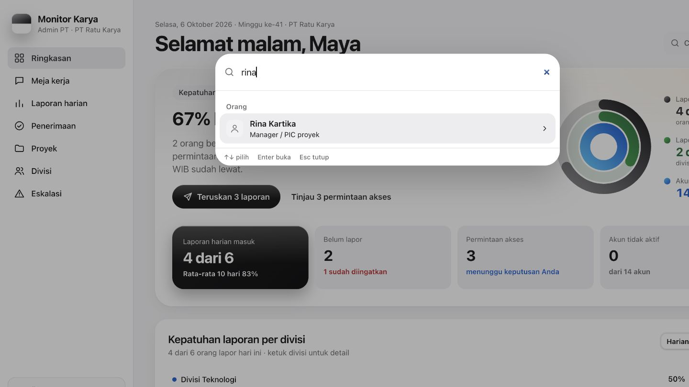

# CX 15 — Fitur kecil dan integrasi pencarian

Cari header Admin membuka palet dan menemukan Rina Kartika. PIC memilih proyek
absensi dari palet dan membuka Sheet yang benar, termasuk lookup ID di luar
halaman/filter dengan cakupan akun serta penolakan respons lama. Kartu review
menampilkan jenis bukti output. Delta progres hanya tampil dengan riwayat nyata.
Ringkasan Manajemen menangani PIC null dengan placeholder; fixture tanpa PIC
Audit Pajak 2026 tetap dipertahankan.

Berkas: `src/components/admin/admin-summary.tsx`,
`src/components/kadiv/review-card.tsx`, `src/components/views/projects-view.tsx`,
`src/components/oversight/management-dashboard.tsx`, route `projects` dan
`ringkasan`; tes `tests/cx/cx15-features.test.ts`/`cx9-metrics.test.ts`.

Poincaré (bersama CX 9): **249 tes/9 berkas lolos, 30 baru**, tsc/lint/diff lolos.
Red: pencarian 4 gagal, PIC null 1, delta 1; log
`/tmp/cx15-{search,null-pic,delta}-red.log`. Green
`/tmp/cx9-cx15-final-tests.log` dibaca DOCS. Browser parent mengonfirmasi palet PIC
→ absensi → Sheet dan placeholder PIC null lolos; cari Admin juga lolos.

Tidak perlu migrasi 0027. **Tab Log Direktur entitas menunggu keputusan pemilik**;
`ROLE_TABS` tidak diubah.

Bukti integrasi bersama dan versi runtime: [hasil CX 8–15](CX8–15-HASIL.md).
Riwayat pemeriksaan: [lampiran lanjutan](LANJUTAN-POIN1-7-DAN-CX8-15.md).

Browser live parent, baca-saja pada data pengguna: pergantian tiga proyek PIC
**A → B → C memperbarui Agenda dan Outputs tanpa item proyek lama**, lolos.
Pemeriksaan ini tidak mengubah data pengguna.
