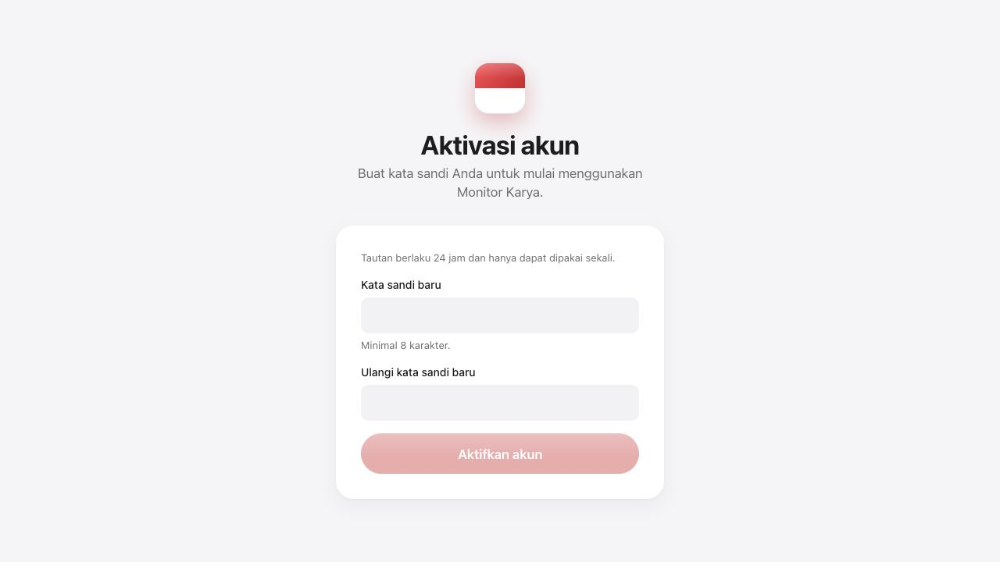
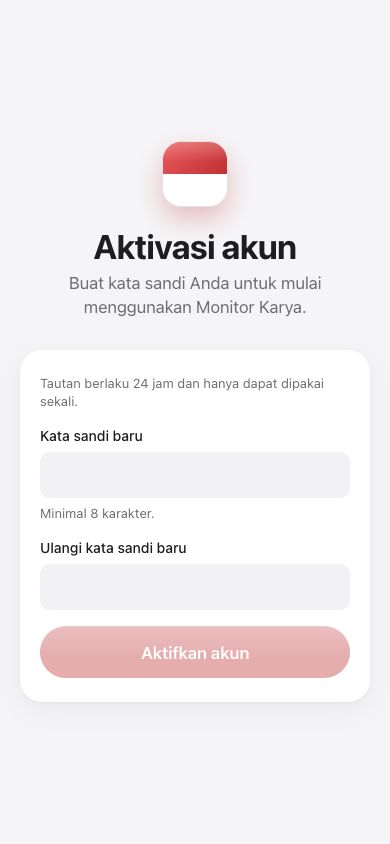

# Lima prioritas lanjutan — CX16–20

Tanggal: 7 Oktober 2026, WIB. Worktree `monitor-karya-codex`, cabang `codex/kerja`. Lingkup: lima poin hasil pemeriksaan yang disetujui pemilik.

Commit implementasi lokal: `a6b702d` (dependensi), `10110e8` (suite vendor dan format upstream), `73b37e1` (akses, sesi, aktivasi, dan operasional). Tidak di-push atau digabung ke cabang Claude.

| Poin | Hasil implementasi | Rujukan |
|---|---|---|
| 1 | Kedaluwarsa akses diperiksa pada autentikasi; pemulihan atomik; penugasan sementara dipulihkan | [CX16–17](CX16-17-AKSES-SESI.md) |
| 2 | Sesi tersimpan dan dapat dicabut; logout tahan kegagalan audit; perubahan sandi dan sesi pengganti atomik | [CX16–17](CX16-17-AKSES-SESI.md) |
| 3 | Aktivasi akun hasil persetujuan melalui tautan sekali pakai 24 jam, penerbitan ulang dan UI penyerahan tautan | [CX18](CX18-AKTIVASI.md) |
| 4 | Sharp dan deepmerge diperbarui; braces ditambal lokal dengan sumber, lisensi, provenance, dan regresi dalam CI | [CX19](CX19-DEPENDENSI.md) |
| 5 | Liveness/readiness, probe storage, heartbeat cron/backup, monitor dengan exit gagal, konfigurasi deploy | [CX20](CX20-OPERASIONAL.md) |

## Bukti dan batas penerapan

- Gerbang akhir: **69 berkas / 1.356 tes aplikasi**, TypeScript tanpa emit, ESLint `src`, dan diff check lulus. Suite dependensi terpisah **794 tes** lulus pada Node 22/Linux, selain verifikasi sumber/tarball agen.
- Build produksi Next dan runner Docker `monitor-karya:cx16-complete` lulus. Digest manifest lokal: `sha256:ccbf939307bb43844eb73a8c8f2cfcbf7e13f470dec92254dfc91a8820eee544`.
- **7 skenario HTTP/PostgreSQL** lulus pada image final: logout/replay token, rollback sandi bila insert sesi gagal, expiry bersamaan, audit logout gagal, pemulihan PIC/kepala divisi, aktivasi/reissue/konsumsi bersamaan, heartbeat/backup. [Bukti](bukti/CX16-20-http-local.json).
- **3 probe gangguan** lulus: semua komponen sehat, storage terputus, database terputus. [Bukti fixture HTTP lokal](bukti/CX20-probe-local.json).
- Pengujian memakai database Docker terisolasi serta fixture HTTP penyimpanan. Probe ini tidak membuktikan izin unggah/hapus pada Supabase sungguhan.
- Build memakai URL database tiruan dan rahasia placeholder build; container runtime non-root, read-only, hanya port loopback.
- Cadangan lokal dibuat sebelum migrasi database pengguna. Tidak ada reset/seed ke DB pengguna, Supabase, deploy VPS, push, atau PR.
- Audit npm melaporkan nol setelah patch. Versi braces lokal tidak dinilai registry sebagai rilis upstream resmi; bukti mitigasi adalah patch serta tes regresi, bukan angka audit semata. Patch harus diganti rilis resmi kompatibel ketika tersedia.
- Operator produksi tetap perlu menerapkan migrasi, mengatur rahasia monitor, menyediakan objek probe, memasang jadwal, serta menguji backup/restore dan storage sungguhan. Skrip dan petunjuk sudah tersedia; layanan produksi tidak disentuh.
- Hibah PIC historis tanpa snapshot tidak direkonstruksi secara spekulatif. Yang belum dipulihkan ditolak autentikasinya sampai penugasan direkonsiliasi; yang sudah ditandai dipulihkan versi lama memerlukan audit operator. Lihat catatan CX18. Pembatas laju bersama untuk beberapa instans tetap di luar lima poin ini.

## Tampilan aktivasi

Token contoh tidak terdaftar digunakan untuk pemeriksaan visual; kata sandi tidak dimasukkan melalui browser. Label formulir dan urutan fokus diperiksa, lebar 390 px tidak meluap horizontal. Alur konsumsi aktivasi diuji lewat HTTP terhadap database fixture.

Regresi perpindahan fragment pada halaman yang sama ditemukan dan diperbaiki: formulir kini membaca tautan baru melalui `hashchange`, membuang fragmen dari alamat, dan mengabaikan respons aktivasi lama. Verifikasi browser pada localhost3200 lulus tanpa reload.

