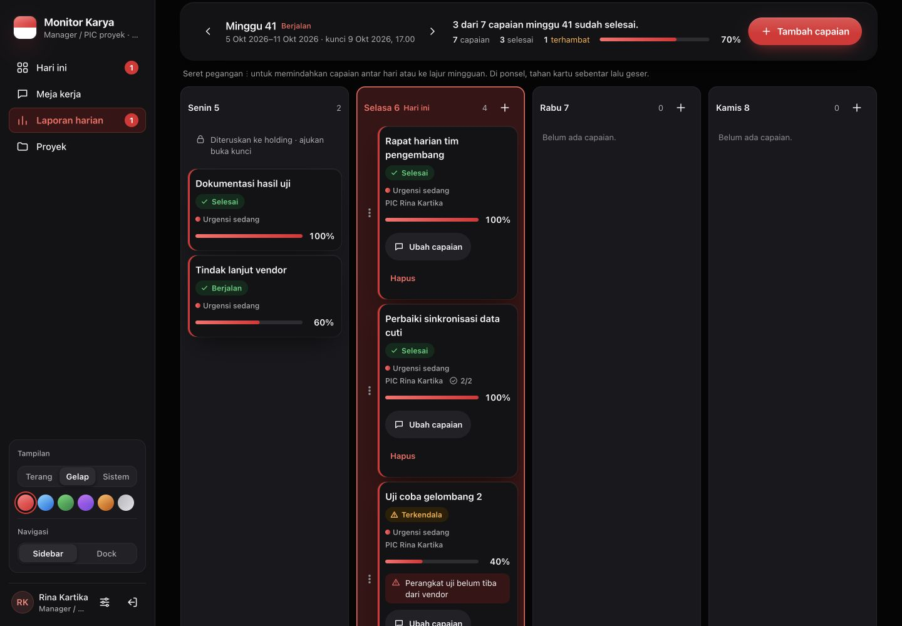
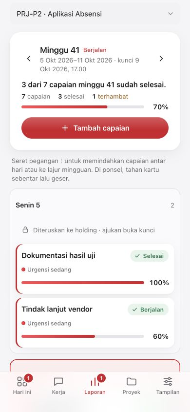

# Hasil CX 1–7

Implementasi selesai di worktree `/Users/godam/PROYEK/monitor-karya-codex`, cabang `codex/kerja`, pada 6 Oktober 2026. Tidak digabungkan ke worktree Claude; tidak ada akses Supabase, migrasi database nyata, atau deployment VPS.

| Tugas | Hasil | Laporan |
|---|---|---|
| CX 1 | Bukti laporan/task mengikuti buka kunci aktif, kedaluwarsa, dan kunci ulang | [CX1](CX1-HASIL.md) |
| CX 2 | Hari beku baca-saja, keterangan kunci aksesibel, guard pindah/edit/hapus/Urungkan | [CX2](CX2-HASIL.md) |
| CX 3 | Workflow GitHub CI lengkap dengan URL DB tiruan dan secret acak | [CX3](CX3-HASIL.md) |
| CX 4 | PostgreSQL lokal, initializer metadata Storage, skrip berpengaman | [CX4](CX4-HASIL.md), [panduan](db-lokal.md) |
| CX 5 | Seed model terbaru, relasi divisi/PIC lengkap, pengulangan hanya di DB lokal | [CX5](CX5-HASIL.md) |
| CX 6 | Skrip deploy diperkuat, checklist rilis, Docker runner teruji | [CX6](CX6-HASIL.md), [checklist](../../deploy/CHECKLIST-RILIS.md) |
| CX 7 | Supabase bawaan, driver S3/MinIO opsional dengan tanda tangan SigV4 | [CX7](CX7-HASIL.md), [konfigurasi](penyimpanan.md) |

## Bukti pemeriksaan

- TypeScript, ESLint, dan Vitest lulus: **42 berkas, 789 tes**. Tambahan CX berjumlah 129 tes.
- Next production build berhasil, 57 halaman statis. Docker target runner dan build berhasil; runner non-root, read-only, cap-drop ALL, no-new-privileges sehat. `/login` 200 dan `/pratinjau` 404 dalam produksi.
- Seluruh 9 skrip deploy dan skrip DB lokal lulus bash -n serta ShellCheck tingkat warning. YAML CI dan konfigurasi Compose sah; port app tidak dipublikasikan di paket deploy, hanya Caddy.
- PostgreSQL lokal dari Compose kosong: 22 migrasi berhasil, seed dua kali, admin uji dibuat, status migrasi mutakhir. Karena port host 54329 dipakai layanan lain, uji menggunakan namespace Docker tanpa jaringan eksternal dan tanpa port host. Tidak menghentikan layanan lain.
- Runner dengan DB lokal: login admin, sesi, dan entitas masing-masing 200. SUPERADMIN tidak memiliki meja kerja, sehingga endpoint tersebut menolak dengan 400 sesuai perannya.
- MinIO lokal terpisah: unggah nama Unicode, presigned GET privat, penolakan overwrite, hapus, hapus ulang, serta GET 404 setelah hapus lulus. Penyimpanan lain tidak disentuh.

## Integrasi lanjutan

Permintaan pengguna untuk menyelesaikan sisa tugas telah ditindaklanjuti. Potret terbaru Claude `f0ce8ee` digabungkan ke cabang Codex; mock laporan/proyek dan tes Admin terbaru dipertahankan. Integrasi lintas zona hanya dilakukan di worktree Codex.

- PIC pratinjau mingguan kini terbuka. Fixture Aplikasi Absensi mempunyai Senin 5 Oktober beku terisi; minggu sebelumnya juga mempunyai hari beku kosong.
- Hari beku tetap dalam urutan kronologis di WeeklyBoard. Prop disabledLanes/renderLaneNote opsional; sortable/droppable dan handler drag memblokir asal/tujuan terkunci. Ketergantungan CSS nth-child dihapus.
- CSP mengizinkan origin tepat dari driver S3 yang valid, tanpa wildcard. Tes diferensial memastikan origin CSP sama dengan signer. Pesan konfigurasi unggah mengikuti driver, setelah pemeriksaan akses.
- Pemeriksaan final: **46 berkas, 862 tes**, TypeScript dan ESLint lulus; Next production build lulus dengan URL DB tiruan. CI GitHub menjalankan rangkaian pemeriksaan serta Docker build pada cabang yang di-push; hasil dapat dilihat pada tab Actions repository.
- Runner Docker final juga healthy, read-only/non-root: login dan sesi 200, pratinjau produksi 404; CSP produksi mengizinkan origin S3 tepat tanpa wildcard. Login dan endpoint baca empat peran (Super Admin, Admin PT, Kepala divisi, PIC) berhasil dengan DB lokal.
- Browser nyata: login admin ke database lokal berhasil; pratinjau hari beku terisi, tanpa handle/tombol tambah/edit, diuji keyboard serta seret pointer ke hari beku (jumlah kartu tetap 2/4). Lebar 1440/834/390 tidak meluapkan halaman; tema terang/gelap serta aksen merah/biru/grafit diperiksa. Pembaca layar nyata dan zoom OS 200% belum diuji.

## Localhost yang dapat dipakai

Buka **http://localhost:3200/login**. Username uji `admin`; kata sandinya disetel lewat `scripts/buat-superadmin.ts` (lihat [db-lokal.md](db-lokal.md)) dan tidak dicatat di repo. Server memakai PostgreSQL Docker lokal loopback **54339**, karena 54329 dipakai PostgreSQL lain. Container/volume lokal dan server ini dipertahankan untuk pemeriksaan pengguna. Supabase Storage dinonaktifkan di server pengujian; bukti tautan tetap dapat dipakai. Pratinjau tanpa login: http://localhost:3200/pratinjau?peran=PIC_PROYEK.

Server Claude di port 3100 tetap berjalan terpisah. Folder utama masih mempunyai perubahan Claude yang belum di-commit dan proses Claude aktif; penggabungan kembali dilakukan setelah worktree itu siap, sesuai KOORDINASI-AGEN.md. Hasil integrasi lengkap sudah tersedia di codex/kerja.

Script deploy, backup/restore, SSH/UFW/WireGuard, dan Caddy pada VPS masih membutuhkan operator serta akses host tujuan. Peralihan penyimpanan tidak memindahkan objek lama; Supabase tetap driver default.

## Publikasi CI

Push codex/kerja ditolak oleh auto-review karena laporan mencantumkan kata sandi admin lokal. Disiapkan snapshot codex/integrasi-cx di atas origin/main, menghapus kata sandi dari README dan tidak membawa riwayat commit lokal. Push snapshot juga ditolak karena persetujuan eksplisit untuk repository publik belum ada. Persetujuan pengguna sudah diminta; tidak ada branch yang dipublikasikan dan CI GitHub belum berjalan. Seluruh tahap pemeriksaan dan Docker telah lulus secara lokal.
