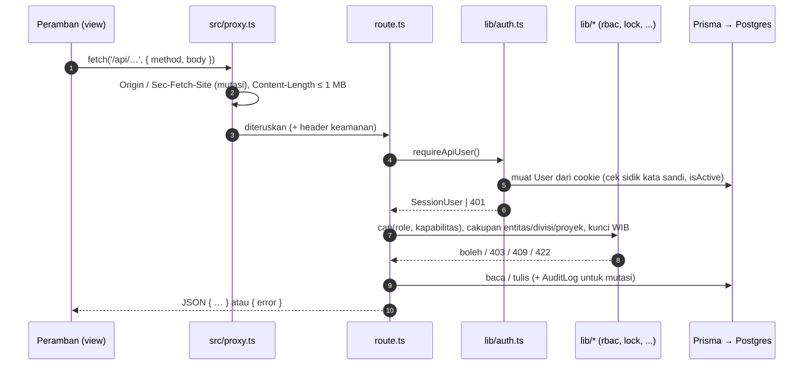

# Arsitektur

[← Indeks](README.md)

Monitor Karya adalah satu aplikasi Next.js 16 (App Router, React 19) yang berjalan di Vercel (region `sin1`). Data disimpan di PostgreSQL Supabase dan diakses lewat Prisma 6. Berkas bukti ada di Supabase Storage. Autentikasi tidak memakai Supabase Auth: akun ada di tabel `User` (kata sandi scrypt), dan sesi berupa cookie bertanda HMAC.


> Proyek ini memakai Next.js versi baru dengan perubahan besar: `middleware.ts` diganti `src/proxy.ts`. Baca panduan di `node_modules/next/dist/docs/` sebelum mengubah konvensi kerangka (lihat [`AGENTS.md`](../../AGENTS.md)).

## Struktur folder

```
prisma/
  schema.prisma          33 model; wilayah [P2-A]..[P2-D] untuk model 6 Okt 2026
  migrations/0001..0017  SQL tangan; 0013–0017 belum diterapkan
src/
  proxy.ts               CSRF, batas badan, CSP bernonce, 404 /pratinjau di produksi
  app/
    page.tsx             "/" → AppShell (sesi wajib, force-dynamic)
    login/page.tsx       halaman masuk
    pratinjau/page.tsx   pratinjau per peran (hanya dev)
    api/**/route.ts      54 route
    globals.css          Tailwind 4 + token + @import ./css/*.css
    mk-modules.css       gaya modul (kerangka, Dock, meja kerja, perusahaan)
    css/                 laporan, weekly, pic, admin-sistem, proyek-divisi-eskalasi
  components/
    app-shell.tsx        memilih view menurut tab aktif
    app-provider.tsx     konteks sesi, tab aktif, branding
    shell.tsx, dock.tsx  kerangka navigasi
    mk/                  komponen sistem desain (port TSX design-system/components)
    views/               satu berkas per tab
    work-desk/ pic/ kadiv/ admin/ oversight/ companies/   bagian per peran/modul
    preview/             data contoh + penimpa fetch untuk /pratinjau
    ui/                  sisa shadcn/Radix (sebagian besar tidak dipakai lagi)
  hooks/                 use-fetch, use-resource, use-toast
  lib/                   aturan bisnis bersama (lihat tabel di bawah)
design-system/           token (tokens.css), preset Tailwind, komponen acuan
tests/                   vitest (lib/, api/)
```

## Alur sebuah permintaan



Pola ini dipakai setiap route:

1. `requireApiUser()` ([`src/lib/auth.ts`](../../src/lib/auth.ts)) membaca cookie dan memuat ulang akun dari basis data pada setiap permintaan. Perubahan peran dan akses sementara berlaku seketika. Akun nonaktif dan token dengan sidik kata sandi lama ditolak.
2. Kapabilitas diperiksa dengan `can(role, 'x:y')` dari [`src/lib/rbac.ts`](../../src/lib/rbac.ts).
3. Cakupan data:
   - `scopeEntityIds(user)`: PT akun dan seluruh anaknya, lewat `Entity.path`. Peran grup mendapat `null` (seluruh grup).
   - `scopeUserIds(user)`: akun dalam cakupan itu.
   - Pembantu khusus: `guardProjectAccess` ([`pic-access.ts`](../../src/lib/pic-access.ts)), `canManageDivision` ([`kadiv.ts`](../../src/lib/kadiv.ts)), `canWriteEvidence` dan `canReadEvidence` ([`evidence-access.ts`](../../src/lib/evidence-access.ts)).
4. Aturan waktu dari [`src/lib/lock.ts`](../../src/lib/lock.ts).
5. Setiap mutasi penting menulis `AuditLog`. Notifikasi dalam aplikasi ditulis ke `NotificationLog` (`channel: 'APLIKASI'`).

Kode status yang dipakai konsisten:

| Kode | Arti |
| --- | --- |
| 400 | Badan tidak valid atau aksi tak dikenal |
| 401 | Tidak ada sesi |
| 403 | Bukan wewenang / di luar cakupan |
| 404 | Tidak ada, atau ada tetapi di luar cakupan |
| 409 | Konflik keadaan: terkunci, sudah diteruskan, pengingat kedua, dua klik bersamaan |
| 411, 413, 415 | Badan tanpa panjang, badan terlalu besar, jenis berkas tidak cocok |
| 422 | Validasi bisnis gagal; jawabannya membawa `errors: string[]` |
| 429 | Pembatas laju, dengan header `Retry-After` |
| 503 | Layanan belum disiapkan, misalnya Storage atau `CRON_SECRET` |

## Halaman dan view

Aplikasi berjalan di satu halaman. [`src/app/page.tsx`](../../src/app/page.tsx) membaca sesi di server (`force-dynamic`), memuat branding holding dan PT, lalu merender `AppShell`. Perpindahan tab tidak mengganti URL. Tab aktif disimpan di konteks [`app-provider.tsx`](../../src/components/app-provider.tsx), dan [`app-shell.tsx`](../../src/components/app-shell.tsx) memilih view:

| Tab (`NavTabId`) | View | Dokumen |
| --- | --- | --- |
| `dashboard` | `views/dashboard-view.tsx` → `role-dashboards.tsx` / `oversight-dashboard.tsx` | [ringkasan.md](ringkasan.md) |
| `companies` | `views/companies-view.tsx` | [perusahaan-akun.md](perusahaan-akun.md) |
| `work-desk` | `views/work-desk-view.tsx` → `work-desk/*` | [meja-kerja.md](meja-kerja.md) |
| `daily-input` | `views/daily-input-view.tsx` | [laporan-harian.md](laporan-harian.md) |
| `weekly-input` | `views/weekly-input-view.tsx` → `division-weekly-desk.tsx` | [capaian-mingguan.md](capaian-mingguan.md) |
| `inbox` | `views/inbox-view.tsx` | [penerimaan.md](penerimaan.md) |
| `projects` | `views/projects-view.tsx` | [proyek.md](proyek.md) |
| `divisions` | `views/divisions-view.tsx` | [divisi.md](divisi.md) |
| `escalations` | `views/escalations-view.tsx` | [eskalasi.md](eskalasi.md) |
| `entities` | `views/entities-view.tsx` | [entitas.md](entitas.md) |
| `audit` | `views/audit-view.tsx` | [log.md](log.md) |
| `system` | `views/system-view.tsx` | [sistem.md](sistem.md) |

View mengambil data dengan `useFetch` atau `useResource` ([`src/hooks/`](../../src/hooks/)). `useResource` memberi `reload()` untuk layar yang menulis lalu membaca ulang. Jawaban 401 langsung mengarahkan ke `/login`.

## RBAC: peran, kapabilitas, tab

Semua hak ada sebagai data di [`src/lib/rbac.ts`](../../src/lib/rbac.ts). Tabel yang sama mengatur navigasi di peramban dan pemeriksaan di API: UI menyembunyikan yang tidak boleh, API menolaknya.

| Kapabilitas | PIC | Kadiv | Admin PT | Direktur | SDM&GA | Manajemen | Auditor | TI | Super Admin |
| --- | :-: | :-: | :-: | :-: | :-: | :-: | :-: | :-: | :-: |
| `daily:input` | ● | | ● | | | | | ● | ● |
| `daily:forward` | | | ● | | | | | ● | ● |
| `weekly:input` | | ● | ● | | | | | ● | ● |
| `weekly:approve` | | ● | | | | | | ● | ● |
| `weekly:forward` | | | ● | | | | | ● | ● |
| `escalation:raise` | ● | ● | ● | ● | ● | | | ● | ● |
| `escalation:followup` | | | | ● | ● | ● | | ● | ● |
| `escalation:decide` | | | | | | ● | | ● | ● |
| `project:propose` | ● | | ● | ● | ● | ● | | ● | ● |
| `project:approve` | | | ● | ● | ● | ● | | ● | ● |
| `project:manage` | | | ● | | | | | ● | ● |
| `notify:remind` | | | ● | ● | ● | | | ● | ● |
| `unlock:request` | | | ● | | | | | ● | ● |
| `unlock:approve` | | | | | ● | | | ● | ● |
| `unlock:execute` | | | | | | | | ● | ● |
| `users:manage` | | | | | | | | ● | ● |
| `companies:manage` | | | | | | | | | ● |
| `accounts:manage` | | | ● | | | | | | |
| `audit:read` | | | | ● | ● | ● | ● | ● | ● |
| `group:read` | | | | | ● | ● | ● | ● | ● |

Hal penting:

- **Peran grup** (`MANAJEMEN`, `AUDITOR`, `TI`, `SUPERADMIN`, `DIREKTUR_SDM_GA`) membaca seluruh grup. Peran lain terpaku pada `scopeEntityId`. Akun berlingkup tanpa PT ditolak (`refuseUnscoped`). Sejak penguatan keamanan, pemeriksaan ini gagal-tertutup.
- **Akun induk** (`TI`, `SUPERADMIN`, `isMasterRole`) boleh menulis di mana pun.
- **Tab per peran** ada di `ROLE_TABS`. Tab pertama menjadi tab pembuka; untuk semua peran itu Ringkasan. Urutan tampil mengikuti `NAV_TABS` di [`src/lib/constants.ts`](../../src/lib/constants.ts).
- **Rantai persetujuan proyek** ada di `PROJECT_APPROVAL_CHAIN`, lihat [proyek.md](proyek.md).


## Waktu, tenggat, dan kunci (WIB)

Semua tenggat dihitung di [`src/lib/lock.ts`](../../src/lib/lock.ts) dalam WIB (UTC+7). Stempel waktu disimpan dalam UTC. Kunci **diturunkan dari jam**, tidak dipasang oleh cron, sehingga cron yang terlewat tidak pernah membuat laporan tetap terbuka.

| Aturan | Fungsi | Bawaan | Variabel env |
| --- | --- | --- | --- |
| Hari laporan = tengah malam WIB | `startOfWibDay`, `wibDateKey` | — | — |
| Hari kerja = Senin–Jumat WIB | `isWorkingDay` | — | — |
| Laporan harian hari D terkunci | `dailyLockAt`, `isDailyLocked` | D pukul 17.00 WIB | `DAILY_CUTOFF_HOUR` |
| Serah capaian mingguan | `weeklyDeadlines().handoverBy` | Kamis 17.00 WIB | `WEEKLY_HANDOVER_DAY`, `WEEKLY_CUTOFF_HOUR` |
| Minggu terkunci | `weeklyDeadlines().lockAt`, `isWeeklyLocked` | Jumat 17.00 WIB | `WEEKLY_LOCK_DAY` |
| Laporan kemajuan mingguan | `progressLockAt` | ikut kunci Jumat | — |
| Laporan kemajuan bulanan | `progressLockAt` | tanggal 3 bulan berikutnya, 17.00 WIB | — |
| Minggu ISO | `isoWeekOf`, `weekPeriodOf`, `parseWeekKey` | Senin 00.00 – Minggu 23.59 WIB | — |
| Tanggal dari klien | `parseWibDateKey("YYYY-MM-DD")` | tanggal mustahil → `null` | — |

Label tenggat untuk pesan (`DAILY_CUTOFF_LABEL` = "17.00 WIB", `WEEKLY_HANDOVER_LABEL`, `WEEKLY_LOCK_LABEL`) ikut nilai env, sehingga teks tidak pernah bertentangan dengan aturan. Laporan yang sudah terkunci hanya bisa dibuka lewat permintaan buka kunci, lihat [permintaan-akses.md](permintaan-akses.md#buka-kunci-laporan).

> Tenggat mingguan diputuskan 6 Okt 2026: serah Kamis 17.00 WIB dan kunci Jumat 17.00 WIB. Spesifikasi desain, data pratinjau, dan kode sudah memakai aturan yang sama. Laporan yang sudah diteruskan ke holding dibekukan sampai buka kunci dijalankan (`weeklyWriteBlock` di `src/lib/lock.ts`).

## Status proyek, satu sumber

[`src/lib/project-status.ts`](../../src/lib/project-status.ts) → `deriveProjectStatus(project, latestReport)` adalah satu-satunya tempat status proyek dihitung. Ringkasan semua peran, Proyek, dan Entitas memakainya. Aturannya berurutan:

| Urutan | Kondisi | Status | Kata |
| --- | --- | --- | --- |
| 1 | `lifecycle = DITUTUP`, laporan terakhir `SELESAI`, atau progres ≥ 100 | `done` | Selesai |
| 2 | `targetEndDate` sudah lewat | `late` | Terlambat ("Lewat tenggat n hari", minimal 1) |
| 3 | Belum ada laporan harian | `neutral` | Belum mulai |
| 4 | Laporan terakhir `TERKENDALA`, `MENUNGGU_KEPUTUSAN`, atau `needsEscalation` | `risk` | Perlu perhatian (alasan = kalimat pertama kendala, maks 88 karakter) |
| 5 | Selain itu | `on` | Sesuai jadwal |

Urutan tampil daftar: `STATUS_ORDER` (late → risk → on → neutral → done).

## Model data


Model dikelompokkan di [`prisma/schema.prisma`](../../prisma/schema.prisma):

- **Organisasi.**
  - `Entity` membentuk pohon `HOLDING → SUB_HOLDING → SECTOR → REGION → PT → UNIT` dengan `path` termaterialisasi. Cakupan dihitung dengan `path startsWith`.
  - `Division` (per PT, punya `headUserId`) dan `DivisionType`.
- **Pengguna.** `User` dengan `role`, `scopeEntityId`, `username`, `passwordHash`, dan `divisionId` untuk keanggotaan divisi (0015).
- **Proyek.**
  - `Project`: `lifecycle` (DIUSULKAN, AKTIF, DITOLAK, DITUTUP, DIARSIPKAN), `phase`, `approvalChain[]`, dan `divisionId` (0015).
  - `ProjectApproval` dan `ProjectEntity` (PT terkait).
  - Model 6 Okt 2026: `Output` (0013), `ProjectStage`, `ProjectNote`, `DeadlineProposal` (0014).
- **Laporan harian.**
  - `DailyProjectReport`: satu per proyek per hari WIB.
  - `Task`: rincian kerja yang di-rollup menjadi laporan.
  - `Subtask`: milik tugas atau item mingguan.
  - `ProjectProgressReport`: laporan kemajuan mingguan/bulanan.
- **Laporan mingguan.** `WeeklyDivisionReport` (satu per divisi per minggu ISO) dan `WeeklyReportItem`.
- **Bukti.** `Evidence` bersifat polimorfik (`targetType` + `targetId`). Target: `DAILY_REPORT`, `WEEKLY_ITEM`, `TASK`, `PROGRESS_REPORT`, `OUTPUT`, `PROJECT_CLOSING`.
- **Kendali.** `Escalation`, `UnlockRequest`, `AuditLog`, dan `NotificationLog`, ditambah `AccessRequest`, `ReminderRule` (0016), `Attendance` (0015), dan `WeeklyReportRead` (0017).

Kolom status disimpan sebagai `String` dengan nilai yang didokumentasikan di komentar skema, bukan enum Postgres.

## Sistem desain `mk`

Komponen UI ada di [`src/components/mk/`](../../src/components/mk/index.ts). Ini port TSX dari `design-system/components`, dengan props yang sama seperti `index.d.ts`:

| Berkas | Komponen |
| --- | --- |
| `core.tsx` | `Icon`, `Button`, `IconButton`, `SegmentedControl`, `Chip`, `SearchField`, `AccentPicker`, `StatusBadge`, `Avatar`, `ProgressBar`, `ProgressRing`, `Card`, `NavItem`, `TabBar` |
| `data.tsx` | `Sparkline`, `StatTile`, `BarChart`, `AreaChart`, `DonutChart`, `ActivityRings`, `Heatmap`, `Timeline`, `FlowDiagram`, `DivisionBar` |
| `layout.tsx` | `AttentionItem`, `ProjectRow`, `ApprovalItem`, `ActivityItem`, `PageHeader`, `Hero`, `EmptyNote`, `ErrorNote`, `Skeleton`, `DashboardSkeleton`, `DateBox` |
| `sheet.tsx` | `Sheet`: samping 440 di desktop, form sheet di tablet, layar didorong di ponsel. Punya fokus masuk/kembali, Esc, dan geser tepi. |

Pembantu bersama formulir ada di [`src/components/companies/parts.tsx`](../../src/components/companies/parts.tsx): `Field`, `SwitchRow`, `SectionTitle`, `selectCls`, dan `useConfirm` untuk konfirmasi hapus. Toast memakai sonner (`<SonnerToaster position="top-center" />` di [`layout.tsx`](../../src/app/layout.tsx)). Tindakan yang bisa dibalik memakai tombol "Urungkan".

Aturan yang ditegakkan di semua layar:

- **Nilai visual hanya dari token.** Sumbernya [`design-system/tokens.css`](../../design-system/tokens.css), lewat `var(--…)` atau kelas Tailwind bertoken (`bg-surface`, `text-ink-2`, `bg-accent-fill`).
- **Tema dan aksen.** Tema diatur `data-theme="light|dark"` di `<html>` (next-themes). Aksen diatur `data-accent` dengan nilai `merah`, `biru`, `hijau`, `ungu`, `oranye`, atau `grafit`, disimpan di localStorage `mk-tampilan`.
- **Status tetap**, selalu warna + ikon + kata lewat `StatusBadge`: Sesuai jadwal, Perlu perhatian, Terlambat, Selesai, Belum mulai.
- **Susunan layar.** Satu kalimat jawaban di atas setiap dashboard, maksimal 4 KPI, maksimal 1 tombol primer per kartu, dan maksimal 1 kartu bergradien per layar.
- **Detail di Sheet**, tidak pindah halaman.


## Kerangka: shell dan Dock

[`src/components/shell.tsx`](../../src/components/shell.tsx) memilih tata letak dari lebar layar:

| Lebar | Navigasi | Tab yang muat |
| --- | --- | --- |
| ≥ 1024 | Sidebar 248 px: logo, peran, `NavItem`, panel Tampilan, profil | semua |
| 600–1023 | Tab bar mengambang di tengah atas, avatar di kanan | ≤ 5 semua; lebih → 4 + "Lainnya" |
| < 600 | Tab bar kaca di bawah | ≤ 4 semua + "Tampilan"; lebih → 3 + "Lainnya" |

Alternatifnya Dock ([`src/components/dock.tsx`](../../src/components/dock.tsx)), dipilih di panel Tampilan:

| Layar | Bentuk Dock |
| --- | --- |
| Desktop | ala macOS, dengan magnifikasi |
| Tablet | ala iPadOS, sampai 8 ikon |
| Ponsel | kapsul kaca, 5 slot |

`⌥⌘D` menyalakan Dock sembunyi otomatis.

Preferensi tampilan ada di [`src/lib/tampilan.ts`](../../src/lib/tampilan.ts) dan dipasang sebagai `data-nav`, `data-accent`, dan `data-dock-autohide` di `<html>` oleh skrip [`tampilan-boot.ts`](../../src/lib/tampilan-boot.ts) sebelum render pertama, jadi tidak ada kedipan.

Perpindahan Sidebar ↔ Dock memakai View Transitions ([`src/lib/nav-transition.ts`](../../src/lib/nav-transition.ts)). Ikon bernama `nav-<id>` terbang ke posisi barunya. Kurvanya ada di [`mk-modules.css`](../../src/app/mk-modules.css). Di bawah `prefers-reduced-motion`, transisi menjadi pudar 200 ms.

Bagian kerangka lain:

- Tautan "Lewati ke isi" mengarah ke `<main id="isi">`.
- Badge navigasi diambil dari `/api/nav-badges` (`refreshNavBadges()` di [`src/components/pic/nav-badges.ts`](../../src/components/pic/nav-badges.ts)).
- Lonceng notifikasi diperbarui serentak lewat event jendela `mk:notifikasi-berubah`.

## Pustaka `src/lib`

| Berkas | Tanggung jawab |
| --- | --- |
| `auth.ts` | Cookie sesi HMAC, `getSessionUser`, `requireApiUser`, cakupan (`scopeEntityIds`, `scopeUserIds`, `refuseUnscoped`) |
| `password.ts` | scrypt hash/verifikasi |
| `rbac.ts` | Kapabilitas, tab, rantai persetujuan proyek, meja akun |
| `lock.ts`, `wib.ts` | Waktu WIB, tenggat, kunci, validasi laporan |
| `project-status.ts` | Status proyek |
| `daily-rollup.ts` | Tugas → status/progres laporan harian, sinkron jumlah bukti |
| `daily-intake.ts` | `countDailyIntake`: hitungan "laporan masuk" untuk Ringkasan dan Meja kerja |
| `evidence-access.ts`, `storage.ts` | Hak baca/tulis bukti, Supabase Storage (bucket `evidence`, URL 5 menit) |
| `pic-access.ts` | Relasi akun ↔ proyek (PIC, KADIV, ADMIN, MASTER, VIEWER), notifikasi, audit untuk fitur PIC |
| `kadiv.ts` | Divisi yang dipimpin, tim, beban kerja, kehadiran, pengingat tim |
| `reminders.ts`, `reminder-rules.ts`, `admin-meta.ts` | Pengingat mingguan divisi, aturan pengingat otomatis dan nilai bawaannya |
| `access-requests.ts`, `account-desk.ts`, `accounts.ts`, `companies.ts` | Permintaan akses dan aturan meja akun |
| `unlock-requests.ts` | Buka kunci laporan |
| `security.ts`, `security-headers.ts`, `cron-auth.ts` | Pembatas laju, teks aman, CSP, rahasia cron |
| `constants.ts`, `format.ts`, `division-tone.ts`, `branding.ts` | Label, format tanggal/angka, warna divisi tetap, logo |
