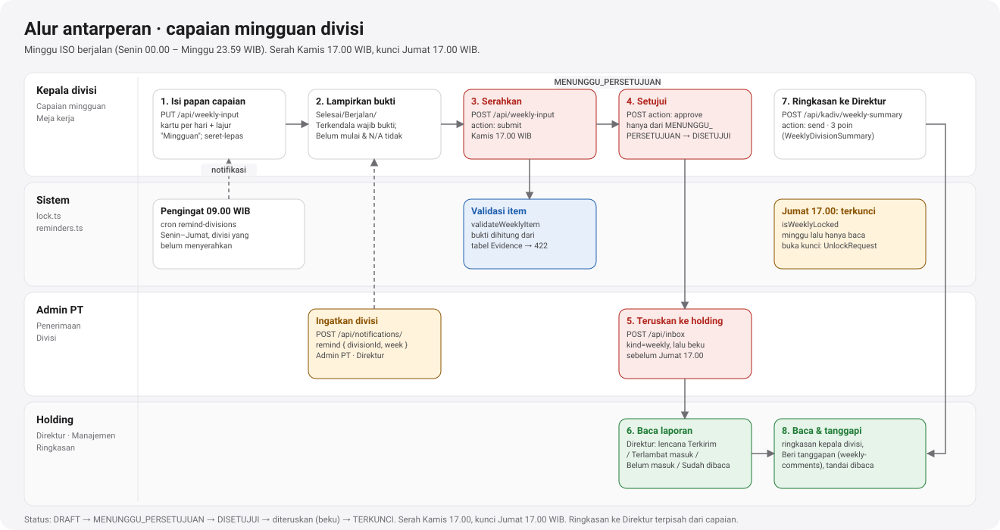
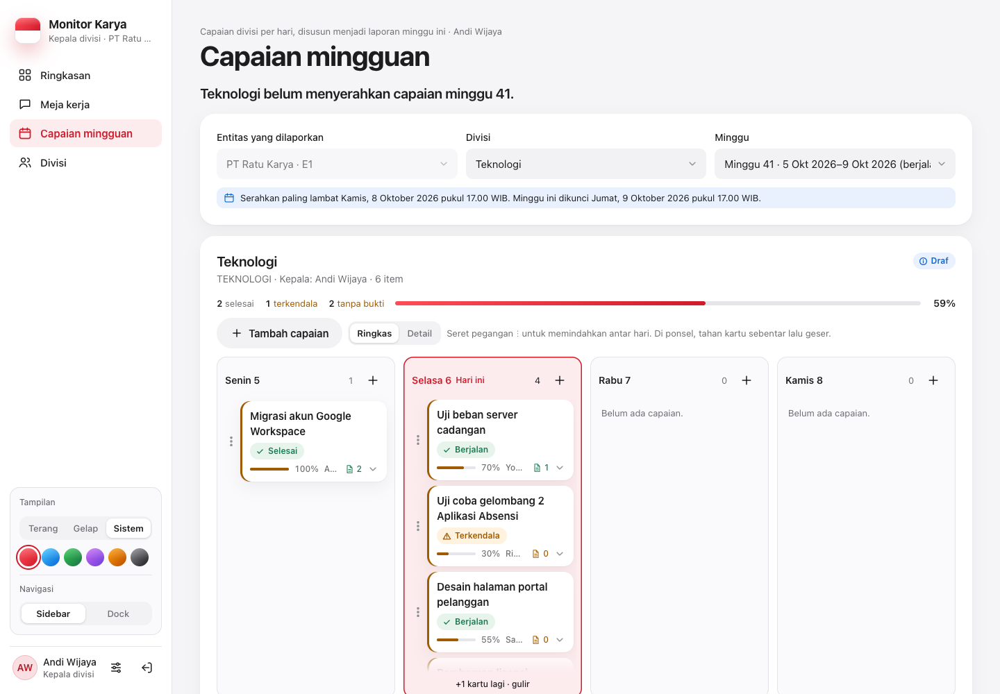
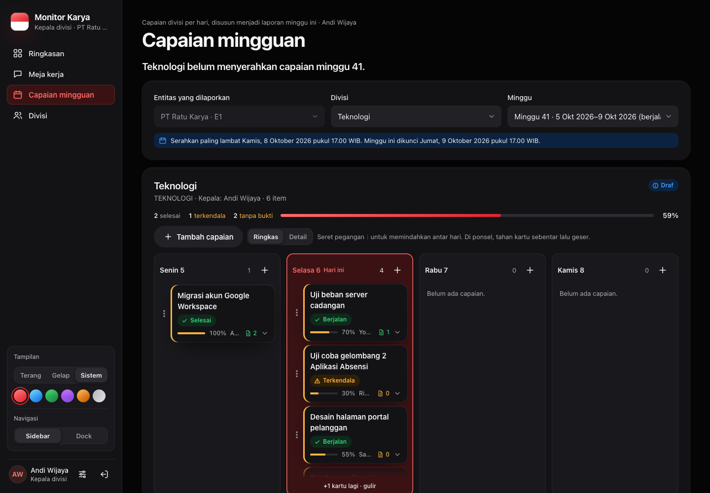
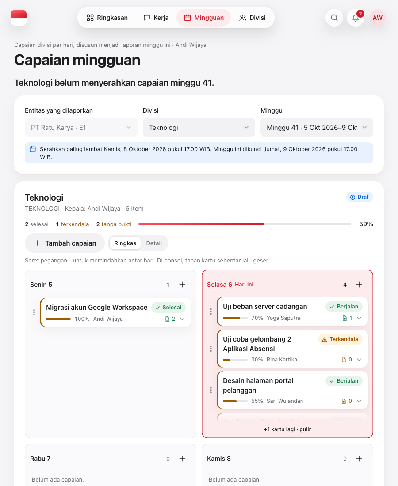
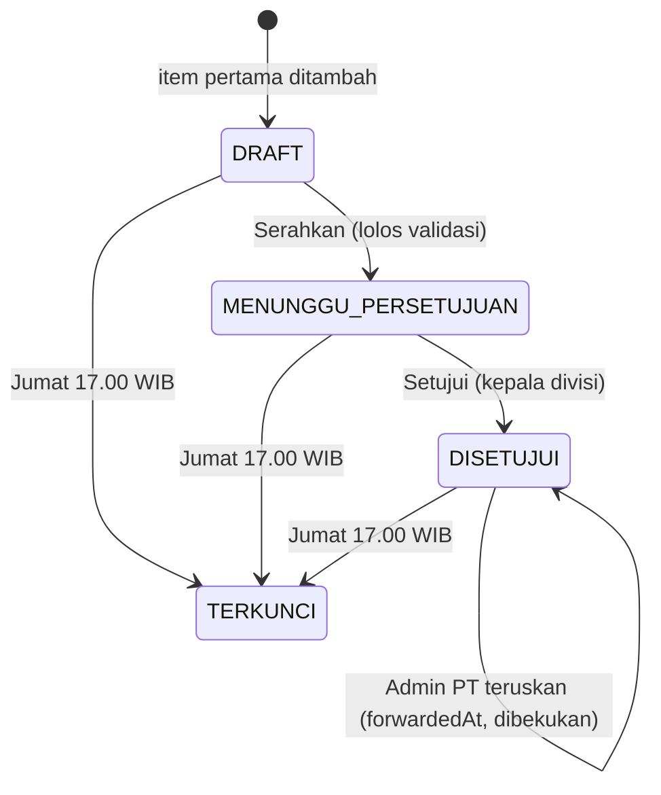

# Capaian mingguan divisi

[← Indeks](README.md) · Spesifikasi: [`03-kepala-divisi.md`](../design/peran/03-kepala-divisi.md)

## Tujuan

Setiap minggu kepala divisi menyusun capaian divisinya di papan per hari. Kartu ditaruh pada hari pengerjaannya, atau di lajur "Mingguan" bila tanpa hari tertentu. Kepala divisi menyerahkannya ke Admin PT, lalu menyetujuinya. Admin PT meneruskan bundel divisi ke holding sebelum minggu terkunci.

## Siapa memakai

| Peran | Tempat | Hak |
| --- | --- | --- |
| Kepala divisi | Tab **Capaian mingguan** | Divisi yang ia pimpin (`Division.headUserId`); mengisi, menyerahkan (`weekly:input`), menyetujui (`weekly:approve`) |
| Admin PT | Tab **Divisi** (pilih entitas & divisi) | Semua divisi PT-nya; mengisi (`weekly:input`), meneruskan (`weekly:forward`) |
| TI, Super Admin | Capaian mingguan / Divisi | Semua PT |
| Pengawas | Divisi, Ringkasan | Hanya baca, lencana laporan |

| Desktop terang | Desktop gelap | Tablet |
| --- | --- | --- |
|  |  |  |

## Alur langkah demi langkah

1. **Pilih entitas, divisi, dan minggu.** Minggu yang lalu hanya bisa dibaca, kecuali laporannya sedang dibuka lewat buka kunci.
2. **Tambah capaian** dengan `ItemDialog` (Sheet lebar). Isinya:
   - uraian pekerjaan, target output, PIC dan jabatannya;
   - aspek (`AspectCategory`), prioritas, tag;
   - hari pengerjaan atau lajur Mingguan;
   - status: Selesai, Berjalan, Belum mulai, Terkendala, N/A;
   - progres, capaian minggu ini, kendala & tindak lanjut;
   - langkah (subtugas).
3. **Susun papan dengan seret-lepas** (dnd-kit). Pegangan ⋮ bertarget sentuh 44 px; di ponsel tahan kartu sebentar lalu geser. Setiap pemindahan disimpan (`PATCH`) dan menampilkan toast "Susunan tersimpan." dengan "Urungkan", yang mengirim urutan sebelumnya lewat `PATCH` yang sama.
4. **Lampirkan bukti** per item (`EvidencePanel`, target `WEEKLY_ITEM`).
5. **Serahkan** (`POST`, `action: 'submit'`) paling lambat **Kamis 17.00 WIB**.
   - Server memvalidasi setiap item.
   - Bila ada yang gagal, jawabannya 422 `{ errors }` dengan daftar item yang bermasalah. Tidak ada yang diubah dan tidak ada log yang ditulis.
   - Bila lolos, status menjadi `MENUNGGU_PERSETUJUAN`.
   - Hanya laporan `DRAFT` yang bisa diserahkan; serah ulang laporan yang menunggu persetujuan atau sudah disetujui dijawab 409.
6. **Setujui** (`action: 'approve'`) oleh kepala divisi. Status menjadi `DISETUJUI`.
   - Hanya laporan `MENUNGGU_PERSETUJUAN` yang bisa disetujui. Draf dijawab 422 "Laporan masih draf. Serahkan laporan dulu; …"; yang sudah disetujui 409.
   - Perubahan status bersyarat pada status yang dibaca (`where: { id, statusHeader }`): suntingan bersamaan yang menarik laporan ke draf membuat persetujuan gagal 409, bukan tertimpa.
7. **Admin PT meneruskan** di [Penerimaan](penerimaan.md) (`POST /api/inbox`, `kind: 'weekly'`) sebelum **Jumat 17.00 WIB**.
8. **Jumat 17.00 WIB**: minggu terkunci (`TERKUNCI`, diturunkan dari jam). Perubahan setelahnya butuh [buka kunci](permintaan-akses.md#buka-kunci-laporan).
   - **Sudah diteruskan = dibekukan.** Begitu Admin PT meneruskan (`forwardedAt`), laporan tidak bisa diubah, disusun ulang, dihapus itemnya, diserahkan, atau disetujui lagi (409 `{ locked: true, frozen: true }`), walau minggunya belum terkunci.
9. **Ringkasan untuk Direktur.** Terpisah dari capaian, kepala divisi mengirim 3 poin ringkasan minggu itu lewat "Kirim ke Direktur" (`/api/kadiv/weekly-summary`, model `WeeklyDivisionSummary`). Ringkasan ikut dibekukan begitu capaian diteruskan dan tidak bisa diubah setelah kunci Jumat. Lihat [peran-kadiv.md](peran-kadiv.md#ringkasan-mingguan-untuk-direktur).
10. **Pengawas membaca.** Direktur melihat lencana Terkirim, Terlambat masuk, Belum masuk, atau Sudah dibaca, membaca poin ringkasan kepala divisi, dan bisa "Beri tanggapan" (`/api/weekly-comments`). Kepala divisi membalas dari kartu Tanggapan direktur di Meja kerja. Lihat [ringkasan.md](ringkasan.md#direktur-entitas) dan [peran-direktur-manajemen.md](peran-direktur-manajemen.md).

## Aturan bisnis

**Tenggat** ([`lock.ts`](../../src/lib/lock.ts) → `weeklyDeadlines`):

| Tenggat | Waktu bawaan |
| --- | --- |
| Serah | Kamis 17.00 WIB |
| Kunci | Jumat 17.00 WIB |

Keduanya bisa digeser lewat env `WEEKLY_HANDOVER_DAY`, `WEEKLY_LOCK_DAY`, dan `WEEKLY_CUTOFF_HOUR`.

**Boleh ditulis atau tidak** ([`lock.ts`](../../src/lib/lock.ts) → `weeklyWriteBlock`, dipakai `PUT`, `PATCH`, `POST`, `DELETE`, dan `GET` untuk `divisions[].writable`). Diperiksa berurutan:

| Keadaan | Jawaban |
| --- | --- |
| Buka kunci berlaku untuk laporan itu (`activeUnlockFor('WEEKLY_REPORT', id)`, `DIEKSEKUSI`, belum lewat `unlockUntil`) | boleh, juga untuk minggu lalu dan laporan yang sudah diteruskan |
| Minggu yang belum berjalan | 409 `reason: FUTURE_WEEK` |
| Sudah diteruskan ke holding | 409 `reason: FORWARDED`, `frozen: true` |
| Minggu lalu | 409 `reason: PAST_WEEK` "Hanya minggu berjalan yang bisa diisi. …" |
| Setelah kunci Jumat 17.00 | 409 `reason: TIME_LOCKED` "Minggu ini sudah dikunci (Jumat 17.00 WIB). Ajukan permohonan buka kunci." |
| Baris `isLocked` / `TERKUNCI` | 409 `reason: REPORT_LOCKED` |

Baris laporan baru hanya dibuat untuk minggu berjalan yang masih terbuka. Selama buka kunci berlaku, koreksi pada laporan yang **sudah diteruskan** tersimpan langsung: status tidak ditarik ke draf, laporan tidak diserahkan ulang (409), dan AuditLog mencatat `unlocked: true`. Laporan yang belum diteruskan kembali ke draf seperti biasa dan bisa diserahkan serta disetujui selama buka kunci berlaku.

`GET` mengirim per divisi `writable`, `lockReason`, `frozen`, dan `unlockUntil`; layar memakai `writable` untuk mengunci papan dan menampilkan `lockReason`.

**Bukti wajib** (`validateWeeklyItem`):

| Status | Bukti |
| --- | --- |
| Selesai, Berjalan, Terkendala | minimal 1 |
| Belum mulai, N/A | tidak wajib |

Jumlah bukti dihitung dari tabel `Evidence`, bukan dari kolom `evidenceCount`.

**Kolom wajib per item:**

- uraian pekerjaan, target output, PIC, status, capaian minggu ini;
- aspek dan prioritas;
- kendala + tindak lanjut bila Terkendala.

**Hari pengerjaan** harus di dalam minggu itu (422 "Hari pengerjaan berada di luar minggu ini.").

**Item yang sudah dieskalasi** tidak bisa dihapus (409).

**Satu laporan per divisi per minggu ISO**: kunci unik `(divisionId, isoYear, isoWeek)`.

**Pengingat:**

- **Cron harian 09.00 WIB.** Pada hari kerja, mengingatkan kepala divisi yang belum menyerahkan. Divisi yang sudah diingatkan hari itu dilewati. PT yang mematikan "Pengingat laporan mingguan" juga dilewati.
- **Manual.** Admin PT atau Direktur memakai `POST /api/notifications/remind`. Tanpa parameter: semua divisi dalam lingkup, minggu berjalan. Dengan `divisionId` dan `week` ("2026-W40"): satu divisi untuk minggu itu (minggu berjalan atau yang sudah lewat, bukan minggu depan), dipakai Direktur untuk minggu laporan yang sedang tampil. Divisi di luar lingkup dijawab 404. Batas "sekali per hari" dihitung per kepala divisi, divisi, dan minggu. Kalimat tenggat di pengingat mengikuti jam: sebelum Kamis 17.00 "Serahkan paling lambat …", sesudahnya "Tenggat serah … sudah lewat", dan setelah kunci "Minggu itu sudah dikunci sejak Jumat 17.00 WIB; hubungi Admin PT untuk permohonan buka kunci."

Lihat [pengingat.md](pengingat.md).

## Endpoint

| Metode & path | Parameter | Jawaban | Izin |
| --- | --- | --- | --- |
| `GET /api/weekly-input` | `?entityId=&week=2026-W41` | divisi yang menjadi tanggung jawab akun beserta laporan minggu itu, item, tenggat (`week.handoverBy`, `week.lockAt`) | `weekly:input`; Admin PT terpaku pada PT-nya |
| `PUT /api/weekly-input` | `{ divisionId, week, itemId?, workItem, targetOutput, picName, picTitle, status, progressPct, achievementThisWeek, obstacleFollowUp?, followUp?, aspectCategoryId, priorityId, targetDate?, workDate?, tags?, subtasks? }` | item baru/terbarui | `weekly:input` + divisi tanggung jawab; minggu berjalan atau buka kunci berlaku (`weeklyWriteBlock`) |
| `PATCH /api/weekly-input` | `{ divisionId, week, moves: [{ itemId, workDate \| null, position }] }` | urutan baru | sama |
| `POST /api/weekly-input` | `{ divisionId, week, action: 'submit' \| 'approve' }` | `{ ok, statusHeader }`; 422 `{ error, errors }`; 422 menyetujui draf; 409 status tidak sesuai / diteruskan / terkunci | `submit`: `weekly:input`, hanya dari `DRAFT`; `approve`: `weekly:approve`, hanya dari `MENUNGGU_PERSETUJUAN` |
| `DELETE /api/weekly-input` | `?itemId=` | hapus item | `weekly:input`; tidak bila terkunci/dieskalasi |
| `GET /api/weekly-reports` | `?entityId&isoYear&isoWeek&statusHeader&page&pageSize` | arsip berhalaman (tab Divisi) | cakupan entitas |
| `GET /api/tasks?week=` / `PATCH /api/tasks` | — | papan tugas mingguan proyek (`WeeklyTaskBoard`) | lihat [laporan-harian.md](laporan-harian.md) |
| `GET /api/notifications/remind` | `?entityId=&divisionId=&week=` | divisi yang belum menyerahkan minggu itu (bawaan minggu berjalan) | `notify:remind` |
| `POST /api/notifications/remind` | `{ entityId?, divisionId?, week? }` | kirim pengingat ke kepala divisi masing-masing | `notify:remind`; 30 per 5 menit; divisi harus di lingkup (404) |

## Berkas kode utama

| Lapisan | Berkas |
| --- | --- |
| Layar | [`views/weekly-input-view.tsx`](../../src/components/views/weekly-input-view.tsx), [`division-weekly-desk.tsx`](../../src/components/division-weekly-desk.tsx) (`DivisionWeeklyDesk`, `ItemDialog`), [`weekly-board.tsx`](../../src/components/weekly-board.tsx) (lajur, `relocate`, `reorderOnDrop`, `movesFor`), [`weekly-task-board.tsx`](../../src/components/weekly-task-board.tsx), CSS [`app/css/weekly.css`](../../src/app/css/weekly.css) |
| API | [`api/weekly-input`](../../src/app/api/weekly-input/route.ts), [`api/weekly-reports`](../../src/app/api/weekly-reports/route.ts), [`api/notifications/remind`](../../src/app/api/notifications/remind/route.ts), [`api/cron/remind-divisions`](../../src/app/api/cron/remind-divisions/route.ts) |
| Aturan | [`lib/lock.ts`](../../src/lib/lock.ts), [`lib/reminders.ts`](../../src/lib/reminders.ts) |
| Tes | [`tests/api/weekly-input.test.ts`](../../tests/api/weekly-input.test.ts), [`tests/api/notifications-remind.test.ts`](../../tests/api/notifications-remind.test.ts) |

## Catatan terbuka

- **Tenggat (diputuskan 6 Okt 2026).** Serah Kamis 17.00 WIB, kunci Jumat 17.00 WIB. Spesifikasi (00, 01, 02, 03, 04), data pratinjau, dan teks layar sudah disamakan.
- **Draf otomatis (selesai, F2).** Ringkasan mingguan untuk Direktur disusun otomatis dari output diterima, status proyek, dan kendala terbuka; kepala divisi menyunting 1–3 poin lalu mengirimnya. Lihat [peran-kadiv.md](peran-kadiv.md).
- **Buka kunci oleh kepala divisi.** Kepala divisi tidak punya `unlock:request`; pengajuan buka kunci capaian dilakukan Admin PT. Perlu konfirmasi produk (lihat [`SISA-PEKERJAAN.md`](../SISA-PEKERJAAN.md)).
- **Bukti saat buka kunci / setelah diteruskan (selesai, integrasi akhir).** `src/lib/evidence-access.ts` kini memakai `weeklyWriteBlock` + `activeUnlockFor('WEEKLY_REPORT', id)`, sama dengan isian item: bukti item minggu lalu yang dibuka bisa diubah, dan bukti laporan yang sudah diteruskan dibekukan. Diuji di `tests/lib/evidence-access.test.ts`.
