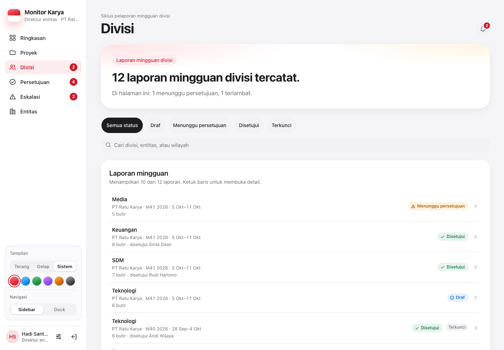
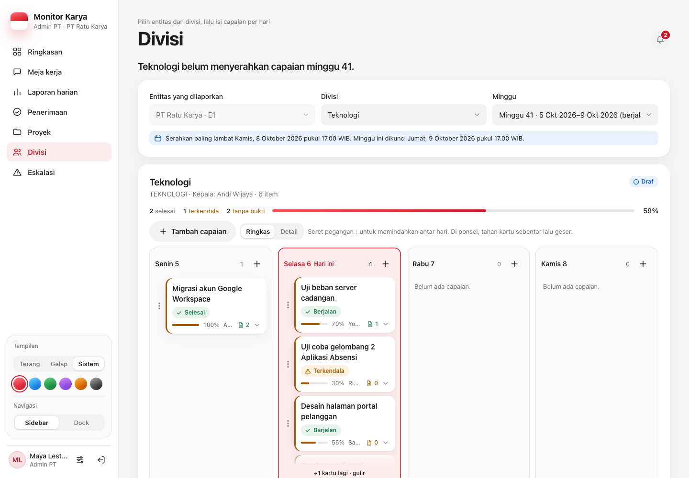

# Divisi

[← Indeks](README.md)

## Tujuan

Tab Divisi punya dua isi, tergantung peran:

1. Bagi yang mengisi capaian, tab ini memuat meja capaian mingguan divisi.
2. Bagi semua peran pembacanya, tab ini memuat **arsip laporan mingguan divisi** beserta detailnya.

## Siapa memakai

| Peran | Isi tab |
| --- | --- |
| Kepala divisi | `DivisionWeeklyDesk` untuk divisinya di atas (sama dengan tab Capaian mingguan), lalu "Arsip laporan mingguan" |
| Admin PT | `DivisionWeeklyDesk` (pilih entitas & divisi) di atas, lalu "Arsip laporan mingguan" |
| TI, Super Admin | sama dengan Admin PT, semua PT |
| Direktur entitas, Direksi SDM & GA, Manajemen, Auditor | `Hero` dengan satu kalimat jawaban, lalu arsip dalam cakupan |

Peran yang bisa mengisi tidak mendapat `Hero` di tab ini, supaya layar tidak memuat dua kartu bergradien.

| Direktur (arsip) | Admin PT (meja + arsip) |
| --- | --- |
|  |  |

## Alur

1. **Saring** dengan chip status (`DRAFT`, `MENUNGGU_PERSETUJUAN`, `DISETUJUI`, `TERKUNCI`) dan `SearchField`.
2. **Baris laporan** (`mk-rrow`): divisi, PT, minggu "M41 2026", lencana status, dan lencana terlambat.
3. **Ketuk baris** untuk membuka Sheet lebar. Isinya:
   - periode dan catatan persetujuan;
   - 3 `StatTile`: Butir, Selesai, Terkendala;
   - butir pekerjaan dengan status, progres, PIC, target, capaian, dan kotak kendala.
4. Skeleton, galat dengan "Coba lagi", kosong, dan kosong-setelah-saring ditangani.

## Keanggotaan divisi (data)

Sejak migrasi 0015, divisi punya anggota dan proyek:

| Kolom | Isi |
| --- | --- |
| `User.divisionId` | Keanggotaan. Satu orang satu divisi. Hanya akun PIC yang bisa jadi anggota. Kepala divisi tetap lewat `Division.headUserId`. |
| `Project.divisionId` | Divisi pelaksana proyek |

Bila proyek belum punya divisi, sistem mencarinya dengan urutan berikut. Urutan yang sama dipakai [`src/lib/kadiv.ts`](../../src/lib/kadiv.ts) dan `/api/ringkasan`:

1. divisi tempat PIC-nya menjadi anggota;
2. divisi yang dipimpin PIC-nya.

Tim kepala divisi = anggota divisi ∪ PIC proyek divisi.

Pengaturan lewat "Atur anggota" ([`kadiv/members-sheet.tsx`](../../src/components/kadiv/members-sheet.tsx)), kolom "Anggota divisi" di Sheet akun (`PATCH /api/companies/users { memberDivisionId }`), dan kolom "Divisi pelaksana" di formulir proyek:

| Metode & path | Parameter | Jawaban | Izin |
| --- | --- | --- | --- |
| `GET /api/kadiv/members` | `?divisionId=` | anggota, calon anggota (akun aktif di PT yang sama), proyek PT beserta divisinya | kepala divisi itu, Admin PT PT-nya, TI/Super Admin |
| `PUT /api/kadiv/members` | `{ divisionId, userId, member: boolean }` | tambah/keluarkan anggota | sama; akun harus di PT yang sama |
| `PUT /api/kadiv/members` | `{ divisionId, projectId, assign: boolean }` | tautkan/lepas proyek | sama; kepala divisi tidak bisa menarik orang/proyek dari divisi lain |

## Endpoint arsip

| Metode & path | Parameter | Jawaban | Izin |
| --- | --- | --- | --- |
| `GET /api/weekly-reports` | `?entityId&isoYear&isoWeek&statusHeader&page&pageSize` | laporan mingguan divisi berhalaman, dengan item | cakupan entitas (`null` untuk peran grup) |

Isian minggu berjalan: lihat [capaian-mingguan.md](capaian-mingguan.md).

## Berkas kode utama

- [`src/components/views/divisions-view.tsx`](../../src/components/views/divisions-view.tsx), CSS [`app/css/proyek-divisi-eskalasi.css`](../../src/app/css/proyek-divisi-eskalasi.css)
- [`src/components/division-weekly-desk.tsx`](../../src/components/division-weekly-desk.tsx)
- [`src/app/api/weekly-reports/route.ts`](../../src/app/api/weekly-reports/route.ts), [`src/app/api/kadiv/members/route.ts`](../../src/app/api/kadiv/members/route.ts)

## Catatan terbuka

- Hero hanya menghitung halaman yang sedang dimuat, karena API berhalaman.
- Data lama belum punya `divisionId`. Sampai Admin PT atau kepala divisi mengisinya, tim kepala divisi diturunkan dari proyek yang PIC-nya adalah kepala divisi itu sendiri, sehingga tim bisa terlihat kosong.
- Bagi Direktur, tab Divisi membawa badge jumlah laporan mingguan minggu laporan yang sudah masuk tetapi belum ditandai dibaca (`/api/nav-badges`).
- Data contoh `/pratinjau` untuk `/api/weekly-reports` ada (F3-A). Layar ini sudah melewati audit desain otomatis F4 di 1440/834/390 px.
