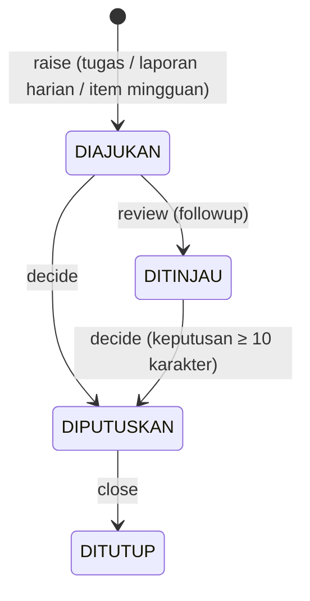

# Eskalasi

[← Indeks](README.md)

## Tujuan

Mengangkat hambatan yang di luar wewenang pelapor ke tingkat yang bisa memutuskan, dengan batas waktu (SLA) yang terlihat. Kalimat pembuka menjawab, misalnya, "2 eskalasi menunggu keputusan."

## Siapa memakai

| Langkah | Kapabilitas | Peran |
| --- | --- | --- |
| Mengajukan (`raise`) | `escalation:raise` | PIC proyek (tugas/laporan proyeknya), Kepala divisi (item divisinya), Admin PT, Direktur entitas, Direksi SDM & GA, TI, Super Admin |
| Meninjau (`review`) | `escalation:followup` | Direktur entitas, Direksi SDM & GA, Manajemen, TI, Super Admin |
| Memutuskan (`decide`) | `escalation:decide` | Manajemen, TI, Super Admin |
| Menutup (`close`) | `decide` atau `followup`, atau pengaju sendiri | — |

Tab Eskalasi ada untuk Admin PT, Direktur entitas, Direksi SDM & GA, Manajemen, TI, dan Super Admin. PIC dan kepala divisi mengajukan dari tempat kerjanya: kartu tugas, laporan harian, atau item mingguan.

## Alur

1. **Ajukan** dari sumbernya:
   - Sumber: `TASK`, `DAILY_REPORT`, atau `WEEKLY_ITEM`.
   - Isi ringkasan minimal 10 karakter.
   - Pilih yang dibutuhkan: `KEPUTUSAN`, `ANGGARAN`, atau `DUKUNGAN_LINTAS_FUNGSI`.
   - PT dan penanggung jawab ditentukan dari sumbernya.
   - Satu sumber hanya boleh punya satu eskalasi terbuka. `Task.escalationId` mencegah pengajuan ganda dari tugas.
2. **Tinjau.** Direktur menandai bahwa ia menindaklanjuti (`DIAJUKAN → DITINJAU`).
3. **Putuskan.** Manajemen menulis keputusan (`decisionText`, minimal 10 karakter).
4. **Tutup.** Pengaju atau pengawas menutup eskalasi yang sudah diputuskan.

Setiap transisi ditulis ke `AuditLog`: `CREATE_ESCALATION`, `REVIEW_ESCALATION`, `DECIDE_ESCALATION`, `CLOSE_ESCALATION`.

## Di layar

- **Header dan hero.** `PageHeader`, lalu `Hero` dengan kalimat jawaban dan baris dukungan: lewat SLA, menunggu tindakan Anda, diputuskan tetapi belum ditutup.
- **Saringan.** Chip status, chip "Lewat SLA", dan pilihan kebutuhan.
- **Papan Kanban** per status, dengan kepala kolom `EscalationStatusBadge` + jumlah.
  - Di bawah 1024 px papan bergulir menyamping dengan snap.
  - Di 1024 px ke atas papan menjadi grid 4 kolom.
- **Detail di Sheet.** Isinya ringkasan, info, `FlowDiagram` langkah status, dan keputusan. Tombol Tinjau, Putuskan, dan Tutup ada di footer Sheet menurut `escalationPerms`.

## Aturan bisnis

- **SLA bawaan 7 hari** (`slaDays`). Eskalasi dianggap lewat SLA bila umurnya lebih dari `slaDays` hari. Saringan `?overdue=true|false` tersedia.
- **Cakupan.**
  - Peran berlingkup hanya melihat eskalasi PT dalam cakupannya.
  - Di luar cakupan → 403 "Eskalasi ini di luar cakupan Anda".
- **Transisi tidak valid → 409:**
  - meninjau yang bukan `DIAJUKAN`;
  - memutuskan yang sudah `DITUTUP`;
  - menutup sebelum `DIPUTUSKAN`.
- **Batas panjang teks** 4000 karakter.
- **Urungkan.** Tinjau, putuskan, dan tutup bisa diurungkan 15 menit oleh pelaku yang sama lewat toast "Urungkan", selama eskalasi belum diubah orang lain. Lihat [urungkan.md](urungkan.md). [F2-URUNGKAN]

## Endpoint

| Metode & path | Parameter | Jawaban | Izin |
| --- | --- | --- | --- |
| `GET /api/escalations` | `?status&needed&entityId&overdue&page&pageSize` | daftar berhalaman, per baris `ageDays`, `isOverdue` | cakupan entitas |
| `POST /api/escalations/actions` | `{ action: 'raise', sourceType, sourceId, summary, needed }` | eskalasi baru | `escalation:raise` + pemilik sumber |
| `POST /api/escalations/actions` | `{ action: 'review', id }` | status DITINJAU | `escalation:followup` |
| `POST /api/escalations/actions` | `{ action: 'decide', id, decisionText }` | status DIPUTUSKAN | `escalation:decide` |
| `POST /api/escalations/actions` | `{ action: 'close', id }` | status DITUTUP | decide/followup/pengaju |

## Berkas kode utama

- [`src/components/views/escalations-view.tsx`](../../src/components/views/escalations-view.tsx) (`escalationPerms`), [`status-badges.tsx`](../../src/components/status-badges.tsx) (`EscalationStatusBadge`)
- Mengajukan dari sumber: [`task-section.tsx`](../../src/components/task-section.tsx), [`division-weekly-desk.tsx`](../../src/components/division-weekly-desk.tsx) (`WeeklyEscalationDialog`)
- [`src/app/api/escalations/route.ts`](../../src/app/api/escalations/route.ts), [`src/app/api/escalations/actions/route.ts`](../../src/app/api/escalations/actions/route.ts)

## Catatan terbuka

- Di Ringkasan Direktur, eskalasi tampil sebagai `AttentionItem`, bukan `ApprovalItem`, karena Direktur tidak punya `escalation:decide`.
- Aturan "Eskalasi ke kepala divisi setelah 2 hari" (pengingat otomatis `ESKALASI_KADIV`) mengirim notifikasi. Aturan ini tidak membuat baris `Escalation`. Lihat [pengingat.md](pengingat.md).
- `/pratinjau` belum punya data contoh untuk `/api/escalations`.
