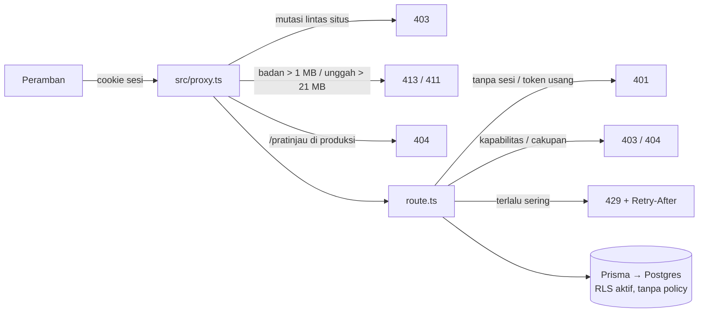

# Keamanan

[← Indeks](README.md) · Rincian lengkap dan keputusan: [`docs/KEAMANAN.md`](../KEAMANAN.md)

Halaman ini merangkum lapisan keamanan dari sisi fitur: apa yang terjadi pada setiap permintaan, dan aturan mana yang memengaruhi pengguna. Alasan, hasil audit IDOR, dan temuan yang belum diputuskan ada di `docs/KEAMANAN.md`.

## Lapisan per permintaan

| Lapisan | Berkas | Isi |
| --- | --- | --- |
| Proxy | [`src/proxy.ts`](../../src/proxy.ts) | CSRF (Origin / Sec-Fetch-Site, `APP_ORIGINS`), batas badan, CSP bernonce (`'strict-dynamic'`; Report-Only di dev), 404 `/pratinjau` di produksi |
| Header statis | [`next.config.ts`](../../next.config.ts), [`src/lib/security-headers.ts`](../../src/lib/security-headers.ts) | nosniff, Referrer-Policy, Permissions-Policy, CORP, `no-store` untuk `/api`; HSTS, X-Frame-Options, COOP hanya produksi |
| Sesi | [`src/lib/auth.ts`](../../src/lib/auth.ts) | lihat di bawah |
| Pengaman bersama | [`src/lib/security.ts`](../../src/lib/security.ts) | `safeEqual`, `clientIp`, `hit` / `limitReminders` (pembatas laju), `cleanText`, `contentMatchesMime`, `safeDisplayName` |
| Cron | [`src/lib/cron-auth.ts`](../../src/lib/cron-auth.ts) | `CRON_SECRET` wajib, minimal 16 karakter, dibandingkan waktu-konstan |
| Route | `src/app/api/**` | `requireApiUser` + kapabilitas + cakupan (lihat [arsitektur.md](arsitektur.md#rbac-peran-kapabilitas-tab)) |

## Masuk dan sesi

**Masuk** lewat `POST /api/auth/login` dengan `{ identifier, password }`. `identifier` berisi username atau email lama.

| Perlindungan | Isi |
| --- | --- |
| Pesan galat | sama untuk "akun tidak ada" dan "sandi salah" |
| Waktu jawab | sama untuk keduanya, berkat verifikasi hash tiruan |
| Pembatas laju per akun | 5 kegagalan / 15 menit |
| Pembatas laju per IP | 30 percobaan / 15 menit |
| Log | setiap kegagalan dicatat sebagai `LOGIN_FAILED`; masuk berhasil sebagai `LOGIN` |

**Cookie sesi:**

- Nama `mk_session` di dev, `__Host-mk_session` di produksi.
- `httpOnly`, `SameSite=Lax`, `Secure` di produksi.
- Berlaku 8 jam.

**Isi token:**

- Bertanda HMAC (`AUTH_SECRET`).
- Membawa sidik kata sandi. Mengganti atau menyetel ulang kata sandi mencabut semua sesi lama, dan pemiliknya mendapat token baru.
- Token lama tanpa sidik ditolak, jadi **semua orang perlu masuk ulang sekali setelah rilis**.

**Akun dimuat ulang** dari basis data pada setiap permintaan. Menonaktifkan akun atau mengubah peran berlaku seketika.

**Keluar** (`POST /api/auth/logout`) menghapus cookie. Token tidak dicabut di server, karena belum ada tabel sesi.

## Aturan yang dirasakan pengguna

| Keadaan | Akibat |
| --- | --- |
| Lima kali salah sandi | Akun ditolak masuk 15 menit (429) |
| Lima kali salah sandi lama saat ganti sandi | 429 selama 15 menit |
| Lebih dari 30 pengingat dalam 5 menit | 429 (`/api/work-desk`, `/api/notifications/remind`, `/api/kadiv/team`) |
| Unggah HTML yang dinamai `.png` | 415 (byte awal tidak cocok MIME) |
| Tautan bukti `https://user:pass@…` atau lebih dari 2000 karakter | ditolak |
| Membuka data di luar cakupan | 403, atau 404 bila keberadaannya pun tidak boleh bocor |
| Peran tanpa `audit:read` membuka log | hanya jejaknya sendiri |

## Cakupan data

Cakupan diputuskan di server pada setiap route, tidak pernah dari parameter klien:

- **Peran berlingkup** (PIC, Kepala divisi, Admin PT, Direktur entitas) terpaku pada `scopeEntityId` dan turunannya (`Entity.path`). Parameter kueri hanya bisa **mempersempit** pandangan peran grup, tidak pernah melebarkan pandangan peran berlingkup.
- **Akun berlingkup tanpa PT** ditolak (gagal-tertutup), misalnya di `/api/inbox`, `/api/work-desk`, dan `/api/projects`.
- **Bukti** hanya ditulis oleh pemilik sumbernya atau Admin PT di PT itu. Peran pengawas tidak bisa menulis atau menghapus bukti.
- **Meja akun terbatas** (Admin PT) tidak bisa melepas akun ke tingkat holding atau membuat Direktur entitas.
- **Tidak ada yang memutuskan permintaannya sendiri**: permintaan akses, buka kunci, dan usulan tenggat.

## Basis data dan rahasia

- Semua tabel memasang `ENABLE ROW LEVEL SECURITY` tanpa policy. Akses hanya lewat Prisma di server. RLS menutup jalur PostgREST/anon key.
- `SUPABASE_SERVICE_ROLE_KEY` hanya dipakai server untuk Storage, dan tidak pernah dikirim ke peramban.
- `.env` tidak ikut di repositori. Isinya lihat [README.md](README.md#menjalankan-di-mesin-lokal).

## Tes

- [`tests/api/login.test.ts`](../../tests/api/login.test.ts): cookie httpOnly + SameSite=Lax, sidik kata sandi di token, jawaban seragam untuk akun tidak ada dan sandi salah, 429 per akun dan per IP, sandi raksasa ditolak, akun nonaktif 403.
- [`tests/api/proxy.test.ts`](../../tests/api/proxy.test.ts): CSRF dan batas badan.
- [`tests/lib/security.test.ts`](../../tests/lib/security.test.ts): `safeEqual`, `cleanText`, tanda tangan berkas.

## Catatan terbuka

Ringkasan dari `docs/KEAMANAN.md`:

| Butir | Status / saran |
| --- | --- |
| `next` 16.3.4 | Punya advisori kritis di `next/og` (tidak dipakai). Naikkan ke ≥ 16.3.6. |
| Kata sandi | Selesai (F1-C): minimal 8 karakter, akun buatan/setelan ulang admin wajib ganti saat masuk pertama. |
| `Caddyfile` | Blok `@transform_port_query` adalah open proxy (SSRF). Hapus bila dipakai di server sungguhan. |
| Pembatas laju | Hidup di memori per instans server. Kuota global butuh penyimpanan bersama (Upstash/KV). |
| Keluar | Belum mencabut token. Butuh tabel sesi. |
| Pesan galat 500/422 | Beberapa route mengembalikan `err.message` mentah. |
| `GET /api/notifications` | Tanpa `inbox=1`, peran grup melihat isi notifikasi semua orang. |
| CSP produksi | Belum diperiksa di peramban produksi. Pastikan konsol bebas "Refused to execute … Content Security Policy". |
| Proxy yang mengubah Host | Isi `APP_ORIGINS`, atau mutasi sah akan ditolak 403. |
