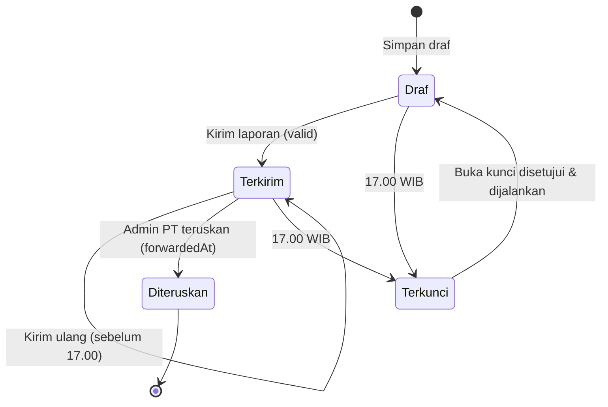

# Laporan harian (laporan kemajuan proyek)

[← Indeks](README.md) · Spesifikasi: [`05-pic-proyek.md`](../design/peran/05-pic-proyek.md)

## Tujuan

Setiap hari kerja PIC proyek melaporkan kemajuan proyeknya:

- apa yang dikerjakan (tugas);
- capaian;
- kendala;
- rencana tindak lanjut;
- bukti.

Laporan masuk ke Admin PT, yang meneruskannya ke holding. Di tab yang sama PIC juga mengisi **laporan kemajuan mingguan dan bulanan** per proyek.

## Siapa memakai

| Peran | Hak |
| --- | --- |
| PIC proyek | Proyek yang ia pegang (`Project.picUserId`) |
| Admin PT | Semua proyek PT-nya, untuk mengisi atas nama PIC bila perlu |
| TI, Super Admin | Semua proyek |
| Peran lain | Tidak punya tab ini. API menjawab 403 "Peran Anda tidak melakukan input harian". |

## Alur langkah demi langkah

1. **Buka tab Laporan harian.**
   - Bila PIC memegang satu proyek, formulir tampil langsung di kartu.
   - Bila lebih dari satu, tampil daftar baris dan tiap proyek dibuka di Sheet lebar.
   - Pilihan Harian / Mingguan / Bulanan berupa `SegmentedControl`.
2. **Susun tugas hari ini.**
   - Tambah, ubah, atau hapus tugas lewat `TaskDialog` (Sheet). Isinya: judul, deskripsi, tag, jam mulai/selesai, urgensi (Rendah, Sedang, Tinggi, Kritis), status, progres, dan langkah (subtugas).
   - Centang di kartu tugas menandai selesai, dengan toast "Urungkan".
   - Hapus tugas memakai `useConfirm`.
3. **Rollup otomatis.** Bila proyek punya tugas hari itu, status dan progres laporan diturunkan dari tugas (`computeRollup`). Status yang diketik di formulir diabaikan.
4. **Isi capaian.** Kendala dan Rencana tindak lanjut muncul bila status Terkendala atau Menunggu keputusan.
5. **Lampirkan bukti** di `EvidencePanel`:
   - seret-lepas berkas atau "Unggah bukti" (foto, PDF, dokumen, maks 20 MB);
   - atau tautan http(s).
6. **Kirim laporan.**
   - `PUT /api/daily-input` dengan `action: 'submit'`.
   - Server memvalidasi. Bila gagal, jawabannya 422 dengan daftar `errors` yang ditampilkan di formulir.
   - Bila berhasil, `submittedAt` diisi, lencana menjadi "Terkirim HH.MM", dan badge navigasi "Laporan harian" hilang seketika (`refreshNavBadges()`).
   - Laporan bisa dikirim ulang ("Kirim ulang laporan") sampai 17.00.
7. **Simpan draf**: `action: 'save'`, tanpa validasi kelengkapan.
8. **Hapus laporan** lewat `useConfirm`. Ditolak bila sudah terkunci atau sudah diteruskan.
9. **17.00 WIB**: laporan hari itu terkunci. Admin PT meneruskannya di [Penerimaan](penerimaan.md). PIC melihat "Diteruskan ke holding" di `FlowDiagram`.

## Aturan bisnis

**Tenggat.** Laporan hari D terkunci pada D pukul 17.00 WIB (`isDailyLocked`). Setelah itu:

| Endpoint | Jawaban |
| --- | --- |
| `PUT /api/daily-input` | 409 `{ locked: true }` |
| `DELETE /api/daily-input` | 409 |
| Tugas hari itu di `/api/tasks` | ditolak |

**Hari kerja.** Senin–Jumat WIB. Badge navigasi tidak muncul di hari libur maupun setelah tenggat.

**Validasi** (`validateDailyReport` di [`lock.ts`](../../src/lib/lock.ts)):

| Kolom | Wajib bila |
| --- | --- |
| Status | selalu: `SELESAI`, `ON_PROGRESS`, `TERKENDALA`, `MENUNGGU_KEPUTUSAN`, atau `TIDAK_ADA_PERUBAHAN` |
| Capaian hari ini | selalu |
| Bukti minimal 1 | semua status kecuali `TIDAK_ADA_PERUBAHAN` |
| Kendala | `TERKENDALA` atau `MENUNGGU_KEPUTUSAN` |
| Rencana tindak lanjut | `TERKENDALA` |

**Bukti dihitung dari tabel `Evidence`**, bukan dari kolom `evidenceCount`. `syncEvidenceCount` menyelaraskan kolom itu.

**Satu laporan per proyek per hari**: kunci unik `(projectId, reportDate)`. `reportDate` = tengah malam WIB.

**Hapus** ditolak bila laporan sudah diteruskan (409 "Laporan yang sudah diteruskan tidak dapat dihapus").

**Laporan kemajuan:**

- Mingguan (`periodKey` "2026-W41") terkunci bersama kunci Jumat 17.00.
- Bulanan ("2026-10") terkunci tanggal 3 bulan berikutnya pukul 17.00 WIB.
- Satu laporan per proyek per kadens per periode.

**Tugas:**

- Konteks harian mengikuti kunci 17.00 hari tugas itu.
- Konteks papan mingguan (`context=week`) mengikuti kunci Jumat, sehingga capaian Senin masih bisa dirapikan hari Rabu.
- `PUT /api/tasks` tanpa `picUserId` mempertahankan nilai lama. Mengirim `null` mengosongkannya.
- Batas panjang: judul 200, deskripsi 4000, tag 40.

**Eskalasi dari tugas.** Tugas Terkendala atau Menunggu keputusan bisa diajukan sebagai eskalasi (`POST /api/escalations/actions`, `action: 'raise'`, `sourceType: 'TASK'`). `Task.escalationId` mencegah eskalasi ganda. Lihat [eskalasi.md](eskalasi.md).

## Endpoint

| Metode & path | Parameter | Jawaban | Izin |
| --- | --- | --- | --- |
| `GET /api/daily-input` | `?projectId=` opsional | Proyek tanggung jawab akun beserta laporan hari ini (`status`, `progressPct`, `submittedAt`, `forwardedAt`, `isLocked`, …) dan hitung mundur | `daily:input` |
| `PUT /api/daily-input` | `{ projectId, action: 'save'\|'submit', status, progressPct, achievementToday, obstacle?, followUp?, decisionRequestedFrom? }` | laporan tersimpan; 422 `{ error, errors, evidenceCount }`; 409 terkunci | `daily:input` + pemilik proyek |
| `DELETE /api/daily-input` | `?projectId=` | hapus laporan hari ini | sama; tidak bila terkunci/diteruskan |
| `GET /api/tasks` | `?projectId=&date=YYYY-MM-DD` atau `?projectId=&week=2026-W41` | tugas sehari atau seminggu | pemilik proyek |
| `POST /api/tasks` | tugas + `subtasks[]` | tugas baru | `daily:input` + pemilik proyek |
| `PUT /api/tasks` | `{ id, … }` (daftar subtugas diganti) | tugas terbarui + rollup | sama |
| `PATCH /api/tasks` | `{ projectId, week, moves: [{ id, lane, sortOrder }] }`; `lane` = tanggal hari (YYYY-MM-DD) atau lajur mingguan | urutan papan mingguan | sama |
| `DELETE /api/tasks` | `?id=` | hapus tugas | sama |
| `GET /api/progress-reports` | `?projectId=&cadence=MINGGUAN\|BULANAN` | periode terakhir beserta laporannya | pemilik proyek |
| `PUT /api/progress-reports` | `{ projectId, cadence, periodKey?, action, status, progressPct, summary, obstacle?, followUp? }` | simpan/kirim satu periode | `daily:input` + pemilik; periode terkunci → 409 |
| `DELETE /api/progress-reports` | `?id=` | hapus yang belum terkunci | sama |
| `GET /api/evidence` | `?targetType=&targetId=` | daftar bukti | `canReadEvidence` |
| `POST /api/evidence` | `{ targetType, targetId, fileName, url }` | tambah tautan (http/https, ≤ 2000 karakter, tanpa kredensial) | `canWriteEvidence` |
| `POST /api/evidence/upload` | multipart `file, targetType, targetId, label?` | unggah ke Storage | sama; > 20 MB → 413, isi tidak cocok MIME → 415, Storage belum disiapkan → 503 |
| `GET /api/evidence/[id]` | — | URL bertanda tangan 5 menit (berkas) atau tautan | `canReadEvidence` |
| `DELETE /api/evidence/[id]` | — | hapus baris dan objek Storage | `canWriteEvidence` |
| `GET /api/daily-reports` | `?entityId&status&dateFrom&dateTo&search&page&pageSize` | daftar laporan berhalaman (pengawas) | cakupan entitas |

Jenis berkas bukti yang diterima: JPG, PNG, WEBP, HEIC, GIF, PDF, DOC/DOCX, XLS/XLSX, TXT, CSV. Ekstensi harus cocok dengan MIME, dan byte awal berkas harus cocok dengan jenisnya.

## Berkas kode utama

| Lapisan | Berkas |
| --- | --- |
| Layar | [`views/daily-input-view.tsx`](../../src/components/views/daily-input-view.tsx), [`task-section.tsx`](../../src/components/task-section.tsx), [`task-dialog.tsx`](../../src/components/task-dialog.tsx), [`progress-report-panel.tsx`](../../src/components/progress-report-panel.tsx), [`evidence-panel.tsx`](../../src/components/evidence-panel.tsx), CSS [`app/css/laporan.css`](../../src/app/css/laporan.css) |
| API | [`api/daily-input`](../../src/app/api/daily-input/route.ts), [`api/tasks`](../../src/app/api/tasks/route.ts), [`api/progress-reports`](../../src/app/api/progress-reports/route.ts), [`api/evidence`](../../src/app/api/evidence/route.ts), [`api/evidence/upload`](../../src/app/api/evidence/upload/route.ts) |
| Aturan | [`lib/lock.ts`](../../src/lib/lock.ts), [`lib/daily-rollup.ts`](../../src/lib/daily-rollup.ts), [`lib/evidence-access.ts`](../../src/lib/evidence-access.ts), [`lib/storage.ts`](../../src/lib/storage.ts) |

## Catatan terbuka

- **Tujuan pengiriman.** Spesifikasi desain meminta tombol "Kirim ke kepala divisi". API mengirim ke Admin PT, yang lalu meneruskannya ke holding. Tombol berbunyi "Kirim laporan" sampai produk memutuskan alurnya.
- **Kolom Kendala dan Rencana.** Hanya tampil untuk status Terkendala/Menunggu keputusan (perilaku lama). Desain menampilkannya selalu.
- **Laporan setelah diteruskan** masih bisa diubah dan dikirim ulang oleh PIC. `forwardedAt` tetap terisi, jadi holding diam-diam melihat isi berbeda. Perlu keputusan: bekukan, atau kembalikan ke antrean Admin PT.
- **Buka kunci untuk hari lalu** belum berefek: `/api/daily-input` hanya menulis laporan hari ini, dan belum ada route yang memanggil `activeUnlockFor`.
- **Pratinjau.** `/pratinjau` belum punya data contoh untuk `/api/daily-input` dan `/api/progress-reports`, jadi tab ini menampilkan keadaan galat di pratinjau.
