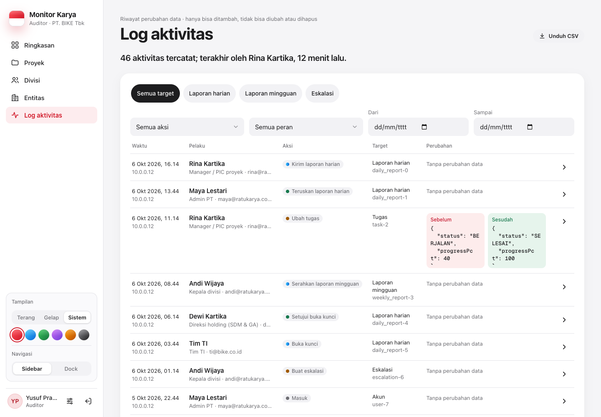
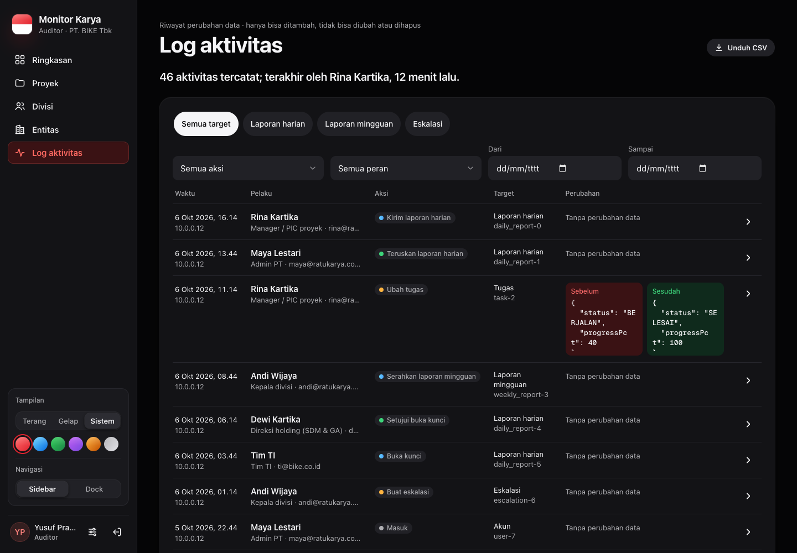

# Log aktivitas

[← Indeks](README.md)

## Tujuan

Jejak audit: siapa melakukan apa, kapan, terhadap data apa, dan isi sebelum/sesudahnya. Dipakai untuk pemeriksaan, investigasi, dan menjawab "kenapa angka ini berubah".

## Siapa memakai

| Peran | Melihat |
| --- | --- |
| Pemegang `audit:read` di tingkat grup: Direksi SDM & GA, Manajemen, Auditor, TI, Super Admin | seluruh grup |
| Direktur entitas (`audit:read`, tanpa `group:read`) | akun dalam cakupan PT-nya |
| Peran tanpa `audit:read` | hanya jejaknya sendiri (lewat API; tab tidak tampil) |

Pembatasan untuk peran tanpa `audit:read` ditambahkan pada penguatan keamanan 6 Okt 2026. Sebelumnya PIC bisa membaca log seluruh PT, termasuk IP dan perubahan akun orang lain.

| Desktop terang | Desktop gelap |
| --- | --- |
|  |  |

## Alur di layar

1. **Header.** `PageHeader` dengan satu kalimat jawaban.
2. **Saringan.**
   - Chip sasaran (`targetType`).
   - Pilihan aksi dan peran pelaku.
   - Rentang tanggal WIB (`dateFrom`, `dateTo`; `dateTo` mencakup seluruh hari).
   - Di ponsel saringan pindah ke Sheet "Saring log".
   - "Unduh CSV" memakai rentang dan aksi yang sama (`/api/audit-logs/export`).
3. **Daftar.**
   - Tabel tampil mulai 1280 px; di bawahnya daftar kartu (F4-B, supaya kolom Perubahan tidak membuat halaman bergulir ke samping).
   - Diff sebelum/sesudah memakai warna token.
   - Label aksi dari `AUDIT_ACTION_LABELS`, ditampilkan oleh `ActionTag`.
4. **Ketuk baris** untuk membuka Sheet berisi diff lengkap, IP, dan user-agent.
5. **Pagination** dengan `IconButton`. Kosong dan kosong-setelah-saring punya tombol "Hapus saringan".

## Aksi yang dicatat (contoh)

| Area | Aksi |
| --- | --- |
| Masuk | `LOGIN`, `LOGIN_FAILED` |
| Laporan | simpan/kirim/hapus laporan harian, penerusan, serahkan/setujui mingguan |
| Proyek | `PROPOSE_PROJECT`, `CREATE_PROJECT`, `CREATE_PROJECT_NO_APPROVAL`, `UPDATE_PROJECT`, `RESUBMIT_PROJECT`, `REJECT_PROJECT`, `DELETE_PROJECT` |
| Eskalasi | `CREATE_ESCALATION`, `REVIEW_ESCALATION`, `DECIDE_ESCALATION`, `CLOSE_ESCALATION` |
| Pengingat | `REMIND_PIC`, `AUTO_REMINDER`, `UPDATE_REMINDER_RULE` (dengan kalimat "<nama> mematikan …" di `afterData.message`) |
| Akses | `REQUEST_ACCESS`, `APPROVE_ACCESS_REQUEST`, `REJECT_ACCESS_REQUEST`, `GRANT_TEMP_ACCESS`, `TEMP_ACCESS_EXPIRED` |
| Buka kunci | `REQUEST_UNLOCK`, `APPROVE_UNLOCK`, `REJECT_UNLOCK`, `RELOCK_REPORT` |
| Akun & perusahaan | tambah/ubah/hapus akun, setel ulang kata sandi, ubah perusahaan |

Kepala divisi melihat sebagian log ini sebagai "Aktivitas tim". Isinya hanya aksi yang aman ditampilkan, tanpa urusan masuk atau kata sandi (daftar di [`src/lib/kadiv.ts`](../../src/lib/kadiv.ts)).

## Endpoint

| Metode & path | Parameter | Jawaban | Izin |
| --- | --- | --- | --- |
| `GET /api/audit-logs` | `?page&pageSize (≤ 200, bawaan 50)&action&targetType&actorId&role&dateFrom&dateTo` | `{ items, total, page, pageSize, canExport }` | `audit:read` (cakupan `auditScopeWhere`); tanpa itu hanya jejak sendiri |
| `GET /api/audit-logs/export` | `?dateFrom&dateTo&action` | CSV UTF-8 ber-BOM, maks 366 hari / 5.000 baris; aman dari CSV injection; 10 unduhan per 10 menit | `audit:read`, atau Admin PT untuk PT-nya |
| `GET /api/admin/activity` | `?limit=` | kalimat aktivitas PT tanpa IP/perangkat | Admin PT (tanpa `audit:read`) |

## Berkas kode utama

- [`src/components/views/audit-view.tsx`](../../src/components/views/audit-view.tsx) (ekspor `AUDIT_ACTION_LABELS`, `ActionTag`, juga dipakai `system-view.tsx`)
- [`src/app/api/audit-logs/route.ts`](../../src/app/api/audit-logs/route.ts), [`audit-logs/export/route.ts`](../../src/app/api/audit-logs/export/route.ts), [`src/lib/audit-scope.ts`](../../src/lib/audit-scope.ts), [`src/lib/audit-labels.ts`](../../src/lib/audit-labels.ts)

## Catatan terbuka

- Selesai (F1-D, F2): label untuk semua aksi baru, termasuk permintaan akses, buka kunci, pengingat otomatis, `KPI_SNAPSHOT`, aksi output, `UNDO_*`, tanggapan, tinjauan, dan persetujuan.
- Selesai (F2-ADMIN, F2-GRUP): "Unduh CSV", saringan peran dan tanggal.
- Data contoh `/pratinjau` untuk `/api/audit-logs` ada di `mock-group.ts`.
- Di ponsel, log Auditor memakai baris kartu log, belum `ActivityItem` seperti spesifikasi 08.
