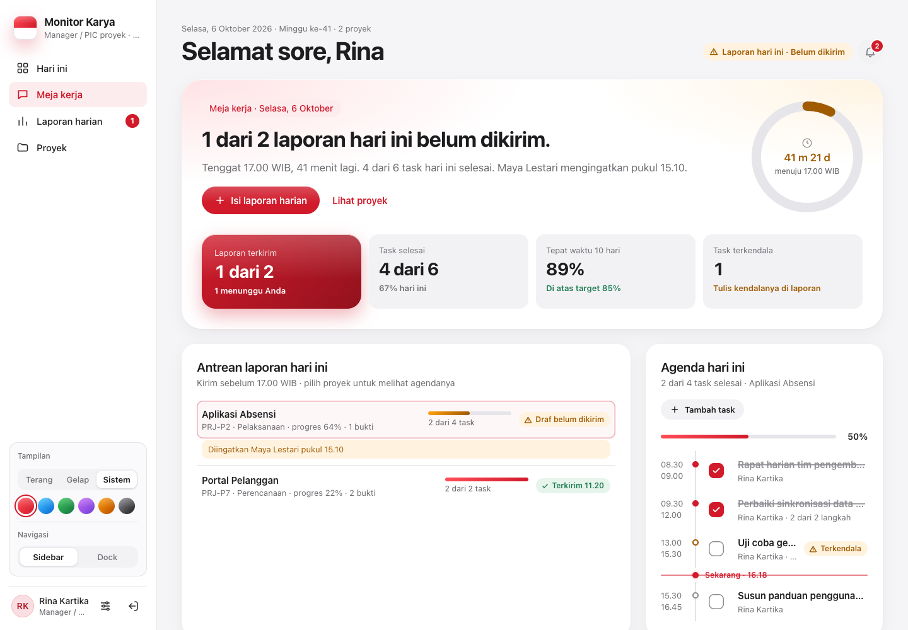
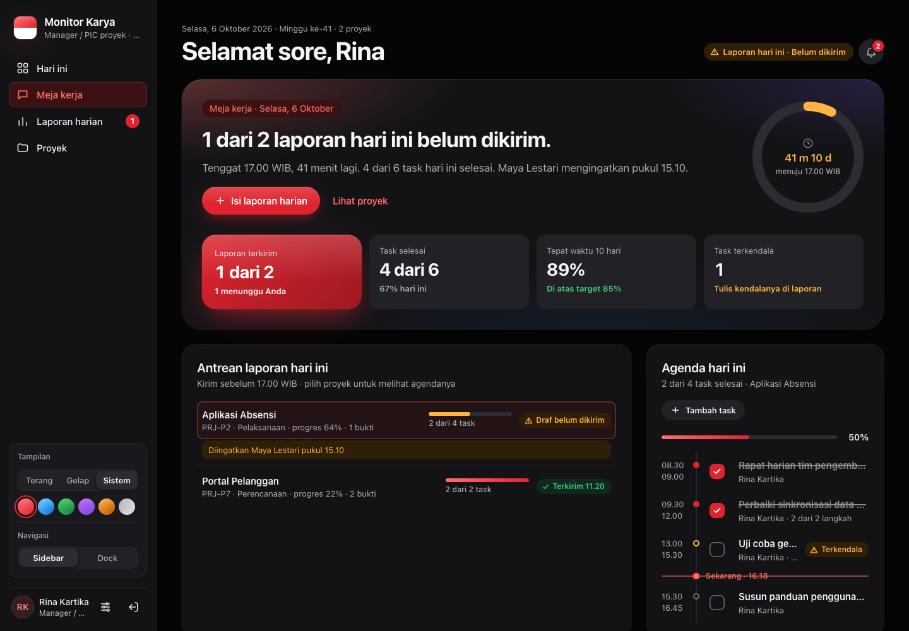
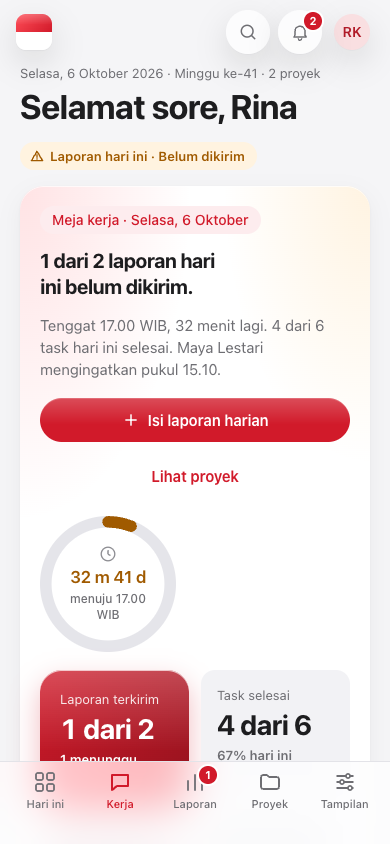
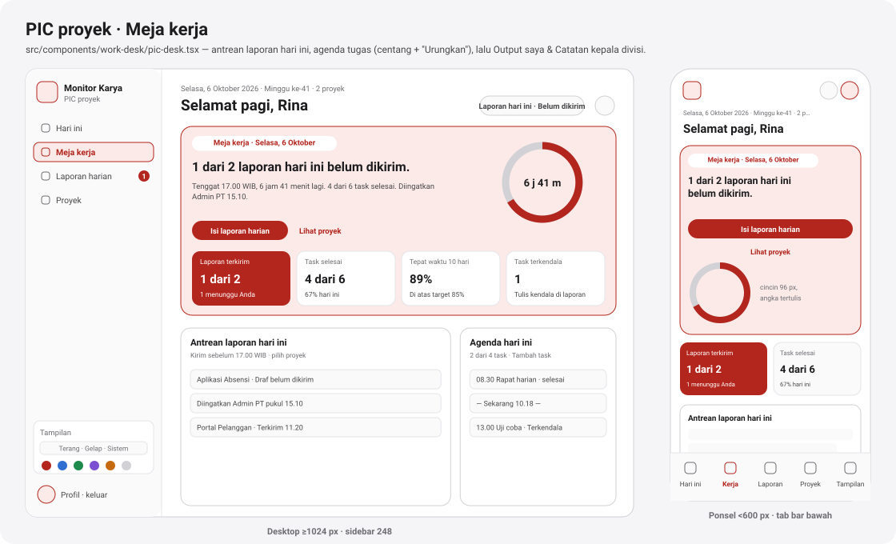
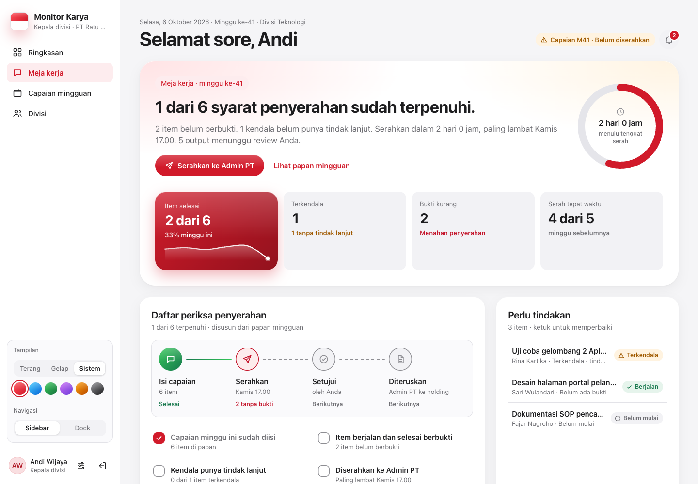
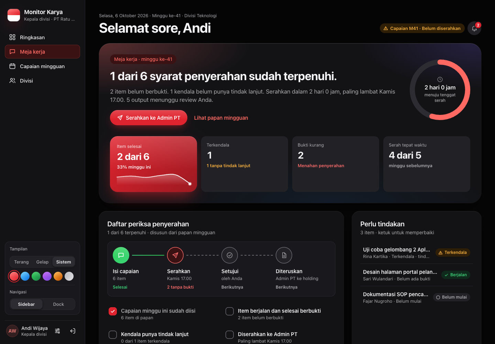
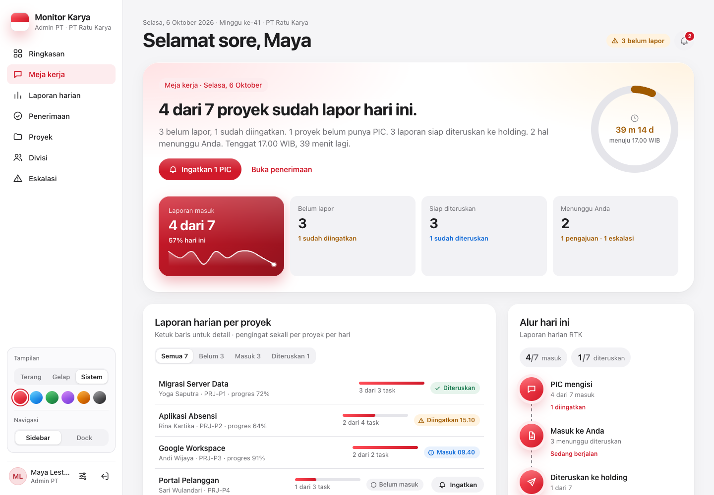
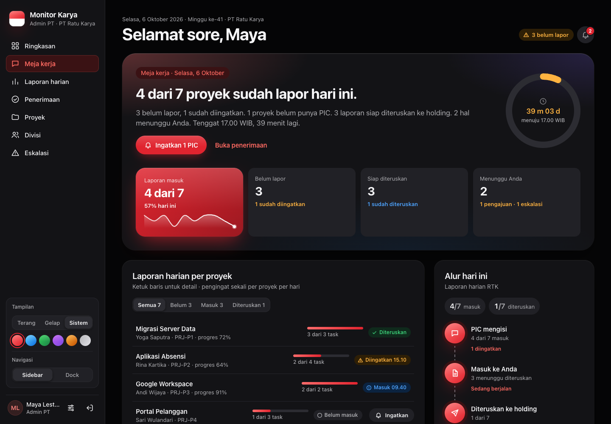
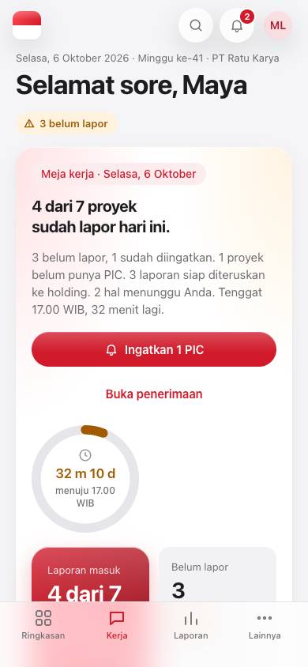

# Meja kerja

[← Indeks](README.md) · Alur: [laporan harian](img/alur-laporan-harian.svg), [capaian mingguan](img/alur-laporan-mingguan.svg)

## Tujuan

Tempat mengerjakan pekerjaan **hari ini**. Ringkasan menjawab "bagaimana keadaannya". Meja kerja menjawab "apa yang harus saya lakukan sekarang". Isinya berbeda per peran, dan akun selalu diambil dari sesi, bukan dari parameter. Satu akun tidak bisa membaca meja akun lain.

| Peran | Komponen | Pertanyaan yang dijawab |
| --- | --- | --- |
| PIC proyek | [`work-desk/pic-desk.tsx`](../../src/components/work-desk/pic-desk.tsx) | Laporan mana yang belum saya kirim, tugas apa yang tersisa hari ini? |
| Kepala divisi | [`work-desk/kadiv-desk.tsx`](../../src/components/work-desk/kadiv-desk.tsx) | Apakah capaian minggu ini siap diserahkan? Siapa di tim yang perlu dibantu? |
| Admin PT | [`work-desk/admin-desk.tsx`](../../src/components/work-desk/admin-desk.tsx) | Siapa yang belum lapor, apa yang siap diteruskan, apa yang menunggu tanda tangan saya? |
| TI, Super Admin | sama dengan Admin PT | Bisa memilih PT |

`WorkDeskView` ([`views/work-desk-view.tsx`](../../src/components/views/work-desk-view.tsx)) memilih komponen dari `kind` di jawaban `GET /api/work-desk`. Bagian bersama (agenda, kartu hitungan, strip riwayat) ada di [`work-desk/parts.tsx`](../../src/components/work-desk/parts.tsx).

## PIC proyek

| Desktop | Desktop gelap | Ponsel |
| --- | --- | --- |
|  |  |  |

Alur:

1. **Hero**: "1 dari 2 laporan hari ini belum dikirim." beserta hitung mundur ke 17.00 WIB dan siapa yang sudah mengingatkan.
2. **Antrean laporan hari ini**: satu baris per proyek aktif dengan status Draf belum dikirim / Terkirim HH.MM. Ketuk proyek untuk melihat agendanya.
3. **Agenda hari ini**: tugas berurutan jam dengan garis "Sekarang". Mencentang tugas memanggil `PUT /api/tasks` (status `SELESAI`) dan menampilkan toast "Urungkan". Field lain tidak ikut berubah, termasuk `picUserId`. "Tambah task" membuka `TaskDialog` (Sheet).
4. **Output saya** dan **Catatan kepala divisi** untuk proyek yang dipilih. Lihat [output-review.md](output-review.md).
5. Riwayat 10 hari kerja dan pengingat yang diterima.
6. **Permintaan persetujuan** (materi, anggaran, cuti) milik sendiri, dengan "Ajukan persetujuan" dan "Tarik permintaan" (Urungkan). Lihat [peran-direktur-manajemen.md](peran-direktur-manajemen.md).
7. **Permintaan akses** (`RequestAccessCard`): untuk diri sendiri atau anggota divisi. Lihat [peran-admin.md](peran-admin.md#fungsi-tambahan-f2-admin).

Laporan harian ter-rollup otomatis dari tugas ([`src/lib/daily-rollup.ts`](../../src/lib/daily-rollup.ts)). Status dan progres laporan diturunkan dari tugas hari itu.

## Kepala divisi

| Desktop | Desktop gelap |
| --- | --- |
|  |  |

Alur:

1. **Hero**: "1 dari 6 syarat penyerahan sudah terpenuhi." dengan cincin waktu menuju tenggat serah dan tombol primer "Serahkan ke Admin PT".
2. **Daftar periksa penyerahan**, disusun dari papan mingguan:
   - capaian sudah diisi;
   - item berjalan/selesai berbukti;
   - kendala punya tindak lanjut;
   - diserahkan ke Admin PT.

   Daftar ini memakai `FlowDiagram`: Isi capaian → Serahkan → Setujui → Diteruskan.
3. **Perlu tindakan**: item terkendala, belum berbukti, atau belum mulai. Ketuk untuk memperbaiki.
4. **Review output**, **Laporan harian tim**, **Beban kerja tim**, **Aktivitas tim**. Lihat [output-review.md](output-review.md) dan [ringkasan.md](ringkasan.md#kepala-divisi).
5. Riwayat capaian 6 minggu terakhir. Papan minggu berjalan dibaca dari `/api/weekly-input`.
6. **Tanggapan direktur** (`WeeklyFeedbackCard`): tanggapan Direktur atas laporan mingguan 8 minggu terakhir, dengan kolom balas (`/api/weekly-comments`).
7. **Permintaan persetujuan** dan **Permintaan akses**, sama seperti di Meja kerja PIC.

Tombol primer hero hanya menampilkan langkah berikutnya: Draf → "Serahkan ke Admin PT"; Menunggu persetujuan → "Setujui laporan"; Disetujui → catatan menunggu Admin PT meneruskan.

Bila server menolak penyerahan, daftar masalahnya (`errors[]` dari 422) tampil di kartu daftar periksa.

## Admin PT

| Desktop | Desktop gelap | Ponsel |
| --- | --- | --- |
|  |  |  |

Alur:

1. **Hero**: "4 dari 7 proyek sudah lapor hari ini." Tombol primer "Ingatkan n PIC" mengingatkan semua PIC yang belum mengirim. Setelah 17.00 WIB tombol terkunci dan cincin menulis "Terkunci · lewat n menit".
2. **Laporan harian per proyek**, dengan saringan Semua / Belum / Masuk / Diteruskan.
   - Status baris: Masuk HH.MM, Belum masuk, Terlambat masuk HH.MM, Diingatkan HH.MM, Diteruskan.
   - Tombol "Ingatkan" per baris (sekali per proyek per hari).
   - Di ponsel tombol turun ke baris sendiri setinggi 44 px.
3. **Alur hari ini**: PIC mengisi → Masuk ke Anda → Diteruskan ke holding, dengan hitungan masing-masing. Penerusan dilakukan di [Penerimaan](penerimaan.md).
4. **Menunggu Anda**:
   - pengajuan proyek yang menunggu slot Admin PT (lihat [proyek.md](proyek.md));
   - eskalasi;
   - **Permintaan akses** dan **Buka kunci** (lihat [permintaan-akses.md](permintaan-akses.md)).
5. Status capaian mingguan per divisi, dan riwayat 10 hari kerja.

Angka masuk/belum/siap diteruskan berasal dari `intake` (`countDailyIntake`), sumber yang sama dengan Ringkasan Admin.

## Aturan bisnis

| Aturan | Di mana |
| --- | --- |
| Pengingat harian PIC paling banyak **sekali per proyek per hari WIB**. Pengingat kedua dijawab 409 "… sudah diingatkan hari ini" dengan `remindedAt`. | `remindPicDaily` di [`src/lib/reminders-pic.ts`](../../src/lib/reminders-pic.ts), dipakai Meja kerja, Sheet kepatuhan Admin, dan pengingat otomatis |
| Setelah 17.00 WIB pengingat ditolak 409 `{ locked: true }`, sebelum proyek dicari | `isDailyLocked` |
| Laporan yang sudah terkirim tidak diingatkan (409). Proyek tanpa PIC aktif → 422. Proyek tidak aktif atau tidak ada → 404. | `remindPicDaily` |
| Admin PT hanya mengingatkan proyek PT-nya (403). Hanya peran `group:read` yang menjangkau semua PT. | gagal-tertutup sejak 6 Okt 2026 |
| Pembatas laju pengingat: 30 per 5 menit per akun | `limitReminders` ([`security.ts`](../../src/lib/security.ts)) |
| Setiap pengingat menulis `NotificationLog` (template `PENGINGAT_HARIAN_PIC`, `tab: 'work-desk'`) dan `AuditLog` (`REMIND_PIC`) | — |
| Mencentang tugas setelah 17.00 hari itu ditolak (kunci harian) | [`tasks/route.ts`](../../src/app/api/tasks/route.ts) |

## Endpoint

| Metode & path | Parameter | Jawaban | Izin |
| --- | --- | --- | --- |
| `GET /api/work-desk` | — | `kind: 'PIC'`: proyek, laporan & tugas hari ini, riwayat 10 hari, pengingat. `kind: 'KADIV'`: riwayat 6 minggu. `kind: 'ADMIN'`: `intake`, proyek, `approvals`, `escalations`, `unlocks`, `history`. | semua peran yang punya tab; Admin/Direktur/Manajemen tanpa PT → 400; PT tidak ada → 404 |
| `POST /api/work-desk` | `{ action: 'remind-pic', projectId }` | `{ ok: true, … }` atau galat di atas (`{ error, remindedAt }`) | `notify:remind` |
| `POST /api/work-desk` | `{ action: 'remind-all-pics' }` | `{ ok: true, sent, skipped }`; proyek yang sudah diingatkan dilewati | `notify:remind`, akun terikat PT |
| `PUT /api/tasks` | `{ id, status, progressPct, subtasks, startTime, endTime, … }` | tugas terbarui + rollup laporan | pemilik proyek (PIC/Admin PT/TI) |
| `GET /api/weekly-input`, `GET /api/kadiv/team`, `GET /api/outputs/review` | lihat [capaian-mingguan.md](capaian-mingguan.md), [output-review.md](output-review.md) | | |

## Tes

[`tests/api/work-desk.test.ts`](../../tests/api/work-desk.test.ts) menguji:

- cakupan per peran: PIC hanya proyeknya, Kadiv hanya divisinya, Admin PT hanya PT-nya;
- 400/404 untuk akun tanpa PT;
- pengingat kedua 409, pengingat kemarin tidak menghalangi;
- 403 di luar PT, kunci 17.00, 422 tanpa PIC;
- `remind-all-pics` melewati yang sudah diingatkan.

## Catatan terbuka

- Belum diuji dengan basis data sungguhan (butir A2 di [`SISA-PEKERJAAN.md`](../SISA-PEKERJAAN.md)).
- Selesai (F1-D): `adminDesk` kini hanya membaca pengingat ke PIC proyek PT-nya, dan pengingat manual serta otomatis memakai satu fungsi (`remindPicDaily`).
