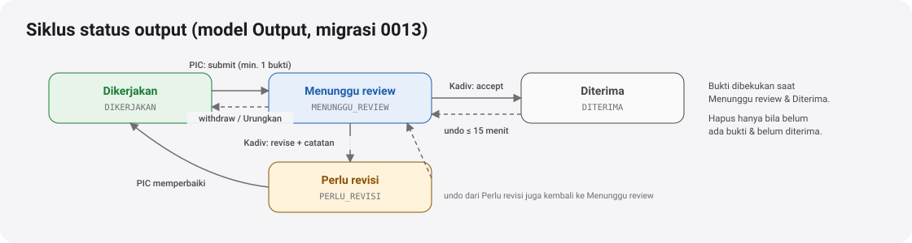

# Output, review, catatan, tahapan, dan usulan tenggat

[← Indeks](README.md) · Spesifikasi: [`05-pic-proyek.md`](../design/peran/05-pic-proyek.md), [`03-kepala-divisi.md`](../design/peran/03-kepala-divisi.md), [`02-direktur.md`](../design/peran/02-direktur.md)

Fitur 6 Oktober 2026 yang membuat pemantauan **berbasis output**:

- PIC mengirim hasil kerja beserta bukti.
- Kepala divisi menerima atau meminta revisi.
- Keduanya bercakap per proyek.
- Proyek punya tahapan bertanggal.
- Pergeseran tenggat diajukan dan diputuskan secara resmi.

> Bergantung pada migrasi **0013** (`Output`), **0014** (`ProjectNote`, `ProjectStage`, `DeadlineProposal`), dan **0015** (`divisionId`). Sampai migrasi itu diterapkan, semua route di halaman ini menjawab 500 di lingkungan sungguhan.

## Siapa terkait dengan sebuah proyek

[`src/lib/pic-access.ts`](../../src/lib/pic-access.ts) → `relationTo(user, project)` memberi satu relasi:

| Relasi | Siapa | Dipakai untuk |
| --- | --- | --- |
| `PIC` | `Project.picUserId` | tulis output, tahapan, usulan tenggat, catatan |
| `KADIV` | kepala divisi aktif di PT proyek (lihat catatan terbuka) | review output, catatan |
| `ADMIN` | Admin PT di PT yang sama | tulis atas nama PIC, catatan |
| `MASTER` | TI, Super Admin | semua |
| `VIEWER` | peran pengawas dalam cakupan entitasnya | baca |

Kelompok relasi: `READ_RELATIONS` (semua), `PIC_WRITE_RELATIONS` (PIC, ADMIN, MASTER), `NOTE_RELATIONS` (PIC, KADIV, ADMIN), dan `REVIEW_RELATIONS` (KADIV, MASTER). Semua route memakai `guardProjectAccess`.

## Output saya (PIC) dan review output (kepala divisi)

**Alur PIC** (`src/components/pic/outputs.tsx`):

1. Kartu **Output saya** berisi chip saring dengan hitungan per status dan 7 output terdekat tenggatnya.
2. "Tambah output" membuat output dengan judul, deskripsi, dan target tanggal.
3. "Unggah bukti" di baris mengunggah berkas lalu langsung mengirim untuk review. Toast "Urungkan" menjalankan `withdraw`.
4. Sheet output memuat:
   - catatan revisi;
   - daftar bukti (buka, hapus dengan konfirmasi);
   - area seret-lepas dan cadangan tautan;
   - "Tanya kepala divisi", yang mengisi kotak balasan Catatan;
   - "Unggah bukti & kirim" atau "Kirim untuk review". Selama menunggu, tombol menjadi "Menunggu review" yang nonaktif.

**Alur kepala divisi** (`src/components/kadiv/review-card.tsx`):

1. Kartu **Output menunggu review** berisi chip per proyek dan satu baris per output: pemilik, umur, proyek, jumlah berkas.
2. "Terima" langsung menerima. Toast "Urungkan" bisa dipakai dalam 15 menit.
3. "Minta revisi" membuka isian catatan (wajib, minimal 5 huruf).
4. "Terima semua" menerima seluruh antrean, atau proyek terpilih.
5. Output yang diterima langsung menaikkan angka hero, cincin Output, dan KPI.

**Aturan:**

- `submit` wajib minimal 1 bukti (`Evidence.targetType = 'OUTPUT'`).
- Bukti dibekukan selama `MENUNGGU_REVIEW` dan setelah `DITERIMA`.
- Hapus output hanya bila belum ada bukti dan belum direview atau diterima.
- Perubahan status dijaga dari dua klik bersamaan: update bersyarat pada status lama, kalah → 409.
- Setiap perubahan menulis `AuditLog` dan notifikasi dalam aplikasi (template `REVIEW_OUTPUT` ke PIC).
- Kepala divisi hanya bisa memutuskan output pada proyek divisi yang ia pimpin, baik lewat `/api/outputs/review` maupun `PATCH /api/outputs` (sebaliknya 403).

| Metode & path | Parameter | Jawaban | Izin |
| --- | --- | --- | --- |
| `GET /api/outputs` | `?projectId&status` (tanpa `projectId`: semua proyek dalam cakupan) | output + hitungan per status + jumlah bukti | `READ_RELATIONS` |
| `POST /api/outputs` | `{ projectId, title, description?, dueDate? }` | output baru (`DIKERJAKAN`) | `PIC_WRITE_RELATIONS` |
| `PATCH /api/outputs` | `{ id, action: 'update', title?, description?, dueDate? }` | terbarui | PIC, Admin PT |
| `PATCH /api/outputs` | `{ id, action: 'submit' }` | `MENUNGGU_REVIEW` | PIC, Admin PT; ≥ 1 bukti |
| `PATCH /api/outputs` | `{ id, action: 'withdraw' }` | kembali `DIKERJAKAN` selama belum direview | PIC, Admin PT |
| `PATCH /api/outputs` | `{ id, action: 'accept' \| 'revise', note? }` | `DITERIMA` / `PERLU_REVISI` (catatan wajib) | kepala divisi proyek itu, TI/Super Admin |
| `DELETE /api/outputs` | `?id=` | dihapus | PIC, Admin PT; tanpa bukti, belum diterima |
| `GET /api/outputs/review` | `?divisionId=` | antrean `MENUNGGU_REVIEW` divisi yang dipimpin + keputusan Anda 24 jam terakhir | kepala divisi |
| `POST /api/outputs/review` | `{ action: 'accept', id }` · `{ action: 'revise', id, note }` · `{ action: 'accept-all', ids?, projectId?, divisionId? }` · `{ action: 'undo', ids }` | hasil keputusan | kepala divisi; `undo` hanya keputusan sendiri ≤ 15 menit |

## Catatan kepala divisi

Percakapan PIC ↔ kepala divisi per proyek (`src/components/pic/notes.tsx`; di sisi kepala divisi lewat `member-sheet.tsx`).

**Alur:**

1. Kartu menampilkan gelembung chat lama → baru, maksimal 100 terakhir.
2. Kotak balasan mengirim dengan Enter. Di ponsel kotak menempel di atas tab bar.
3. Membuka kartu menandai catatan pihak lain sebagai dibaca.
4. Jumlah belum dibaca muncul di kartu dan KPI.

| Metode & path | Parameter | Jawaban | Izin |
| --- | --- | --- | --- |
| `GET /api/project-notes` | `?projectId=` | percakapan + jumlah belum dibaca + nama kepala divisi | `NOTE_RELATIONS` |
| `GET /api/project-notes` | `?unread=1` | total belum dibaca di semua proyek akun | — |
| `POST /api/project-notes` | `{ projectId, body }` | catatan baru + notifikasi ke peserta lain | `NOTE_RELATIONS` |
| `PATCH /api/project-notes` | `{ projectId }` | tandai dibaca semua catatan pihak lain | `NOTE_RELATIONS` |

## Tahapan proyek

Tahapan bertanggal menggantikan 4 fase tetap di layar PIC (`src/components/pic/stages.tsx`).

**Tampilan:**

- `FlowDiagram` vertikal bertanggal dengan status per tahap: Belum mulai, Berjalan, Tertahan, Selesai.
- Ringkasan "3 dari 6 tahap selesai".
- Sheet "Atur tahapan" untuk tambah, ubah, urutkan ulang, dan hapus.
- Tanpa tahapan, kartu kembali ke 4 fase tetap.

**Aturan:**

- Tanggal dikirim "YYYY-MM-DD" (WIB). Tanggal mustahil ditolak.
- Tanggal selesai tidak boleh sebelum tanggal mulai.
- Status `TERTAHAN` wajib disertai catatan, supaya alasannya tampil di diagram.

| Metode & path | Parameter | Izin |
| --- | --- | --- |
| `GET /api/project-stages` | `?projectId=` → tahapan + ringkasan | `READ_RELATIONS` |
| `POST /api/project-stages` | `{ projectId, name, startDate?, dueDate?, status?, note? }` | `PIC_WRITE_RELATIONS` |
| `PUT /api/project-stages` | `{ id, …kolom yang diubah }` | sama |
| `PATCH /api/project-stages` | `{ projectId, order: [id, …] }` | sama |
| `DELETE /api/project-stages` | `?id=` | sama |

## Usulan geser tenggat

"Rilis 24 Okt · usul 31 Okt" (`src/components/pic/stages.tsx` sisi PIC, [`oversight/deadline-decisions.tsx`](../../src/components/oversight/deadline-decisions.tsx) sisi pemutus).

**Alur:**

1. PIC, atau Admin PT atas namanya, mengajukan tanggal baru beserta alasan. Blok tenggat menulis "usul X · sedang ditinjau".
2. Hanya **satu usulan terbuka per proyek**.
3. Pengaju bisa "Tarik usulan", dengan toast "Urungkan".
4. Pemutus melihat `ApprovalItem` di Ringkasan. "Setujui" langsung menyetujui. "Tolak" membuka Sheet yang mewajibkan alasan.
5. Disetujui → `Project.targetEndDate` ikut berubah dalam transaksi yang sama, dan `previousDate` menyimpan tenggat lama.
6. Butir yang sudah diputuskan tetap tampil di daftar, diredupkan dengan lencananya. Dashboard tidak dimuat ulang.

**Pemutus** (`canDecideDeadline`): Direktur entitas (dalam cakupan), Manajemen, Super Admin. Usulan sendiri tidak tampil untuk diputuskan. Direktur entitas mendapat notifikasi saat ada usulan baru.

| Metode & path | Parameter | Izin |
| --- | --- | --- |
| `GET /api/deadline-proposals` | `?projectId=` riwayat · `?status=DIAJUKAN` antrean pemutus | relasi proyek / pemutus |
| `POST /api/deadline-proposals` | `{ projectId, proposedDate: "YYYY-MM-DD", reason }` | PIC, Admin PT |
| `PATCH /api/deadline-proposals` | `{ id, action: 'approve' \| 'reject' \| 'withdraw', note? }` | approve/reject: pemutus (tolak wajib `note`); withdraw: pengaju |

## Berkas kode utama

| Lapisan | Berkas |
| --- | --- |
| UI PIC | [`src/components/pic/`](../../src/components/pic/): `outputs.tsx`, `notes.tsx`, `stages.tsx`, `api.ts`, `nav-badges.ts`; CSS [`app/css/pic.css`](../../src/app/css/pic.css) |
| UI kepala divisi | [`src/components/kadiv/`](../../src/components/kadiv/): `review-card.tsx`, `team-cards.tsx`, `member-sheet.tsx`, `members-sheet.tsx`, `use-kadiv.ts` |
| API | [`api/outputs`](../../src/app/api/outputs/route.ts), [`api/outputs/review`](../../src/app/api/outputs/review/route.ts), [`api/project-notes`](../../src/app/api/project-notes/route.ts), [`api/project-stages`](../../src/app/api/project-stages/route.ts), [`api/deadline-proposals`](../../src/app/api/deadline-proposals/route.ts) |
| Aturan | [`lib/pic-access.ts`](../../src/lib/pic-access.ts), [`lib/kadiv.ts`](../../src/lib/kadiv.ts), [`lib/evidence-access.ts`](../../src/lib/evidence-access.ts) |
| Data contoh | [`preview/mock-pic.ts`](../../src/components/preview/mock-pic.ts), [`preview/mock-kadiv.ts`](../../src/components/preview/mock-kadiv.ts) |

## Catatan terbuka

- **Selesai [F1-D] — relasi `KADIV` per divisi.** `relationTo` (src/lib/pic-access.ts) hanya mengaitkan kepala divisi dengan proyek divisinya: `Project.divisionId`, lalu divisi PIC (`User.divisionId`), lalu divisi yang dipimpin PIC. Berlaku untuk catatan, baca, hitungan belum dibaca, dan penerima notifikasi catatan.
- **Selesai [F1-D] — status baca per akun.** Tabel `NoteRead` (migrasi 0019) menggantikan `ProjectNote.readAt` tunggal. `readAt` lama tetap dibaca: catatan sebelum 0019 yang sudah bertanda dianggap dibaca semua pihak. Respons tetap memuat `readAt` (untuk catatan pihak lain = kapan Anda membacanya; untuk catatan Anda = kapan pertama dibaca pihak lain) dan `readCount`.
- **Selesai [F1-D] — riwayat revisi.** Setiap "Minta revisi" disimpan di `OutputRevision` (migrasi 0019). Mengurungkan permintaan revisi memulihkan catatan putaran sebelumnya; riwayat dibaca lewat `GET /api/outputs?id=&history=1`. Migrasi 0019 belum diterapkan ke basis data; sebelum itu pencatatan riwayat gagal tanpa menggagalkan keputusan.
- **Unggah bukti** butuh `SUPABASE_SERVICE_ROLE_KEY`. Tanpa kunci ini server menjawab 503, dan Sheet menawarkan "Tambah tautan bukti".
- **Selesai (F2-DIREKTUR):** `ProjectSheet` pengawas punya "Kirim catatan ke PIC" (`/api/project-notes`, akses `guardNoteAccess`) dan "Tandai sudah ditinjau" (`/api/project-reviews`, Urungkan 15 menit), serta tahapan bertanggal dari `ProjectStage`.
- **Selesai (F4-B):** kartu review kepala divisi memakai tombol per baris sekunder (`approveVariant="secondary"`); hanya "Terima semua" yang primer.
- **Jenis bukti** di kartu review ditulis sebagai jumlah berkas ("2 berkas"), belum per jenis.
