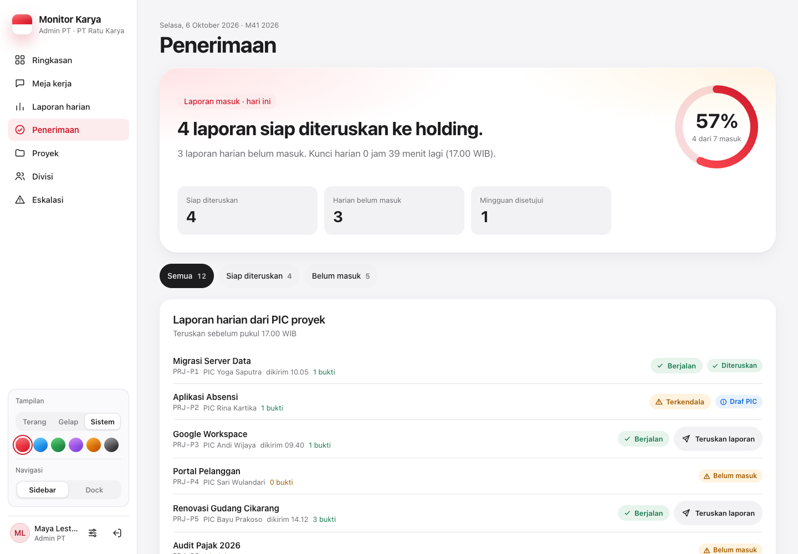
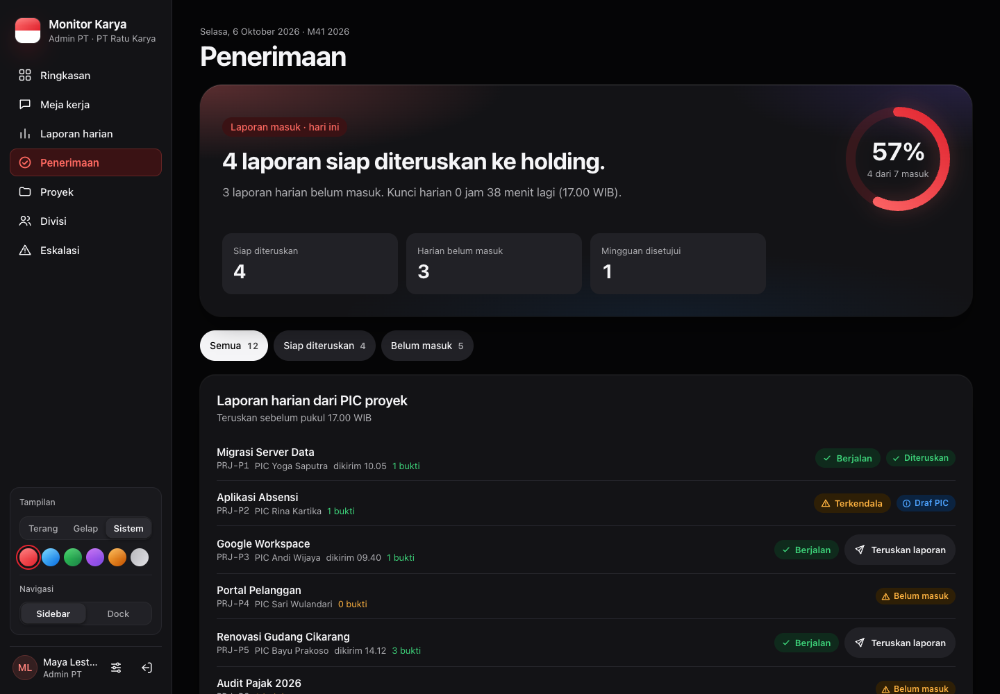
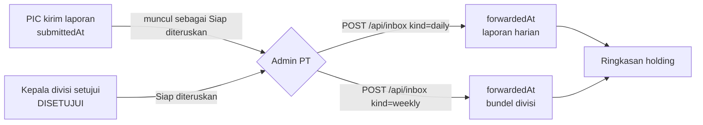

# Penerimaan (meja terima Admin PT)

[← Indeks](README.md) · Spesifikasi: [`04-admin-pt.md`](../design/peran/04-admin-pt.md)

## Tujuan

Admin PT memeriksa apa yang masuk dari PIC (laporan harian) dan dari kepala divisi (capaian mingguan), lalu meneruskannya ke holding sebelum tenggat. Satu kalimat di atas layar menjawab "n laporan siap diteruskan ke holding."

| Desktop terang | Desktop gelap |
| --- | --- |
|  |  |

## Siapa memakai

| Peran | Cakupan |
| --- | --- |
| Admin PT | PT-nya sendiri (`daily:forward`, `weekly:forward`) |
| TI, Super Admin | Semua PT sekaligus |
| Peran lain | 403 "Peran Anda tidak menerima penerusan" |

## Alur langkah demi langkah

1. **Buka tab Penerimaan.** Isinya:
   - `PageHeader`;
   - `Hero` dengan `ProgressRing` laporan harian yang masuk hari ini;
   - 3 `StatTile`.
2. **Saring** dengan chip Semua, Siap diteruskan, atau Belum masuk.
3. **Laporan harian hari ini.**
   - Satu baris per proyek aktif dengan `StatusBadge`.
   - Baris yang sudah dikirim PIC dan belum diteruskan bertanda "Siap diteruskan" dan punya tombol sekunder "Teruskan laporan".
   - Tombol primer kartu hanya satu, sesuai aturan desain.
4. **Capaian mingguan minggu ini.**
   - Satu baris per divisi.
   - Hanya bundel yang sudah `DISETUJUI` kepala divisi yang bisa "Teruskan capaian".
   - Subjudul memuat tenggat serah dan waktu kunci.
5. **Teruskan.** `POST /api/inbox` mengisi `forwardedById` dan `forwardedAt`, menulis `AuditLog`, lalu menampilkan toast dengan "Urungkan" (15 menit).
   - Laporan harian juga diberi `isLocked` dan `lockedAt`, sehingga mesin buka kunci yang sama berlaku.
   - Sejak itu laporan **dibekukan**: PIC atau kepala divisi tidak bisa mengubah, mengirim ulang, atau menghapusnya (409) tanpa buka kunci yang disetujui dan dijalankan.
   - PIC melihat "Diteruskan ke holding".
   - Pengawas melihat laporan di Ringkasan.

## Aturan bisnis

**Laporan harian.**

- Bisa diteruskan bila `submittedAt` terisi dan `forwardedAt` masih kosong.
- PIC belum mengirim → 422 "PIC belum mengirimkan laporan ini".
- Sudah diteruskan → 409. Penulisan bersyarat (`updateMany` dengan `forwardedAt: null`), jadi dua klik bersamaan menghasilkan satu penerusan dan satu 409.

**Capaian mingguan.**

- Bisa diteruskan bila `statusHeader = DISETUJUI` dan `forwardedAt` masih kosong.
- Belum disetujui → 422 "Kepala divisi belum menyetujui laporan ini".
- Sudah diteruskan → 409 "Laporan ini sudah diteruskan". Penulisan bersyarat `where: { id, forwardedAt: null, statusHeader: 'DISETUJUI' }`; dulu klik ganda bisa meneruskan dua kali (diperbaiki F3-D, dites di `tests/api/admin-inbox.test.ts`).

**Cakupan.** Gagal-tertutup: selain TI/Super Admin, PT laporan harus sama dengan PT akun (403 "Laporan ini di luar entitas Anda"). Akun berlingkup tanpa PT → 400.

**Tenggat.**

| Laporan | Tenggat penerusan | Rujukan |
| --- | --- | --- |
| Harian | sebelum laporan hari itu terkunci pukul 17.00 WIB | [laporan-harian.md](laporan-harian.md) |
| Mingguan | sebelum kunci Jumat 17.00 WIB | [capaian-mingguan.md](capaian-mingguan.md) |

## Endpoint

| Metode & path | Parameter | Jawaban | Izin |
| --- | --- | --- | --- |
| `GET /api/inbox` | — | dua aliran untuk hari/minggu berjalan. Harian: `reportId`, `submittedAt`, `forwardedAt`, `readyToForward`. Mingguan: status header, `forwardedAt`, `readyToForward`, plus `week.handoverBy` dan `week.lockAt`. | `daily:forward` atau `weekly:forward` |
| `POST /api/inbox` | `{ kind: 'daily' \| 'weekly', id }` | laporan yang diteruskan | `daily:forward` / `weekly:forward` + PT yang sama |

## Berkas kode utama

- [`src/components/views/inbox-view.tsx`](../../src/components/views/inbox-view.tsx), CSS di [`app/css/weekly.css`](../../src/app/css/weekly.css)
- [`src/app/api/inbox/route.ts`](../../src/app/api/inbox/route.ts)
- Angka "masuk/siap diteruskan" di Meja kerja dan Ringkasan: [`src/lib/daily-intake.ts`](../../src/lib/daily-intake.ts)

## Catatan terbuka

- Penerusan bisa diurungkan 15 menit oleh Admin PT yang sama lewat toast "Urungkan" (lihat [urungkan.md](urungkan.md)), kecuali pelapor sudah mengajukan buka kunci atas laporan itu. Mengurungkan penerusan harian juga memulihkan `isLocked`/`lockedAt`.
- Data contoh `/pratinjau` untuk `/api/inbox` ada di `src/components/preview/mock-laporan.ts` (F3-A).
- Belum dicoba dengan basis data sungguhan.
