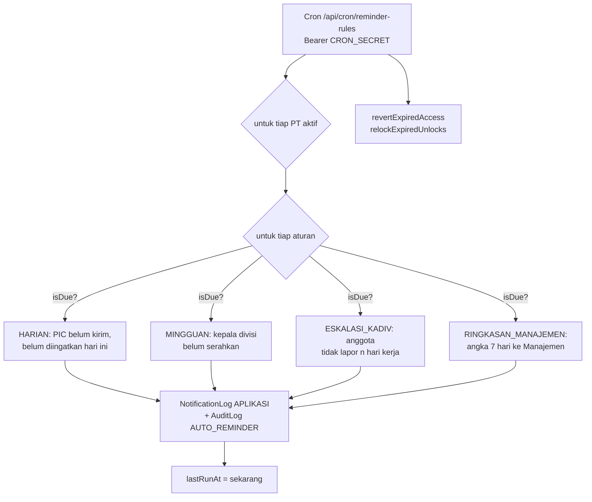

# Pengingat dan notifikasi

[← Indeks](README.md) · Spesifikasi: [`04-admin-pt.md`](../design/peran/04-admin-pt.md)

## Tujuan

Mengingatkan orang yang belum melapor **sebelum** tenggat, tanpa membanjiri mereka. Prinsip utamanya: **satu orang tidak diingatkan dua kali untuk hal yang sama di hari yang sama**, baik oleh tombol manual maupun oleh pengingat otomatis. Keduanya memakai templat dan pemeriksaan yang sama.

## Jenis pengingat

| Pengingat | Pemicu | Penerima | Templat | Sekali sehari per |
| --- | --- | --- | --- | --- |
| Ingatkan PIC (manual) | Admin PT di Meja kerja: `POST /api/work-desk` `remind-pic` / `remind-all-pics` | PIC proyek yang belum mengirim | `PENGINGAT_HARIAN_PIC` | proyek |
| Ingatkan anggota (manual) | Kepala divisi: `POST /api/kadiv/team` `{ action: 'remind', userId? }` | anggota yang belum mengirim (yang cuti dilewati) | `PENGINGAT_HARIAN_PIC` | proyek |
| Ingatkan divisi (manual) | Admin PT / Direktur: `POST /api/notifications/remind` | kepala divisi yang belum menyerahkan capaian minggu berjalan | `PENGINGAT_MINGGUAN_DIVISI` | kepala + divisi |
| Cron mingguan | Vercel Cron `/api/cron/remind-divisions`, `0 2 * * 1-5` (09.00 WIB, Senin–Jumat) | sama dengan baris di atas, semua PT | `PENGINGAT_MINGGUAN_DIVISI` | kepala + divisi |
| Pengingat otomatis harian | cron `/api/cron/reminder-rules`, aturan `HARIAN` (bawaan 16.30 WIB, hari kerja) | PIC yang belum mengirim | `PENGINGAT_HARIAN_PIC` | proyek |
| Pengingat otomatis mingguan | aturan `MINGGUAN` (bawaan Jumat 13.00 WIB) | kepala divisi yang belum menyerahkan | `PENGINGAT_MINGGUAN_DIVISI` | kepala + divisi |
| Eskalasi ke kepala divisi | aturan `ESKALASI_KADIV` (bawaan 09.00 WIB, setelah 2 hari kerja tidak lapor) | kepala divisi orang itu | `ESKALASI_KADIV_HARIAN` | kepala |
| Ringkasan manajemen | aturan `RINGKASAN_MANAJEMEN` (bawaan **mati**, Senin 08.00 WIB) | akun Manajemen aktif | `RINGKASAN_MANAJEMEN` | penerima + PT |

Pesan PIC berbunyi seperti "… Tenggat pukul 17.00 WIB." Teks jamnya diambil dari `DAILY_CUTOFF_LABEL`. Kesalahan lama "17.00 WIB WIB" sudah diperbaiki di tiga tempat.

## Pengingat otomatis per PT

Kartu "Pengingat otomatis" (`src/components/admin/reminder-rules-card.tsx`) menampilkan 4 sakelar per PT, dengan jam dan hari yang bisa diubah.

**Siapa boleh mengubah:**

| Peran | Cakupan |
| --- | --- |
| Admin PT | PT-nya sendiri |
| TI, Super Admin | PT mana pun |

**Cara kerja:**

- **Nilai bawaan.** Baris yang belum ada di tabel `ReminderRule` berarti nilai bawaan (`REMINDER_DEFAULTS` di [`src/lib/admin-meta.ts`](../../src/lib/admin-meta.ts)).
- **Perubahan** berlaku seketika dan ditulis ke `AuditLog` (`UPDATE_REMINDER_RULE`) dengan kalimat "<nama> mematikan pengingat laporan harian". Sakelar punya toast "Urungkan".
- **Jatuh tempo** (`isDue`) bila semua syarat ini terpenuhi:
  - aturan menyala;
  - harinya cocok (atau hari kerja bila `weekday` kosong);
  - jamnya sudah lewat;
  - `lastRunAt` sebelum hari ini.

  Aturan bersifat **menyusul**: cron boleh jalan kapan saja setelah jamnya, tetapi tiap aturan tetap paling banyak sekali sehari per PT.
- **Setelah 17.00 WIB** pengingat harian tidak dikirim.
- **Cron mingguan lama** (`remind-divisions`) melewati PT yang mematikan pengingat mingguannya. Bila tabel `ReminderRule` belum ada (0016 belum diterapkan), cron itu kembali ke perilaku lama dan tidak gagal.

## Notifikasi dalam aplikasi

Semua pengingat dan pemberitahuan keputusan ditulis ke `NotificationLog` dengan `channel = 'APLIKASI'`.

**Payload** berupa JSON `{ title, body, tab? }`. Mengklik notifikasi menutup popover, pindah ke `tab` itu (misalnya `work-desk`), lalu menggulir ke atas.

**Lonceng** ada di header dashboard, bar atas, dan Dock. Lonceng membaca `GET /api/notifications?inbox=1`, yaitu 30 pesan terakhir dan jumlah belum dibaca. Semua lonceng diperbarui serentak lewat event `mk:notifikasi-berubah`, plus polling 60 detik.

**Tandai dibaca:** `PATCH /api/notifications` `{ ids }` atau `{ all: true }`. Hanya pesan milik sendiri.

Saluran `EMAIL` dan `WHATSAPP` ada di skema, tetapi belum dipakai.

## Endpoint

| Metode & path | Parameter | Jawaban | Izin |
| --- | --- | --- | --- |
| `GET /api/admin/reminder-rules` | `?entityId=` | 4 aturan PT, dengan pengubah terakhir | Admin PT (PT sendiri), TI/Super Admin |
| `PATCH /api/admin/reminder-rules` | `{ kind, enabled?, time?: "HH:MM", weekday?: 1–7 \| null, days?, entityId? }` | aturan terbarui | sama |
| `GET /api/cron/reminder-rules` | header `Authorization: Bearer <CRON_SECRET>` | `{ ok, ran[], expiredAccess, relocked }` | rahasia cron |
| `GET /api/cron/remind-divisions` | header `Authorization: Bearer <CRON_SECRET>` | hasil pengingat mingguan | rahasia cron |
| `GET /api/notifications/remind` | `?entityId=` | divisi yang belum menyerahkan minggu ini | `notify:remind` |
| `POST /api/notifications/remind` | `{ entityId? }` | pengingat terkirim | `notify:remind`; 30 per 5 menit |
| `POST /api/kadiv/team` | `{ action: 'remind', userId?, divisionId? }` | pengingat ke anggota | kepala divisi itu; 30 per 5 menit |
| `GET /api/notifications` | `?inbox=1` · atau `?channel&status&template&page&pageSize` | pesan sendiri · log pengiriman | sendiri; log grup untuk peran grup |
| `PATCH /api/notifications` | `{ ids?: string[], all?: true }` | ditandai dibaca | sendiri |

Cron tanpa `CRON_SECRET`, atau dengan rahasia kurang dari 16 karakter, dijawab 503. Rahasia yang salah dijawab 401. Perbandingannya waktu-konstan ([`src/lib/cron-auth.ts`](../../src/lib/cron-auth.ts)).

## Berkas kode utama

- [`src/lib/reminder-rules.ts`](../../src/lib/reminder-rules.ts), [`src/lib/reminders.ts`](../../src/lib/reminders.ts), [`src/lib/kadiv.ts`](../../src/lib/kadiv.ts) (`remindTeam`), [`src/lib/admin-meta.ts`](../../src/lib/admin-meta.ts)
- [`src/app/api/cron/`](../../src/app/api/cron/), [`src/app/api/admin/reminder-rules/route.ts`](../../src/app/api/admin/reminder-rules/route.ts), [`src/app/api/notifications/`](../../src/app/api/notifications/), [`src/app/api/work-desk/route.ts`](../../src/app/api/work-desk/route.ts)
- UI: [`admin/reminder-rules-card.tsx`](../../src/components/admin/reminder-rules-card.tsx), lonceng di [`shell.tsx`](../../src/components/shell.tsx)
- Jadwal: [`deploy/app-vps/cron.sh`](../../deploy/app-vps/cron.sh) (VPS; `vercel.json` tidak berlaku lagi)

## Catatan terbuka

- **`/api/cron/reminder-rules` belum dijadwalkan** di `vercel.json`. Usul jadwal: `*/30 0-11 * * 1-5` (UTC), tiap 30 menit di jam kerja WIB. Jadwal ini butuh paket Vercel yang mengizinkan cron lebih dari sekali sehari. Sampai dijadwalkan, sakelar tersimpan dan tercatat, tetapi hanya cron mingguan 09.00 yang bertindak, dan itu pun hanya untuk sakelar mingguan.
- **Selesai [F1-D]:** aturan otomatis berjalan untuk semua PT aktif dan `UNIT`/`SUB_HOLDING` yang punya proyek aktif atau divisi aktif (`reportingEntities` di `reminder-rules.ts`).
- **Selesai [F1-D]:** eskalasi otomatis memakai kepala divisi proyek (`Project.divisionId`) dulu, baru divisi PIC; PIC tanpa `divisionId` tidak lagi terlewat bila proyeknya punya divisi.
- **"Ingatkan" di layar Direktur** mengingatkan semua divisi PT yang belum menyerahkan minggu berjalan, bukan satu divisi untuk minggu laporan yang tampil ([`lib/reminders.ts`](../../src/lib/reminders.ts)).
- **Selesai [F1-D]:** pengingat harian PIC manual dan otomatis memakai satu fungsi, `remindPicDaily` di [`src/lib/reminders-pic.ts`](../../src/lib/reminders-pic.ts). Meja kerja Admin PT hanya membaca pengingat ke PIC proyek PT-nya.
- **KPI harian [F1-D]:** `/api/cron/kpi-snapshot` memperbarui `KpiSnapshot` BULANAN per entitas pelapor setiap hari (17.30 WIB lewat `deploy/app-vps/cron.sh`). Rumus di [`src/lib/kpi-math.ts`](../../src/lib/kpi-math.ts).
- **Ingatkan per orang** belum ada di Sheet kepatuhan divisi (Admin PT), karena API pengingat bekerja per proyek.
