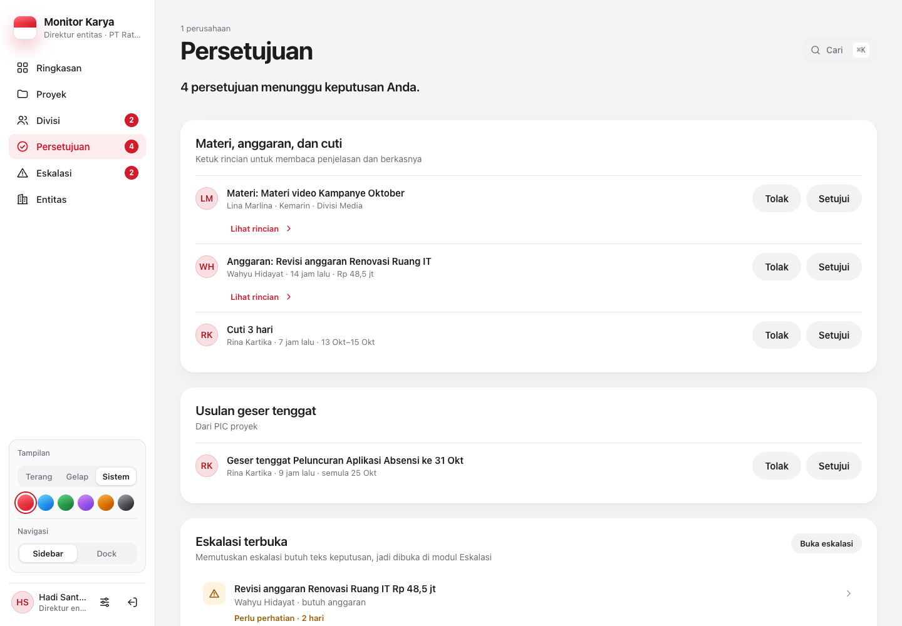
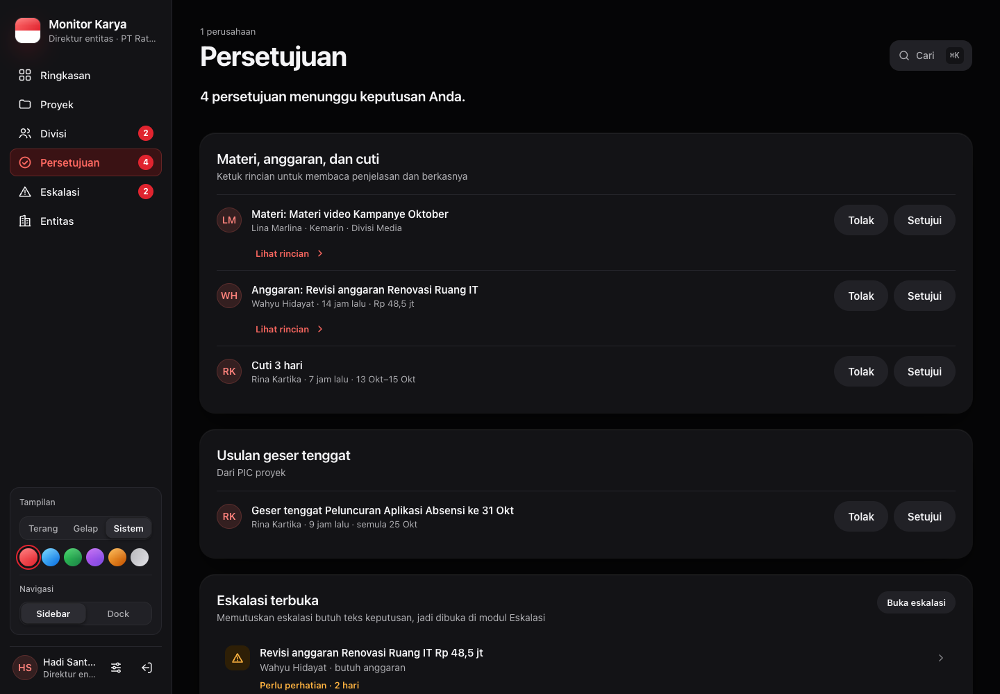

# Peran Direktur dan Manajemen: fungsi dan status implementasi

Spesifikasi layar: [`01-manajemen.md`](../design/peran/01-manajemen.md) dan [`02-direktur.md`](../design/peran/02-direktur.md). Dokumen ini mencatat apa yang sudah dibangun untuk setiap butir spesifikasi, endpoint yang dipakai, dan aturan aksesnya. Pembaruan terakhir: 6 Oktober 2026, fase F2. Wilayah skemanya `[F2-DIREKTUR]` dan migrasinya `0023_oversight_more`.

> **Migrasi 0023 belum diterapkan** ke basis data. Sampai migrasi diterapkan, endpoint baru menjawab bacaan dengan daftar kosong ditambah `pendingMigration: true`, dan menjawab tulisan dengan 503 "Fitur ini menunggu pembaruan basis data. Hubungi Tim TI." Dasbor tetap tampil tanpa bagian yang memakai tabel baru. Semua uji memakai basis data tiruan (mock); belum ada yang diuji dengan basis data sungguhan.

| Persetujuan (Direktur) | Persetujuan, tema gelap |
| --- | --- |
|  |  |

## Siapa yang boleh apa

Aturan ada di `src/lib/oversight-shared.ts` (dipakai klien dan server) dan `src/lib/oversight.ts` (khusus server).

| Fungsi | Peran | Cakupan |
| --- | --- | --- |
| Membaca, menandai dibaca, dan menanggapi laporan mingguan divisi | Manajemen, Direktur entitas, Direksi holding (`DIREKTUR_SDM_GA`), Super Admin | PT dalam `scopeEntityIds` |
| Membalas tanggapan | Kepala divisi pemilik laporan | divisi yang dipimpinnya |
| Membaca tanggapan saja | Admin PT di PT laporan, TI | |
| Tandai proyek sudah ditinjau, kirim catatan ke PIC dari detail proyek | Manajemen, Direktur entitas, Direksi holding, Super Admin, TI | proyek dalam cakupan (`guardProjectAccess`) |
| Mengajukan persetujuan materi, anggaran, atau cuti | Kepala divisi (untuk divisinya), PIC proyek (untuk proyeknya atau dirinya) | |
| Memutuskan persetujuan | Direktur entitas (hanya PT dalam cakupannya); Manajemen, Direksi holding, Super Admin, TI (seluruh grup) | pengaju tidak pernah memutuskan permintaannya sendiri |

Akses di luar cakupan dijawab 404, sama seperti data yang tidak ada, supaya keberadaan datanya tidak bocor (anti-IDOR).

## Model data (migrasi 0023)

Ketiga model sengaja dibuat tanpa relasi Prisma dan tanpa foreign key, mengikuti pola `WeeklyReportRead` (0017). Dengan begitu model milik area lain (User, Project, WeeklyDivisionReport) tidak berubah. Keberadaan baris induk dan cakupannya dijaga di API. Ketiga tabel memakai `ENABLE ROW LEVEL SECURITY`.

- **`WeeklyReportComment`** (`weeklyReportId`, `authorId`, `body`, `readAt`): tanggapan atas laporan mingguan. `readAt` diisi saat kepala divisi membaca tanggapannya.
- **`ProjectReview`** (`projectId`, `reviewerId`, `note`, `reviewedAt`): satu baris untuk setiap kali proyek ditinjau. Urungkan menghapus baris milik peninjau itu.
- **`ApprovalRequest`**: `type` (MATERI, ANGGARAN, CUTI), `title`, `description`, `amount` (BigInt rupiah, wajib untuk ANGGARAN), `entityId`, `divisionId`, `projectId`, `requestedById`, `startDate`/`endDate` (untuk CUTI), `status` (DIAJUKAN, DISETUJUI, DITOLAK, DITARIK), keputusan (`decidedById`, `decidedAt`, `decisionNote`), `appliedData` (JSON tanggal kehadiran yang dibuat, dipakai Urungkan), dan berkas (`fileKey`, `fileName`, `fileMime`, `fileSize`).

Kehadiran **Terlambat**: `Attendance.status` bertipe TEXT, tetapi 0015 memasang CHECK `Attendance_status_check`; migrasi 0023 memperluasnya dengan `TERLAMBAT`. Nilai `TERLAMBAT` ditambahkan ke `ATTENDANCE_STATUSES` (`src/lib/kadiv.ts`), jadi `/api/attendance` menerimanya. Terlambat tetap dihitung **hadir**: tidak mengurangi penyebut laporan harian dan tidak dianggap absen.

## Endpoint

| Endpoint | Fungsi |
| --- | --- |
| `GET/POST/PATCH/DELETE /api/weekly-comments` | Percakapan satu laporan (`?weeklyReportId=`), tanggapan 8 minggu terakhir untuk meja kepala divisi (`?divisionId=`), menulis tanggapan atau balasan (paling banyak 2.000 huruf, 30 per 10 menit), menandai dibaca oleh kepala divisi, dan menarik tanggapan sendiri dalam 15 menit (Urungkan). Laporan yang masih draf belum bisa ditanggapi (409). |
| `GET/POST/DELETE /api/project-reviews` | Lima tinjauan terakhir beserta tinjauan saya, menandai proyek sudah ditinjau, dan Urungkan dalam 15 menit. |
| `/api/project-notes` | Endpoint lama. Akses ditambah lewat `guardNoteAccess`: pengawas dalam cakupan boleh membaca dan menulis di percakapan yang sama dengan PIC, kepala divisi, dan Admin PT. |
| `GET /api/project-stages` | Endpoint lama. Detail proyek pengawas membaca tahapan bertanggal dari sini. |
| `GET/POST/PATCH /api/approval-requests` | `?mine=1` = permintaan saya beserta pilihan formulir; tanpa parameter = permintaan yang menunggu keputusan saya; `?decided=1` = keputusan 14 hari terakhir. POST mengajukan permintaan (20 per 10 menit, paling banyak 20 yang terbuka per pengaju). PATCH menerima `approve`, `reject` (alasan wajib, minimal 5 huruf), `undo` (pemutus yang sama, dalam 15 menit), `withdraw`, dan `reopen` (pengaju). |
| `GET/POST /api/approval-requests/berkas` | Berkas pendukung disimpan di **Supabase Storage** (bucket evidence, prefix `APPROVAL_REQUEST/`), dengan jenis dan ukuran yang sama seperti bukti (paling besar 20 MB, isi berkas dicocokkan dengan MIME-nya). Berkas dibaca lewat tautan bertanda tangan yang berlaku 5 menit. |
| `PATCH /api/deadline-proposals` | Ditambah aksi `undo`: pemutus mengurungkan keputusannya sendiri dalam 15 menit. |
| `GET /api/search?q=` | Palet ⌘K/Ctrl+K: kueri 2–80 huruf, paling banyak 6 hasil per jenis, 90 pencarian per menit. |
| `GET /api/nav-badges` | Ditambah badge pengawas (`src/lib/oversight-badges.ts`). |
| `GET /api/ringkasan` | Ditambah tinjauan terakhir per proyek, permintaan persetujuan yang menunggu, jumlah tanggapan per laporan, kontak kepala divisi (email dan telepon), dan kehadiran terlambat. |

Setiap mutasi dicatat di AuditLog: `COMMENT_WEEKLY_REPORT`, `UNDO_WEEKLY_COMMENT`, `REVIEW_PROJECT`, `UNDO_REVIEW_PROJECT`, `CREATE_APPROVAL_REQUEST`, `APPROVE_/REJECT_APPROVAL_REQUEST`, `UNDO_APPROVAL_DECISION`, `WITHDRAW_/REOPEN_APPROVAL_REQUEST`, dan unggah berkas. Galat 500 selalu memakai pesan umum (`serverError`).

### Aturan persetujuan

- **Pemberitahuan**: permintaan baru dikirim ke direktur entitas PT itu (atau induk terdekat). Bila tidak ada direktur, permintaan dikirim ke Manajemen. Keputusan dikabarkan ke pengaju lewat lonceng dan membuka Meja kerja.
- **Cuti disetujui**: setiap hari kerja di rentang cuti dicatat sebagai `Attendance` CUTI atas nama pengaju. Hari yang sudah punya catatan kehadiran tidak ditimpa. Urungkan menghapus catatan cuti yang dibuat keputusan itu saja.
- **Batas cuti**: paling lama 30 hari per permintaan. Tanggal mulai paling jauh 7 hari ke belakang atau 120 hari ke depan.
- Semua perubahan status bersyarat pada status yang dibaca (`updateMany where status`), jadi dua pemutus yang menekan bersamaan menghasilkan satu keputusan dan satu 409.

### Pencarian (⌘K / Ctrl+K)

`src/components/search/command-palette.tsx`, dipasang sekali di `shell.tsx`. Palet dibuka dengan ⌘K/Ctrl+K, tombol "Cari" di header dasbor pengawas (desktop), atau ikon cari di pojok kanan atas kerangka (tablet dan ponsel). Palet bisa dipakai dengan papan ketik: ↑↓ memilih, Enter membuka, Esc menutup.

- **Proyek**: lewat `projectScopeWhere`. Memilih proyek membuka Sheet detail di layar pengawas, atau pindah ke modul Proyek.
- **Divisi** dan **laporan mingguan (12 minggu terakhir)**: lewat cakupan entitas; kepala divisi hanya melihat divisinya. Kueri "M40" atau "40" mencari laporan menurut nomor minggu.
- **Orang**: lewat `scopeUserIds`; kepala divisi hanya melihat timnya. Email dan telepon hanya untuk pengawas, Admin PT, Super Admin/TI, dan kepala divisi (untuk timnya). Auditor mencari tanpa kontak.
- PIC hanya mencari proyeknya sendiri.

## Status per butir spesifikasi: Manajemen (01)

| # | Butir | Status | Catatan |
| --- | --- | --- | --- |
| M1 | Sidebar: Ringkasan · Proyek `24` · Tim & divisi · Persetujuan `n` · Aktivitas · Kehadiran | Sebagian | Tab: Ringkasan · Eskalasi · Proyek · **Tim & divisi** · **Persetujuan** (baru) · Entitas · Log aktivitas. Badge Persetujuan dan Eskalasi sudah ada. Angka jumlah proyek di nav tidak dibuat karena bukan angka yang perlu ditindaklanjuti. Kehadiran tampil sebagai kartu di Ringkasan, bukan tab. |
| M2 | Header: tanggal dan minggu, sapaan, SearchField ⌘K, periode Minggu/Bulan/Kuartal, notifikasi berbadge | Selesai | Tombol "Cari ⌘K" membuka palet. Di bawah 1024 px tombol ini disembunyikan karena ikon cari sudah ada di pojok kanan atas. |
| M3 | Hero: kalimat, pendukung, "Tinjau yang mendesak", "Lihat semua proyek", `ActivityRings` | Selesai | |
| M4 | 4 KPI: Output selesai (gradien, sparkline, ikut periode) · Rata-rata progres · Persetujuan menunggu (risk, "n lewat 24 jam") · Kehadiran | Selesai | Persetujuan menunggu kini menghitung materi/anggaran/cuti, pengajuan proyek, dan usulan tenggat. Delta Rata-rata progres ditulis sebagai "n proyek selesai", karena riwayat progres per minggu belum disimpan. |
| M5 | Output selesai (BarChart 8 batang) dan Perlu perhatian | Selesai | |
| M6 | Timeline proyek prioritas dan Donut status yang menyaring tabel | Selesai | |
| M7 | Proyek prioritas (chip + `ProjectRow`) dan Kinerja divisi (`DivisionBar`, target 85) | Selesai | |
| M8 | Persetujuan menunggu: `ApprovalItem` materi, anggaran, kontrak, laporan, cuti; Setujui/Tolak di tempat | Selesai | Model `ApprovalRequest` baru untuk materi, anggaran, dan cuti. Kontrak diajukan sebagai jenis Materi (tidak ada jenis "Kontrak" tersendiri). Tolak membuka Sheet alasan. Setujui memberi toast Urungkan. Kosong: "Semua persetujuan sudah beres." |
| M9 | Aktivitas terbaru | Selesai | |
| M10 | Kehadiran hari ini: persen besar, batang bertumpuk Hadir / Terlambat / Izin-cuti | Selesai | Kategori Terlambat sekarang ada (`TERLAMBAT`). Datanya hanya ada bila kepala divisi mencatat kehadiran timnya. |
| M11 | Detail proyek (Sheet 440): ring, x dari y output, tenggat, laporan harian terakhir, tahapan, catatan PIC; "Kirim catatan" · "Tandai sudah ditinjau" | Selesai | Tahapan bertanggal dari `ProjectStage` (Selesai/Berjalan/Tertahan/Berikutnya). Bila PIC belum menyusun tahapan, yang tampil adalah fase proyek. "Kirim catatan ke PIC" membuka kolom catatan di Sheet. Kedua tombol turun ke baris kedua bila tidak muat sebaris. "Setujui laporan" tidak ditambahkan karena pengawas tidak menyetujui laporan harian (laporan harian dikirim PIC langsung ke Admin PT). |
| M12 | Tablet: tab Ringkasan · Proyek · Persetujuan · Tim | Selesai | `ROLE_COMPACT_TABS.MANAJEMEN`. Tab lain masuk "Lainnya". Dock tablet dan ponsel mengikuti urutan yang sama. |
| M13 | Ponsel: tab yang sama, detail sebagai layar didorong, tombol menempel | Selesai | Mengikuti perilaku `Sheet` responsif. |
| M14 | Interaksi: periode, klik batang, donat/chip sinkron, Setujui/Tolak mengurangi badge dan KPI | Selesai | Setelah keputusan, `refreshNavBadges()` dan ringkasan dimuat ulang. |

## Status per butir spesifikasi: Direktur (02)

| # | Butir | Status | Catatan |
| --- | --- | --- | --- |
| D1 | Saringan divisi (`SegmentedControl` Semua · divisi) yang menyaring seluruh halaman; segmen donat ikut menyaring | Selesai | |
| D2 | Sidebar: Ringkasan · Laporan mingguan `3` · Milestone · Proyek `8` · Eskalasi `n` · Divisi `3` | Sebagian | Tab: Ringkasan · Proyek · Divisi · Eskalasi · **Persetujuan** (baru) · Entitas. Badge **Eskalasi n** dan **Laporan mingguan n** sudah ada. Angka laporan mingguan menempel di tab Divisi, karena modul Divisi memuat laporan mingguan divisi; angkanya = laporan minggu laporan yang sudah masuk tetapi belum Anda tandai dibaca. Laporan mingguan dan Milestone tampil sebagai kartu di Ringkasan, bukan tab. |
| D3 | Header: tanggal, sapaan, saringan, cari, notifikasi | Selesai | Cari = palet ⌘K. |
| D4 | Hero: eyebrow, kalimat, pendukung, "Tinjau n eskalasi", "Baca laporan mingguan", cincin, 4 KPI | Selesai | |
| D5 | Laporan mingguan divisi: lencana, ringkasan satu kalimat, Baca laporan / Ingatkan, `FlowDiagram` alur | Selesai | Baris menyebut jumlah tanggapan. |
| D6 | Output yang sedang dikerjakan (Donut per divisi) | Selesai | |
| D7 | Milestone proyek (Timeline) | Selesai | Ponsel: Milestone 14 hari sebagai daftar bertanggal. |
| D8 | Proyek di bawah Anda (`ProjectRow`) dan Eskalasi dari kepala divisi (`ApprovalItem`) | Selesai | Antrean berisi materi, anggaran, dan cuti dari kepala divisi/PIC (`ApprovalItem` Setujui/Tolak), usulan geser tenggat, dan eskalasi. Eskalasi tetap `AttentionItem` menuju modul Eskalasi, karena memutuskannya butuh teks keputusan. |
| D9 | Tren output (AreaChart) dan Tepat waktu per divisi | Selesai | |
| D10 | Sheet proyek: ring 112, status, output, tenggat, tahapan `FlowDiagram` bermeta, catatan PIC; "Kirim catatan ke PIC" · "Tandai sudah ditinjau" | Selesai | Sama dengan M11. |
| D11 | Sheet laporan terkirim: lencana, 3 angka, poin utama, Kendala; "Beri tanggapan" · "Tandai sudah dibaca" | Selesai | Percakapan tanggapan tampil di Sheet. Tanggapan dikabarkan ke kepala divisi lewat lonceng, dan kepala divisi membalas dari kartu **Tanggapan direktur** di Meja kerja (`WeeklyFeedbackCard`, `kadiv-desk.tsx`). Kirim tanggapan memberi toast Urungkan (15 menit). |
| D12 | Sheet laporan belum masuk: teks tenggat Kamis 17.00 / kunci Jumat 17.00, status pengingat, "Hubungi <kadiv>" · "Ingatkan kepala divisi" | Selesai | "Hubungi Wahyu" membuka tautan telepon (`tel:`) dan email (`mailto:`) dari akun kepala divisi. Bila keduanya kosong, tertulis bahwa kontak belum diisi. Pengingat dikirim hanya ke divisi itu untuk minggu yang tampil (F1-B). |
| D13 | Tablet: Ringkasan · Proyek · Eskalasi · Divisi | Selesai | `ROLE_COMPACT_TABS.DIREKTUR_ENTITAS`. Persetujuan dan Entitas masuk "Lainnya". |
| D14 | Ponsel: saringan `full`, hero cincin 96, 2 KPI, laporan mingguan, milestone bertanggal, Sheet sebagai layar didorong | Selesai | Dicek di pratinjau 375 px tanpa gulir horizontal. |

## Lintas peran

| Butir | Status | Catatan |
| --- | --- | --- |
| Pengajuan materi/anggaran/cuti oleh kepala divisi | Selesai | Kartu **Permintaan persetujuan** di Meja kerja kepala divisi: daftar milik sendiri dengan status, tombol "Ajukan persetujuan" (Sheet formulir: jenis, judul, nominal, tanggal cuti, penjelasan, proyek terkait, berkas), dan "Tarik permintaan" dengan Urungkan. |
| Pengajuan oleh PIC | Selesai | Kartu yang sama di Meja kerja PIC (`pic-desk.tsx`). |
| Kehadiran Terlambat di meja kepala divisi | Selesai | Pilihan "Terlambat" di pencatatan kehadiran. Orang terlambat tetap wajib mengirim laporan harian. |
| Lonceng header disembunyikan dalam mode Dock | Selesai (F1-D) | |

## Keputusan yang diambil di fase ini

1. Tabel 0023 tanpa foreign key (pola 0017), supaya model milik area lain tidak berubah.
2. Laporan mingguan baru bisa ditanggapi setelah diserahkan. Kepala divisi membalas di laporan yang sama; Admin PT dan TI hanya membaca.
3. Undo memakai jendela **15 menit** (`UNDO_WINDOW_MINUTES`) untuk tanggapan, tinjauan, keputusan persetujuan, dan keputusan usulan tenggat. Toast Urungkan untuk keputusan persetujuan dan usulan tenggat tampil 8 detik, toast lain memakai durasi bawaan sonner. Batas 15 menit dijaga di server.
4. Awalnya tombol Setujui di `ApprovalItem` dibiarkan primer. F4-B menambahkan prop `approveVariant` dan mengubah semua antrean keputusan pengawas (Persetujuan, keputusan Manajemen, usulan tenggat, pengajuan proyek) ke tombol per baris sekunder, sesuai aturan satu tombol primer per kartu. Kalimat hero Direktur kini menyebut "n persetujuan dan n eskalasi menunggu keputusan Anda." dengan tombol "Tinjau n keputusan".
5. Direksi holding (`DIREKTUR_SDM_GA`) boleh memutuskan lewat API dan kartu Persetujuan menunggu di Ringkasannya (layar Manajemen), tetapi belum mendapat tab Persetujuan (tab grup adalah wilayah F2-GRUP).
6. Kontrak tidak menjadi jenis tersendiri: diajukan sebagai Materi.

## Belum selesai

- **Migrasi 0023** belum diterapkan (perintah basis data dilarang di fase ini). Sampai diterapkan: tanggapan, tinjauan, dan persetujuan menjawab 503 saat menulis, kosong saat membaca, dan badge Persetujuan hanya menghitung usulan tenggat dan pengajuan proyek.
- Uji API (`tests/api/weekly-comments.test.ts`, `approval-requests.test.ts`, `project-reviews.test.ts`, `search.test.ts`) memakai basis data tiruan. Alur unggah berkas ke Supabase Storage dan pencatatan cuti ke `Attendance` belum diuji dengan basis data dan Storage sungguhan.
- Badge jumlah proyek ("Proyek 24/8") dan tab terpisah Laporan mingguan, Milestone, Aktivitas, dan Kehadiran tidak dibuat. Isinya ada sebagai kartu di Ringkasan.
- Delta "Rata-rata progres +4 poin" butuh riwayat progres mingguan yang belum disimpan.
- ~~Kartu review output kepala divisi memakai tombol "Terima" primer per baris.~~ Selesai (F4-B).
- Subjudul kartu "Keputusan terbuka" untuk Auditor (`management-dashboard.tsx`) masih menyebut materi, anggaran, cuti, pengajuan proyek, dan usulan tenggat, walau Auditor hanya melihat eskalasi.

## Berkas

- Server: `src/lib/oversight.ts`, `src/lib/oversight-shared.ts`, `src/lib/oversight-badges.ts`, `src/app/api/{weekly-comments,project-reviews,approval-requests,approval-requests/berkas,search,nav-badges,ringkasan,deadline-proposals}/route.ts`.
- Klien: `src/components/oversight/*` (dasbor Manajemen dan Direktur, `weekly-reports.tsx`, `weekly-comments.tsx`, `approval-requests.tsx`, `approvals-view.tsx`, `deadline-decisions.tsx`, `project-sheet-parts.tsx`), `src/components/search/command-palette.tsx`, `ProjectSheet` di `src/components/views/dash-common.tsx`, CSS `src/app/css/oversight.css`.
- Edit kecil bertanda `[F2-DIREKTUR]`: `src/lib/rbac.ts` (tab Persetujuan, `ROLE_COMPACT_TABS`), `src/lib/constants.ts` (tab `approvals`), `src/components/shell.tsx` (palet, ikon cari, tab ringkas, urutan Dock), `src/components/work-desk/kadiv-desk.tsx`, `pic-desk.tsx`, `src/lib/kadiv.ts` dan `src/components/kadiv/types.ts` (TERLAMBAT), `src/app/api/project-notes/route.ts` (`guardNoteAccess`).
- Pratinjau: `src/components/preview/mock-oversight.ts` meniru semua endpoint di atas untuk `/pratinjau?peran=MANAJEMEN|DIREKTUR_ENTITAS|KEPALA_DIVISI|PIC_PROYEK`.
