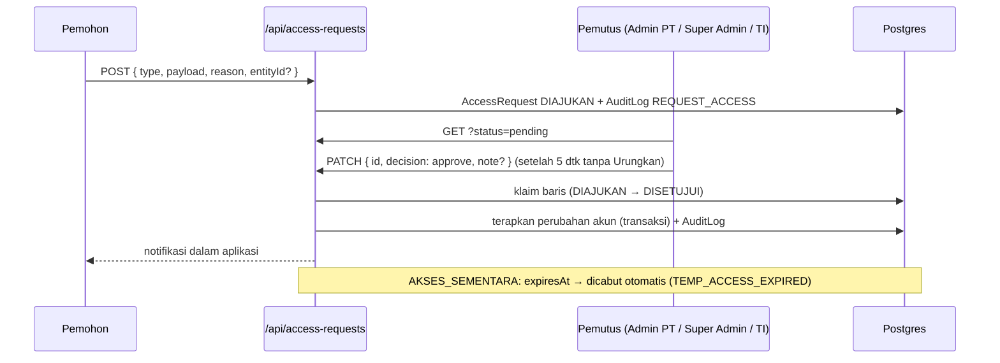

# Permintaan akses dan buka kunci laporan

[← Indeks](README.md) · Spesifikasi: [`04-admin-pt.md`](../design/peran/04-admin-pt.md), [`07-ti.md`](../design/peran/07-ti.md)

Dua jalur persetujuan resmi untuk hal yang tidak boleh diubah satu orang sendirian:

1. Perubahan akses akun.
2. Membuka laporan yang sudah terkunci.

Keduanya mengikuti tiga pagar:

- tidak ada yang memutuskan permintaannya sendiri;
- setiap langkah ditulis ke `AuditLog`;
- pemohon diberi notifikasi.

## Permintaan akses

> Bergantung pada migrasi **0016** (`AccessRequest`).

**Jenis** (`AccessRequest.type`):

| Jenis | Payload (JSON) | Efek saat disetujui |
| --- | --- | --- |
| `AKUN_BARU` | `{ name, username?, email?, role, title?, divisionId?, projectId? }` | Akun dibuat lewat aturan meja akun yang sama dengan `/api/companies/users` |
| `PINDAH_PERAN` | `{ userId, role, divisionId?, projectId? }` | Peran/penempatan diubah (`applyRoleChange`) |
| `AKSES_SEMENTARA` | `{ userId, role?, days }` (1–90 hari) | Peran dan/atau aktivasi diberikan sampai `expiresAt`. Keadaan sebelumnya disimpan di `appliedData`, lalu dicabut otomatis. |

Kata sandi tidak pernah disimpan di permintaan.

**Siapa memutuskan** (`decisionDesk`, `mayDecideFor` di [`src/lib/access-requests.ts`](../../src/lib/access-requests.ts)):

| Pemutus | Cakupan |
| --- | --- |
| Admin PT | PT-nya sendiri, posisi `ADMIN_PT`, `KEPALA_DIVISI`, `PIC_PROYEK` |
| Super Admin | seluruh grup, semua posisi |
| TI | seluruh grup, kecuali mengangkat Super Admin atau menyentuh akun Super Admin |

**Alur:**

1. **Ajukan.** Admin PT mengisi formulir "Ajukan permintaan" di Ringkasan atau Meja kerja (`access-request-sheet.tsx`). Kepala divisi dan PIC juga bisa lewat API.
   - Server memeriksa cakupan, duplikat (409), dan bentrok username/email lebih awal (422).
   - Setiap orang maksimal **20 permintaan terbuka** (429).
2. **Putuskan.** Kartu "Permintaan akses" menampilkan `ApprovalItem` dengan Setujui/Tolak.
   - UI menunggu 5 detik dan menawarkan "Urungkan" sebelum `PATCH` benar-benar dikirim.
   - Di server, baris **diklaim lebih dulu** (update bersyarat `status = DIAJUKAN`), sehingga dua klik tidak menerapkan permintaan dua kali.
   - Persetujuan menerapkan perubahan dalam satu transaksi.
3. **Akses sementara berakhir.** Akses dikembalikan oleh cron `/api/cron/reminder-rules` atau saat pemutus membuka daftar (`revertExpiredAccess`). Log: `TEMP_ACCESS_EXPIRED`.

| Metode & path | Parameter | Jawaban | Izin |
| --- | --- | --- | --- |
| `GET /api/access-requests` | `?status=pending\|all` | permintaan dalam cakupan: pemutus melihat PT-nya atau grup; akun lain hanya miliknya | semua |
| `POST /api/access-requests` | `{ type, payload, reason?, entityId? }` | permintaan baru | semua, dengan cek cakupan |
| `PATCH /api/access-requests` | `{ id, decision: 'approve' \| 'reject', note? }` | diputuskan dan diterapkan | `decisionDesk`; bukan milik sendiri (403); sudah diputuskan (409) |

## Buka kunci laporan

Laporan harian terkunci pukul 17.00 WIB, dan laporan mingguan Jumat 17.00 WIB. Bila laporan perlu diubah setelahnya, jalurnya:

| Langkah | Kapabilitas | Peran | Status |
| --- | --- | --- | --- |
| Ajukan (alasan ≥ 10 karakter) | `unlock:request` | Admin PT, TI, Super Admin | `DIAJUKAN` |
| Setujui / tolak | `unlock:approve` | Direksi SDM & GA, TI, Super Admin | `DISETUJUI` / `DITOLAK` |
| Jalankan (buka n jam, bawaan 24, maks 72) | `unlock:execute` | TI, Super Admin | `DIEKSEKUSI`, `unlockUntil` |
| Kunci kembali lebih awal | `unlock:execute` | TI, Super Admin | `reLockedAt` |

Aturannya:

- Satu laporan hanya boleh punya satu permintaan yang masih diproses (409).
- Setiap langkah mengklaim baris dengan status yang diharapkan. Bila keadaan sudah berubah, jawabannya 409 "Muat ulang lalu coba lagi".
- Buka kunci yang habis masanya dikunci kembali oleh cron (`relockExpiredUnlocks`).

UI ada di kartu "Buka kunci" (`src/components/admin/unlock-card.tsx`), di Ringkasan dan Meja kerja Admin.

| Metode & path | Parameter | Jawaban | Izin |
| --- | --- | --- | --- |
| `GET /api/unlock-requests` | `?status&page&pageSize` | daftar dengan label laporan dan flag izin | cakupan `scopeUserIds` |
| `POST /api/unlock-requests` | `{ targetType: 'DAILY_REPORT' \| 'WEEKLY_REPORT', targetId, reason }` | permintaan baru | `unlock:request`; laporan di PT sendiri |
| `PATCH /api/unlock-requests` | `{ id, action: 'approve' \| 'reject' }` | diputuskan | `unlock:approve`; bukan milik sendiri |
| `PATCH /api/unlock-requests` | `{ id, action: 'execute', hours? }` | laporan dibuka sampai `unlockUntil` | `unlock:execute` |
| `PATCH /api/unlock-requests` | `{ id, action: 'relock' }` | dikunci kembali | `unlock:execute` |

## Berkas kode utama

- [`src/components/admin/`](../../src/components/admin/): `access-requests-card.tsx`, `access-request-sheet.tsx`, `unlock-card.tsx`, `master-data.tsx`
- [`src/app/api/access-requests/route.ts`](../../src/app/api/access-requests/route.ts), [`src/app/api/unlock-requests/route.ts`](../../src/app/api/unlock-requests/route.ts), [`src/app/api/admin/overview/route.ts`](../../src/app/api/admin/overview/route.ts)
- [`src/lib/access-requests.ts`](../../src/lib/access-requests.ts), [`src/lib/account-desk.ts`](../../src/lib/account-desk.ts), [`src/lib/unlock-requests.ts`](../../src/lib/unlock-requests.ts), [`src/lib/admin-meta.ts`](../../src/lib/admin-meta.ts)
- Data contoh: [`preview/mock-admin.ts`](../../src/components/preview/mock-admin.ts)

## Catatan terbuka

- **Buka kunci belum berefek pada penulisan.**
  - Menjalankan buka kunci mengosongkan `isLocked` dan mengisi `unlockUntil`.
  - Tetapi `/api/daily-input`, `/api/weekly-input`, dan `/api/tasks` masih menolak berdasarkan jam, karena belum memanggil `activeUnlockFor(type, id)`.
  - Selain itu, `/api/daily-input` hanya menulis laporan hari ini.
- **Akses sementara yang berakhir** hanya mengembalikan peran. Tautan kepala divisi (`Division.headUserId`) yang dibuat oleh perubahan peran tidak ikut dicabut.
- **Notifikasi keputusan** buka kunci dan permintaan akses menyimpan id akun di kolom `recipient`, padahal notifikasi lain menyimpan email. Tidak berpengaruh untuk notifikasi dalam aplikasi, tetapi tidak konsisten bila kelak dikirim lewat email.
- **Pesan galat 500.** Beberapa route mengembalikan `err.message` pada galat 500/422 (`unlock-requests`, `access-requests`, `admin/reminder-rules`). Pesan Prisma bisa membocorkan detail skema.
- **Formulir pengajuan** hanya ada di layar Admin PT. Daftar akunnya dimuat dari `/api/companies`, yang hanya terbuka untuk peran pemegang meja akun.
