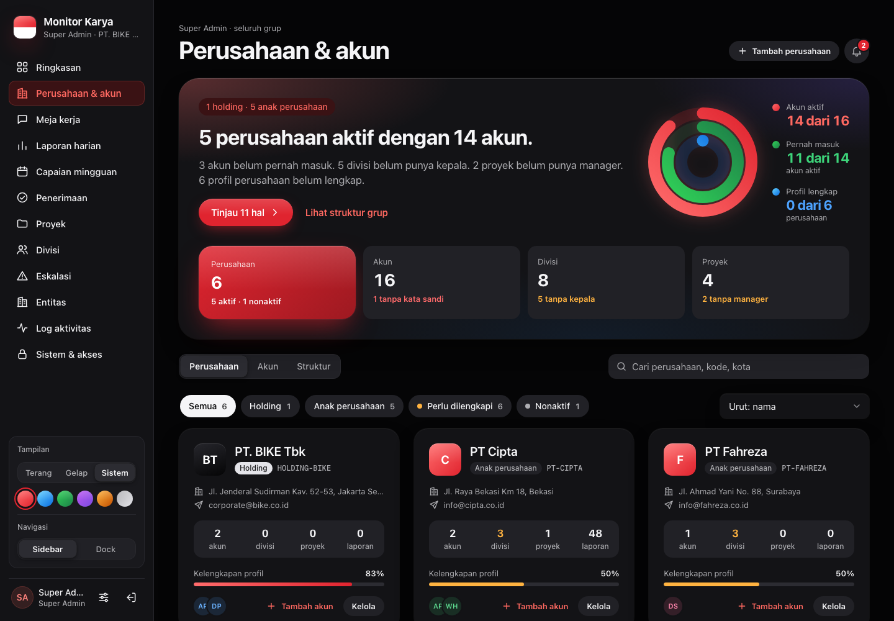
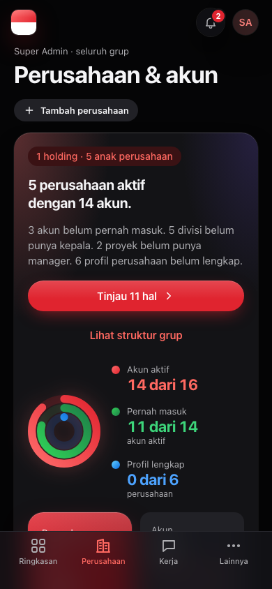
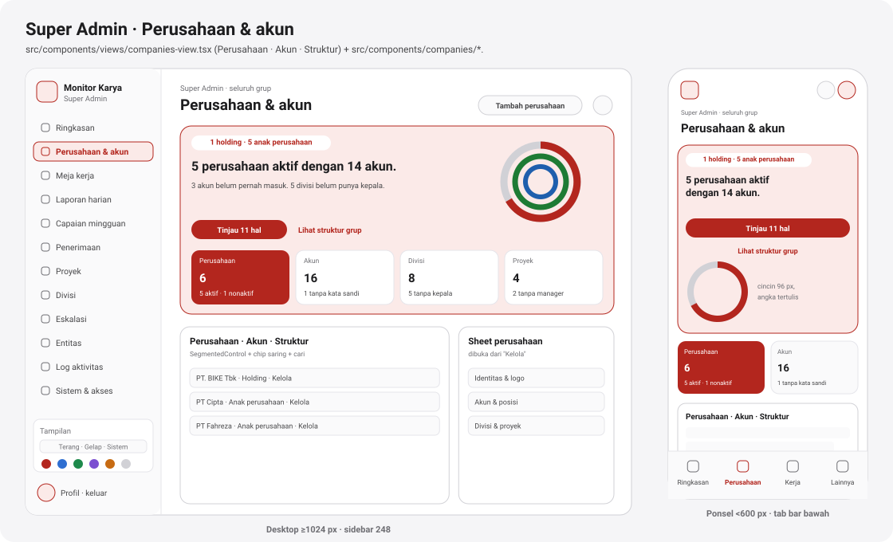

# Perusahaan & akun

[← Indeks](README.md)

| Desktop | Ponsel |
| --- | --- |
|  |  |

## Tujuan

Meja pemilik sistem untuk:

- menambah dan mengubah perusahaan (identitas, logo, induk);
- mengatur posisi dan akun;
- menyetel ulang kata sandi;
- melihat struktur grup.

Kalimat pembuka menjawab, misalnya, "5 perusahaan aktif dengan 14 akun." Hal yang perlu dibereskan dijumlahkan ("Tinjau 11 hal"): akun yang belum pernah masuk, divisi tanpa kepala, proyek tanpa manager, profil perusahaan yang belum lengkap.

## Siapa memakai

| Peran | Meja | Batas |
| --- | --- | --- |
| Super Admin (`companies:manage`) | penuh, tab **Perusahaan & akun** | seluruh grup; semua posisi |
| Admin PT (`accounts:manage`) | terbatas, di Pengaturan → meja akun | hanya PT-nya; hanya posisi `ADMIN_PT`, `KEPALA_DIVISI`, `PIC_PROYEK`; tidak bisa menambah/mengubah perusahaan |
| TI | tidak memegang meja akun; mengelola akses lewat [permintaan akses](permintaan-akses.md) | — |

Direktur entitas dan akun tingkat grup tetap milik Super Admin. Dengan begitu tidak seorang pun bisa membuat penyetujunya sendiri. Aturan ini ada di [`src/lib/account-desk.ts`](../../src/lib/account-desk.ts) dan dipakai bersama oleh `/api/companies/users` dan persetujuan permintaan akses.

## Alur

**Tiga tampilan** di `SegmentedControl`:

1. **Perusahaan.** Kartu per perusahaan berisi logo, jenis, kode, alamat, kontak, hitungan (akun, divisi, proyek, laporan), kelengkapan profil, "Tambah akun", dan "Kelola". Tersedia chip saring (Holding, Anak perusahaan, Perlu dilengkapi, Nonaktif), pencarian, dan urutan.
2. **Akun.** Daftar lintas perusahaan dengan aksi massal. Status akun tampil sebagai lencana: Nonaktif, Tanpa sandi, atau Belum masuk.
3. **Struktur.** Pohon holding → perusahaan → divisi & proyek.

**Tambah perusahaan** memakai wizard (`CompanyWizard`) dengan langkah identitas & logo, posisi/akun pertama, lalu tinjau.

**Kelola** membuka `CompanySheet` dengan tab Ringkasan, Akun, Divisi, Proyek, dan Pengaturan. Pengaturan memuat ubah identitas, logo, induk, dan status aktif, serta hapus perusahaan.

**Akun** dibuka di `AccountSheet`. Isinya:

- nama, username, email, jabatan, telepon;
- peran, perusahaan;
- tautan divisi/proyek;
- status aktif;
- setel ulang kata sandi.

**Pola tindakan:**

| Tindakan | Pola |
| --- | --- |
| Hapus | konfirmasi `useConfirm` |
| Nonaktifkan / aktifkan | tanpa konfirmasi, toast "Urungkan" |

**Pengaturan** (dari menu profil, `SettingsDialog`) memuat:

- profil sendiri: nama tampilan dan telepon;
- penempatan;
- ganti kata sandi sendiri;
- meja akun (bagi yang berhak);
- tema.

## Aturan bisnis

**Pagar akun:**

- Akun sendiri tidak bisa dinonaktifkan atau dihapus.
- Super Admin aktif terakhir tidak bisa diturunkan, dinonaktifkan, atau dihapus (`isLastSuperadmin`).
- Admin PT tidak bisa memindahkan akun keluar dari PT-nya. Mengirim `entityId: null` ditolak.

**Perusahaan:**

- Hanya perusahaan yang belum punya data laporan yang bisa dihapus.
- Logo disimpan sebagai data URL kecil (≤ 256 px, maks 400 ribu karakter) di `Entity.logoData`.

**Masuk** memakai `username` (huruf kecil, unik) atau email lama.

**Kata sandi:**

- Disimpan dengan scrypt.
- Panjang maksimal 256, minimal 8 (`src/lib/password-policy.ts`, F1-C).
- Kata sandi awal akun baru: diusulkan acak 12 karakter di formulir; bila kosong, server membuat acak. Akun yang dibuat atau disetel ulang admin wajib mengganti kata sandi saat masuk pertama (`/login/ganti-sandi`).

**Ganti kata sandi sendiri:**

- Wajib kata sandi lama, dibatasi 5 salah per 15 menit.
- Mengganti atau menyetel ulang kata sandi mencabut sesi lama, karena token membawa sidik kata sandi.
- Pemiliknya mendapat token baru dan tetap masuk.

**Batas panjang kolom** 500 karakter.

## Endpoint

| Metode & path | Parameter | Jawaban | Izin |
| --- | --- | --- | --- |
| `GET /api/companies` | — | holding & anak perusahaan beserta akun, divisi, proyek, hitungan | `companies:manage` (grup) atau `accounts:manage` (PT sendiri) |
| `POST /api/companies` | `{ name, code, type, parentId?, isHolding?, region?, logoData?, alamat/kontak, positions[] }` | perusahaan baru + akun pertamanya | `companies:manage` |
| `PATCH /api/companies` | `{ id, …identitas, logoData?, parentId?, isActive? }` | perusahaan terbarui | `companies:manage` |
| `DELETE /api/companies` | `?id=` | hapus perusahaan tanpa data laporan | `companies:manage` |
| `POST /api/companies/users` | `{ name, username?, email?, title?, phone?, role, entityId, divisionId?/divisionName?, projectId?/projectName?, avatarColor? }` | akun baru | meja akun (penuh/terbatas) |
| `PATCH /api/companies/users` | `{ id, …kolom, isActive?, password? }` | akun terbarui / kata sandi disetel ulang | sama, dengan pagar di atas |
| `DELETE /api/companies/users` | `?id=` | hapus akun | sama |
| `GET /api/profile` | — | profil + penempatan (PT, holding, proyek, divisi) | akun sendiri |
| `PATCH /api/profile` | `{ name?, phone? }` | profil terbarui | akun sendiri |
| `POST /api/profile/password` | `{ currentPassword, newPassword }` | sandi diganti, cookie baru | akun sendiri; 429 setelah 5 salah |

## Berkas kode utama

- [`src/components/views/companies-view.tsx`](../../src/components/views/companies-view.tsx)
- [`src/components/companies/`](../../src/components/companies/): `company-sheet.tsx`, `account-sheet.tsx`, `company-wizard.tsx`, `parts.tsx` (`Field`, `SwitchRow`, `useConfirm`, `LogoPicker`)
- [`src/components/settings-dialog.tsx`](../../src/components/settings-dialog.tsx), [`account-manager.tsx`](../../src/components/account-manager.tsx), [`account-dialog.tsx`](../../src/components/account-dialog.tsx)
- [`src/app/api/companies/route.ts`](../../src/app/api/companies/route.ts), [`src/app/api/companies/users/route.ts`](../../src/app/api/companies/users/route.ts), [`src/app/api/profile/route.ts`](../../src/app/api/profile/route.ts), [`src/app/api/profile/password/route.ts`](../../src/app/api/profile/password/route.ts)
- [`src/lib/account-desk.ts`](../../src/lib/account-desk.ts), [`src/lib/companies.ts`](../../src/lib/companies.ts), [`src/lib/accounts.ts`](../../src/lib/accounts.ts)

## Catatan terbuka

- **Kata sandi** — selesai (F1-C): minimal 8 karakter dan wajib ganti saat masuk pertama.
- **`User.divisionId` dan `Project.divisionId`** belum tampil atau bisa diubah di layar akun dan proyek modul ini. Saat ini hanya lewat "Atur anggota" (lihat [divisi.md](divisi.md)).
- **Sheet akun** di `AccountManager` dipasang dan dilepas tanpa animasi keluar.
