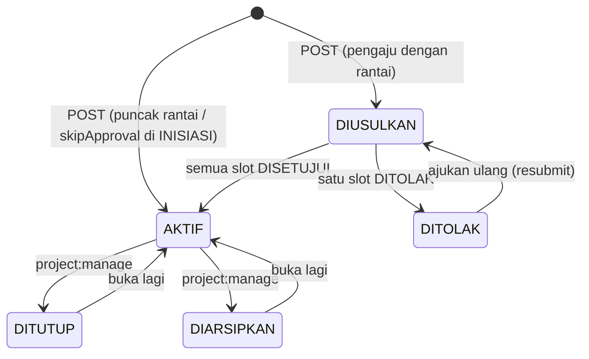
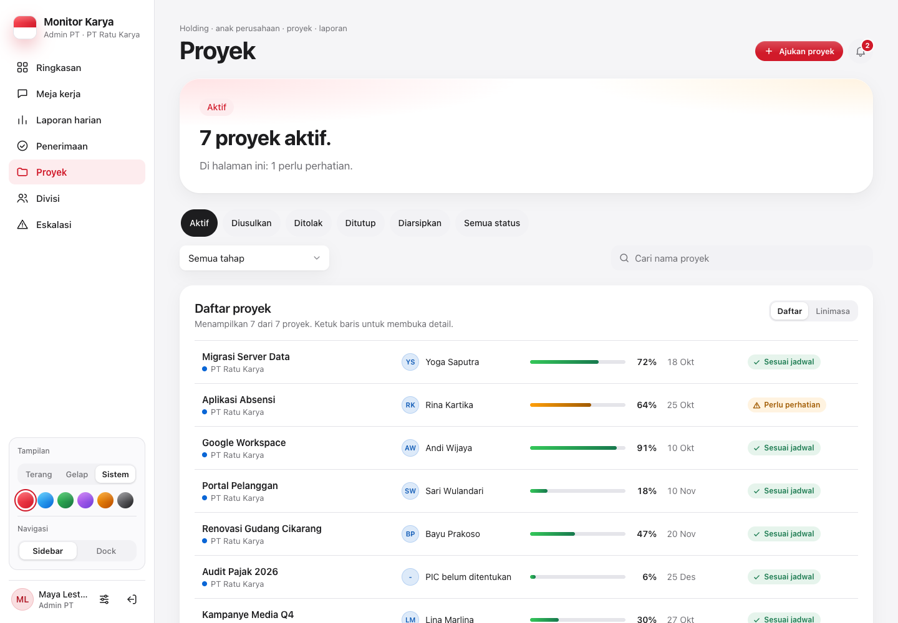
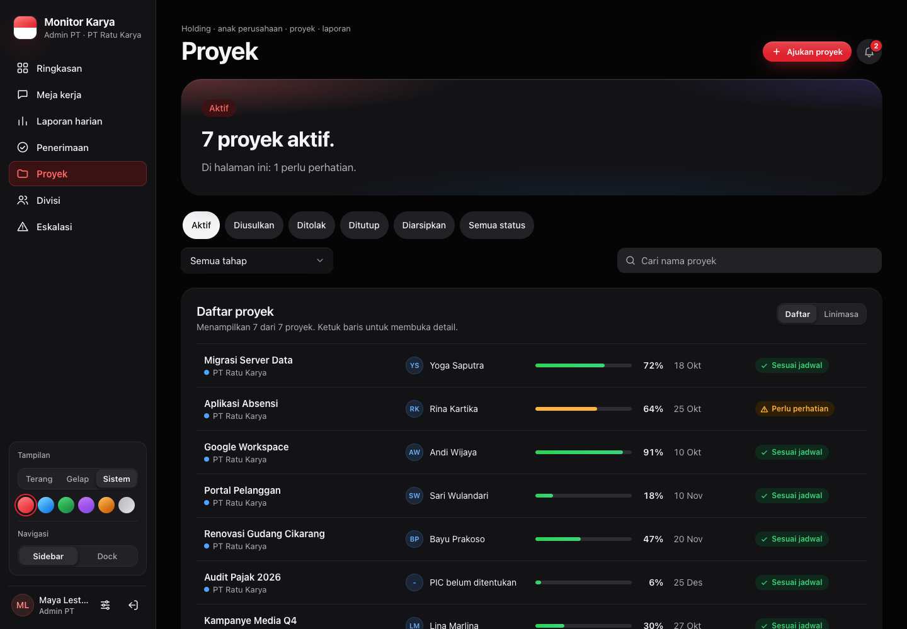

# Proyek

[← Indeks](README.md)

## Tujuan

Daftar proyek dalam cakupan akun, beserta statusnya dan pengajuan proyek yang menunggu keputusan. Di sini proyek juga diajukan, disetujui atau ditolak berantai, diubah, ditutup, diarsipkan, atau dihapus. Kalimat pembuka mengikuti saringan, misalnya "17 proyek aktif.".

## Siapa memakai

| Peran | Melihat | Boleh |
| --- | --- | --- |
| PIC proyek | proyek PT-nya | mengajukan; membenahi atau menarik pengajuannya sendiri selama belum aktif |
| Admin PT | proyek PT-nya dan proyek PT lain yang menyebut PT-nya sebagai PT terkait | mengajukan, menandatangani slot `ADMIN_PT`, ubah/tutup/arsip/hapus (`project:manage`) |
| Direktur entitas | PT-nya | mengajukan, menandatangani slot `DIREKTUR_ENTITAS` |
| Manajemen, Direksi SDM & GA | seluruh grup | mengajukan (langsung aktif), menandatangani slot `MANAJEMEN` |
| TI, Super Admin | seluruh grup | semua, termasuk menandatangani slot mana pun atas nama slot itu |
| Kepala divisi | tidak punya tab ini | — |
| Auditor | seluruh grup | baca saja |

## Rantai persetujuan

`PROJECT_APPROVAL_CHAIN` di [`src/lib/rbac.ts`](../../src/lib/rbac.ts) menentukan rantai menurut peran **pengaju**. Slot ditandatangani berurutan.

| Pengaju | Rantai |
| --- | --- |
| PIC proyek | Admin PT → Direktur entitas |
| Admin PT | Direktur entitas |
| Direktur entitas | Manajemen |
| Manajemen, Direksi SDM & GA, TI, Super Admin | tanpa rantai, langsung AKTIF |

Aturan penandatangan slot:

- Slot `ADMIN_PT` dan `DIREKTUR_ENTITAS` harus ditandatangani dari PT proyek itu.
- Slot `MANAJEMEN` boleh ditandatangani Manajemen atau Direksi SDM & GA.
- TI dan Super Admin boleh menandatangani slot mana pun.

Hasilnya:

- Semua slot DISETUJUI → `lifecycle = AKTIF`.
- Satu slot DITOLAK → `lifecycle = DITOLAK`. Pengaju bisa memperbaiki lalu **mengajukan ulang** (slot dikosongkan).
- **Jalur tanpa persetujuan.** Pengaju yang punya rantai boleh memilih `skipApproval`, tetapi hanya untuk proyek fase INISIASI. Proyek langsung aktif dan ditandai bahwa rantai dilewati (`CREATE_PROJECT_NO_APPROVAL` di log).
- PIC proyek boleh dikosongkan dan diisi belakangan.

Fase proyek (`phase`) berdiri terpisah dari `lifecycle`: INISIASI → PERENCANAAN → PELAKSANAAN → PENYELESAIAN. Tahapan bertanggal per proyek ada di model `ProjectStage` (lihat [output-review.md](output-review.md#tahapan-proyek)).

| Desktop terang | Desktop gelap |
| --- | --- |
|  |  |

## Alur di layar

1. **Header dan hero.**
   - `PageHeader` dengan tombol "Ajukan proyek" dan notifikasi.
   - `Hero` berisi kalimat jawaban dan baris dukungan "Di halaman ini": menunggu keputusan Anda, terlambat, perlu perhatian, belum ada laporan harian.
2. **Saringan.**
   - Chip status lifecycle.
   - Pilihan fase (`mk-select`).
   - `SearchField`.
3. **Menunggu keputusan Anda** (bila boleh menyetujui).
   - Kartu `ApprovalItem`.
   - "Setujui" langsung menyetujui di tempat dan menampilkan toast.
   - "Tolak" membuka Sheet detail langsung ke formulir penolakan. Alasan bisa diisi.
4. **Daftar.** `ProjectRow` dengan status dari `deriveProjectStatus` (lihat [arsitektur.md](arsitektur.md#status-proyek-satu-sumber)). Pengajuan, ditolak, ditutup, dan diarsipkan punya labelnya sendiri. Sakelar Daftar/Linimasa menampilkan proyek yang sama di `Timeline`.
5. **Detail di Sheet:**
   - cincin progres, alasan status, info, tag, deskripsi & tujuan;
   - rantai persetujuan sebagai `FlowDiagram` vertikal, alasan penolakan;
   - formulir setujui/tolak, ajukan ulang, "Ubah proyek", bagian hapus.
6. **Formulir** "Ajukan proyek" / "Ubah proyek" (Sheet lebar):
   - PT, kode, nama, fase, PIC (opsional), **divisi pelaksana** (`Project.divisionId`, divisi aktif di PT pemilik), tanggal mulai/target;
   - deskripsi, tujuan;
   - chip PT terkait;
   - sakelar jalur tanpa persetujuan.
7. **Hapus** lewat `useConfirm`. Proyek yang sudah punya laporan atau tugas tidak dihapus (409 dengan `activity`, `canArchive`), dan layar menawarkan **arsipkan** sebagai gantinya.

## Endpoint

| Metode & path | Parameter | Jawaban | Izin |
| --- | --- | --- | --- |
| `GET /api/projects` | `?lifecycle&phase&entityId&search&page&pageSize` | daftar berhalaman dalam cakupan, termasuk proyek PT lain yang menyebut PT dalam cakupan sebagai PT terkait; per proyek ada flag aksi (mis. `resubmit`) | semua peran bertab Proyek |
| `GET /api/projects?options=1` | `&entityId=` | pilihan formulir: PT, kandidat PIC (akun PIC aktif di PT itu), `divisions`, rantai | `project:propose` |
| `POST /api/projects` | `{ entityId?, code, name, phase?, picUserId?, divisionId?, startDate?, targetEndDate?, description?, purpose?, relatedEntityIds?, skipApproval? }` | proyek baru (DIUSULKAN atau AKTIF) | `project:propose`; PT bebas hanya untuk peran grup/induk |
| `PATCH /api/projects` | `{ id, …kolom }`, `{ id, lifecycle }`, atau `{ id, resubmit: true }` | proyek terbarui | `project:manage` di PT-nya, induk, atau pengaju selama belum aktif; ubah lifecycle bukan hak pengaju biasa |
| `DELETE /api/projects` | `?id=` | dihapus, atau 409 bila sudah ada laporan/tugas | sama dengan PATCH |
| `POST /api/projects/approve` | `{ projectId, decision: 'DISETUJUI' \| 'DITOLAK', note? }` | slot berikutnya ditandatangani, plus `undoToken` | `project:approve` + `canSignSlot`; proyek lama tanpa rantai hanya oleh akun yang menjangkau PT-nya |
| `GET/POST/DELETE /api/project-reviews` | `?projectId=` / `{ projectId, note? }` | tinjauan proyek oleh pengawas (Urungkan 15 menit) | pengawas dalam cakupan; lihat [peran-direktur-manajemen.md](peran-direktur-manajemen.md) |

Setiap perubahan ditulis ke `AuditLog`: `PROPOSE_PROJECT`, `CREATE_PROJECT`, `APPROVE_PROJECT`, dan sejenisnya.

## Berkas kode utama

- [`src/components/views/projects-view.tsx`](../../src/components/views/projects-view.tsx), CSS [`app/css/proyek-divisi-eskalasi.css`](../../src/app/css/proyek-divisi-eskalasi.css)
- [`src/app/api/projects/route.ts`](../../src/app/api/projects/route.ts), [`src/app/api/projects/approve/route.ts`](../../src/app/api/projects/approve/route.ts)
- [`src/lib/rbac.ts`](../../src/lib/rbac.ts) (`PROJECT_APPROVAL_CHAIN`, `PROJECT_SLOT_SIGNERS`, `canSignSlot`, `pendingSlot`), [`src/lib/project-status.ts`](../../src/lib/project-status.ts)

## Catatan terbuka

- Hitungan di baris dukungan hero hanya dari halaman yang sedang dimuat, karena API berhalaman.
- Setujui, tolak, ajukan ulang, dan arsip bisa diurungkan 15 menit lewat toast "Urungkan" (lihat [urungkan.md](urungkan.md)). Arsip lewat formulir hanya membalik siklus hidup, bukan kolom lain yang diubah bersamaan. [F2-URUNGKAN]
- Selesai (F2-ADMIN): divisi pelaksana bisa diatur dari formulir; nilainya tercatat di AuditLog. "Atur anggota" (`PUT /api/kadiv/members`) tetap bisa menautkan proyek.
- Data contoh `/pratinjau` untuk `/api/projects` ada di `src/components/preview/mock-proyek.ts` (F3-A).
