# Ringkasan (dashboard per peran)

[← Indeks](README.md) · Spesifikasi: [`docs/design/peran/`](../design/peran/)

## Tujuan

Tab pertama setiap peran. Layar ini menjawab satu pertanyaan dalam satu kalimat ("92% laporan harian sudah masuk hari ini."), lalu menampilkan paling banyak 4 KPI dan kartu yang menuntun ke tindakan berikutnya. Untuk PIC proyek, tab ini bernama **Hari ini**.

## Siapa memakai, apa yang dilihat

| Peran | Komponen | Kalimat pembuka (contoh) | Sumber data |
| --- | --- | --- | --- |
| PIC proyek | `PicDashboard` | "Aplikasi Absensi 64% selesai." | `/api/my-dashboard` (kind `PIC`), `/api/daily-input`, `/api/project-progress`, `/api/outputs`, `/api/project-notes`, `/api/project-stages`, `/api/deadline-proposals` |
| Kepala divisi | `KadivDashboard` | "Divisi Teknologi menyelesaikan 31 output minggu ini." | `/api/my-dashboard` (kind `KADIV`), `/api/kadiv/team`, `/api/kadiv/weekly-summary`, `/api/outputs/review` |
| Admin PT | `AdminDashboard` (`admin/admin-summary.tsx`) | "92% laporan harian sudah masuk hari ini." | `/api/my-dashboard` (kind `ADMIN`), `/api/admin/compliance`, `/api/admin/activity`, `/api/admin/overview`, `/api/access-requests`, `/api/admin/reminder-rules` |
| Direktur entitas | `DirectorDashboard` | "5 dari 8 proyek berjalan sesuai rencana." | `/api/ringkasan`, `/api/approval-requests`, `/api/weekly-comments`, `/api/project-reviews` |
| Manajemen, Direksi SDM & GA, TI, Super Admin, Auditor | `ManagementDashboard` + `GroupRolePanel` (peran grup) | "6 dari 9 proyek berjalan sesuai rencana." | `/api/ringkasan`, `/api/system/grup` (peran grup), `/api/approval-requests` |

`DashboardView` ([`views/dashboard-view.tsx`](../../src/components/views/dashboard-view.tsx)) memanggil `/api/my-dashboard`. Jawabannya berisi `kind` (`PIC`, `KADIV`, `ADMIN`, atau `OVERSIGHT`) yang menentukan layar. `OVERSIGHT` diteruskan ke [`oversight-dashboard.tsx`](../../src/components/views/oversight-dashboard.tsx), yang memilih layar Direktur atau Manajemen. Bila data divisi kosong (misalnya migrasi 0015 belum diterapkan), Direktur jatuh ke tata letak Manajemen.

## PIC proyek: Hari ini

| Desktop | Desktop gelap | Ponsel |
| --- | --- | --- |
| 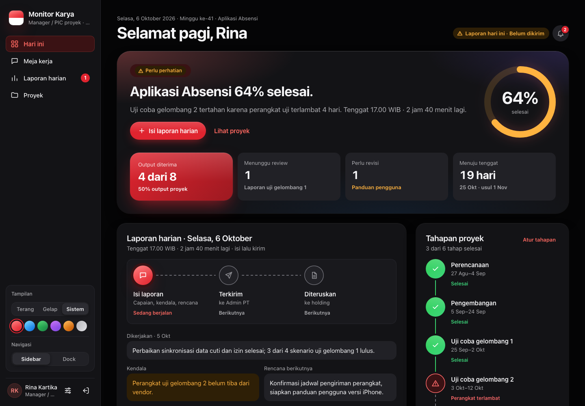 | 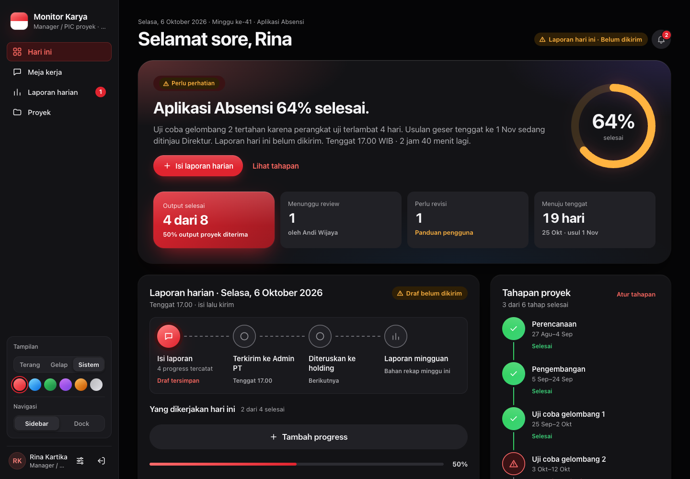 | 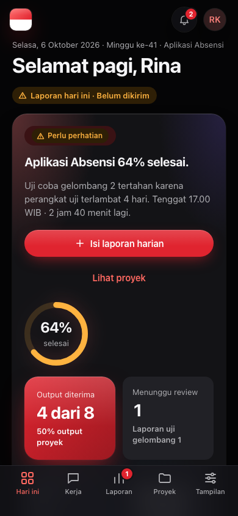 |

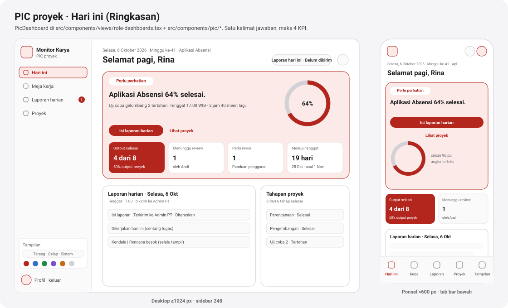

Isi layar:

- **Hero.** Persentase proyek, alasan bila perlu perhatian, sisa waktu menuju 17.00 WIB, tombol primer "Isi laporan harian", dan cincin progres.
- **KPI saat ada output:** Output diterima, Menunggu review, Perlu revisi, Menuju tenggat (dengan "usul …" bila ada usulan tenggat).
- **Kartu Laporan harian** berisi formulir lengkap (`DailyReportCard`, sama dengan tab Laporan harian) dan `FlowDiagram`: Isi laporan → Terkirim ke Admin PT → Diteruskan ke holding. Di ponsel alur baru tampil setelah terkirim.
- **Progres dibanding rencana**, **Tenggat terdekat**, dan **Riwayat laporan** 6 hari kerja (`/api/project-progress`, rumus di [peran-pic.md](peran-pic.md#rumus-progres-dibanding-rencana)).
- Di tablet dan ponsel isi layar dibagi dengan `SegmentedControl` Hari ini · Output · Laporan · Catatan.
- **Tahapan proyek** bertanggal, dengan "Atur tahapan". Tanpa tahapan, kartu menampilkan 4 fase tetap.
- **Output saya** dan **Catatan kepala divisi.** Detailnya di [output-review.md](output-review.md).
- **Lencana header** "Laporan hari ini · Belum dikirim" dan badge navigasi "Laporan harian 1".

## Kepala divisi

| Desktop | Desktop gelap | Ponsel |
| --- | --- | --- |
| 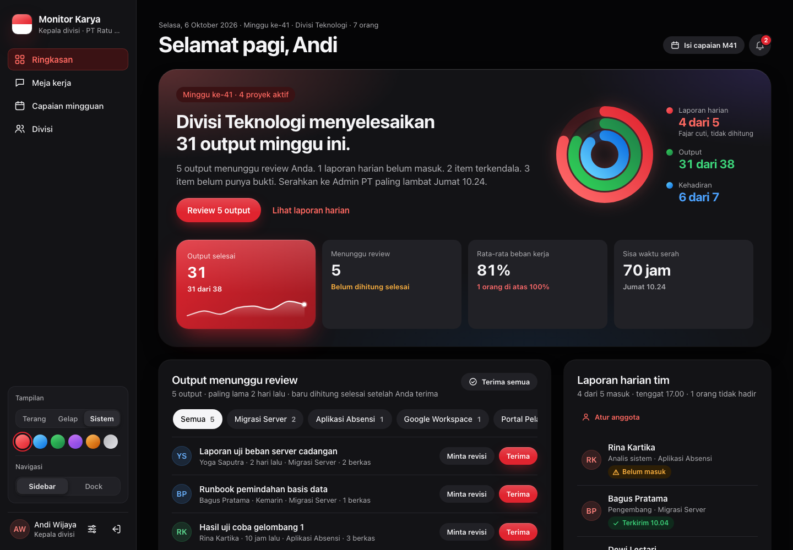 | 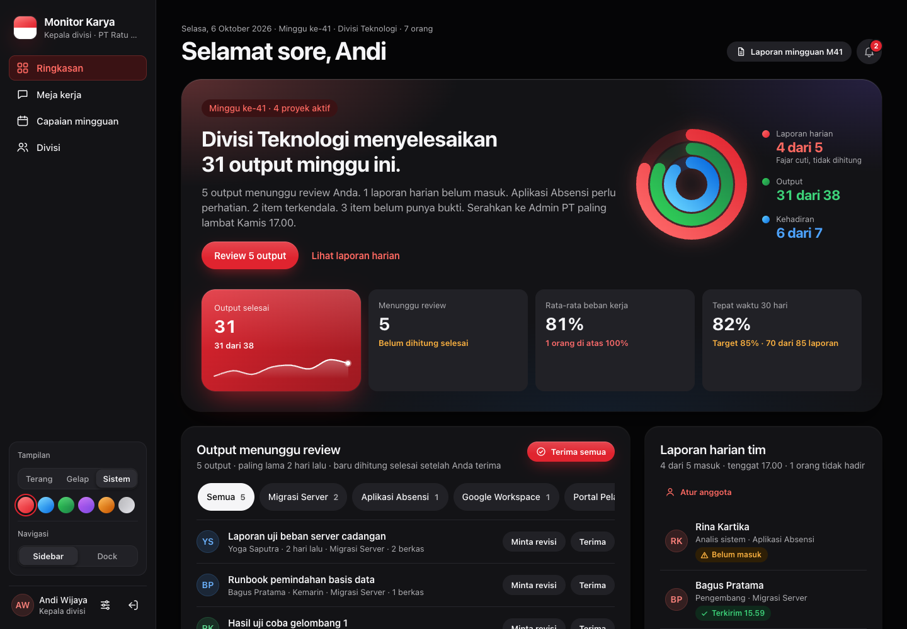 | 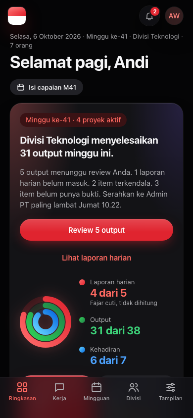 |

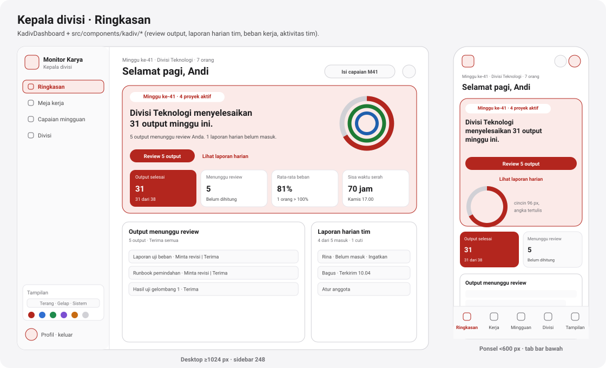

Isi layar:

- **Hero.** Output divisi minggu ini dan tiga cincin: Laporan harian (orang cuti tidak dihitung), Output, Kehadiran.
- **KPI:** Output selesai, Menunggu review, Rata-rata beban kerja, Tepat waktu 30 hari (target 85%; rumus di [peran-kadiv.md](peran-kadiv.md#tepat-waktu-30-hari-kpi-ke-4)).
- **Kartu:**
  - Output menunggu review: "Terima semua" primer, Terima/Minta revisi per baris sekunder.
  - Laporan harian tim, dengan Ingatkan, Tandai sudah dibaca (Urungkan), dan Atur anggota.
  - Proyek divisi (`Timeline`, `ProjectRow compact` di ponsel) dan Sheet proyek.
  - Beban kerja tim, dengan garis target 80%; peta panas 10 hari dan output per minggu.
  - Ringkasan mingguan untuk Direktur ("Kirim ke Direktur", lihat [peran-kadiv.md](peran-kadiv.md#ringkasan-mingguan-untuk-direktur)).
  - Aktivitas tim.
- Bila data tim gagal dimuat, hero kembali ke versi capaian mingguan.

Rumus beban kerja ada di [`src/lib/kadiv.ts`](../../src/lib/kadiv.ts) → `workloadPct`:

```
menit tugas      = durationMin, atau endAt − startAt, atau 60
sisa menit       = menit × (100 − progres) / 100   (tugas terbuka, termasuk tunggakan ≤ 14 hari)
kapasitas        = (hari kerja tersisa minggu ini − hari cuti) × 480 menit
beban (%)        = sisa menit ÷ kapasitas × 100      (80% batas sehat; > 100% kelebihan)
```

`DivisionBar` membatasi batangnya di 100%, tetapi angka sebenarnya (misalnya 112%) tetap ditulis di bawahnya.

## Admin PT

| Desktop | Desktop gelap | Ponsel |
| --- | --- | --- |
| 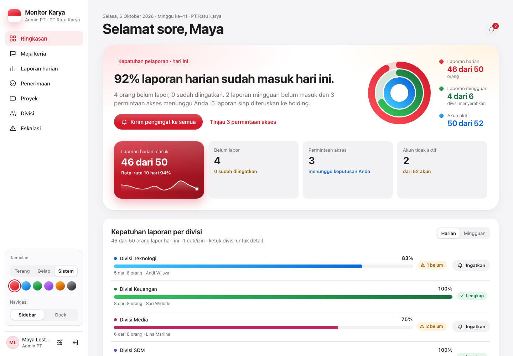 | 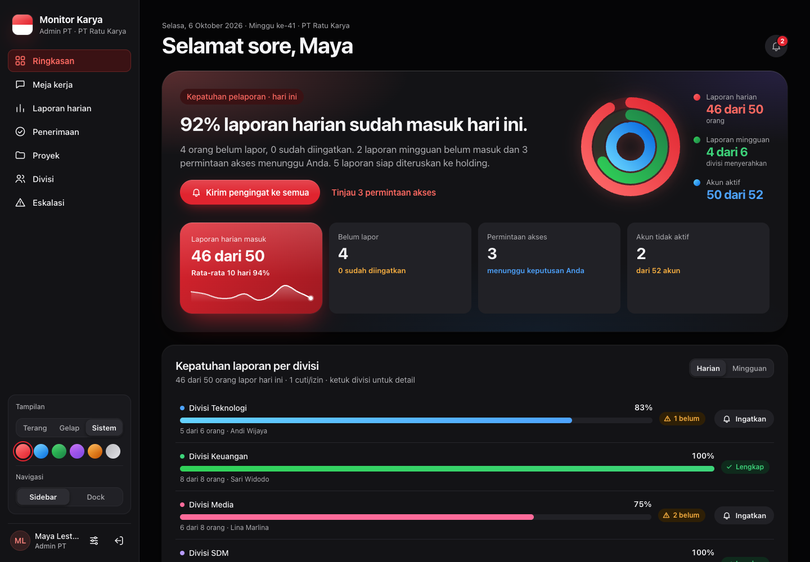 | 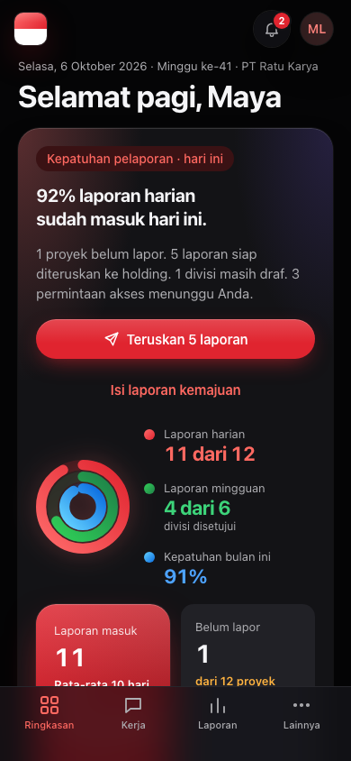 |


Isi layar:

- **Hero.** Persentase laporan harian yang masuk hari ini **per orang** ("46 dari 50 orang"), jumlah yang siap diteruskan, dan permintaan akses yang menunggu. Tombol primer "Kirim pengingat ke semua" (sebelum 17.00), atau "Teruskan n laporan" / "Buka meja kerja". Tiga cincin: Laporan harian, Laporan mingguan, Akun aktif.
- **KPI:** Laporan harian masuk (rata-rata 10 hari), Belum lapor, Permintaan akses, Akun tidak aktif.
- **Kepatuhan per divisi** (Harian/Mingguan, `DivisionBar` "x dari y orang"). Ketuk divisi untuk membuka Sheet: peta panas 10 hari, siapa yang belum lapor dengan "Ingatkan" per orang, "Ingatkan semua", dan "Hubungi kepala divisi". Aturan hitung lengkap ada di [peran-admin.md](peran-admin.md#aturan-hitung-kepatuhan-per-orang-keputusan-f2-admin).
- **Peta panas kepatuhan** 6 divisi × 10 hari kerja.
- **Kartu tambahan:**
  - Permintaan akses dan Pengingat otomatis (lihat [permintaan-akses.md](permintaan-akses.md) dan [pengingat.md](pengingat.md)).
  - Data induk dan Pengguna per peran.
  - Log aktivitas PT dengan "Unduh log" (CSV).

Angka "laporan masuk" di Ringkasan dan di Meja kerja dihitung oleh fungsi yang sama, `countDailyIntake` ([`src/lib/daily-intake.ts`](../../src/lib/daily-intake.ts)): proyek AKTIF dengan laporan hari ini yang sudah terkirim.

## Direktur entitas

| Desktop | Desktop gelap | Ponsel |
| --- | --- | --- |
| 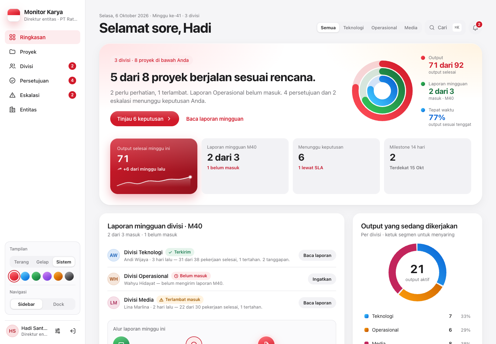 | 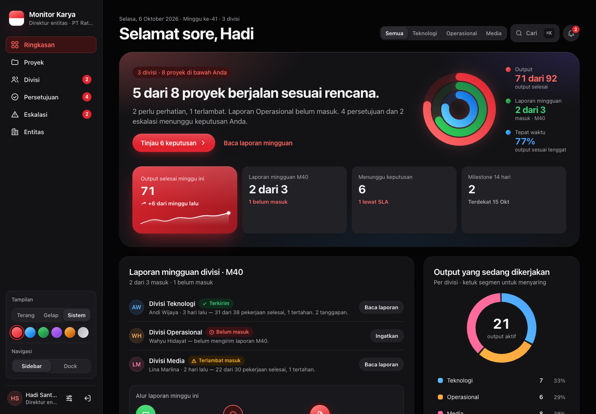 | 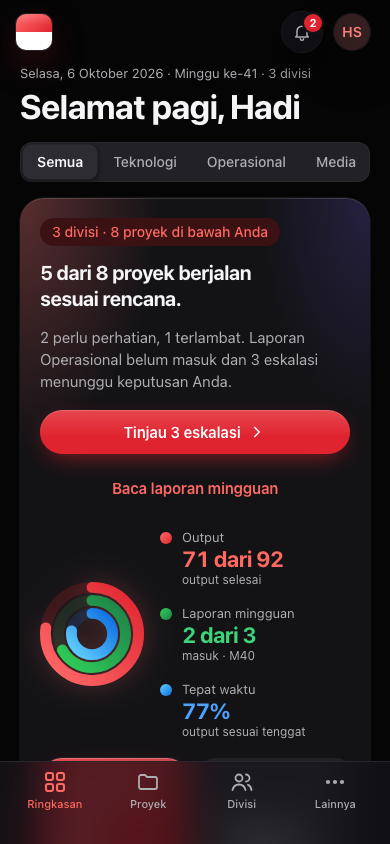 |

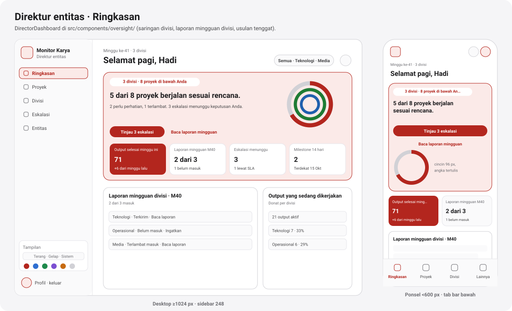

Isi layar:

- **Saringan divisi** berupa `SegmentedControl` (Semua + tiap divisi). Saringan ini berlaku untuk seluruh halaman, dan segmen donat juga bisa dipakai untuk menyaring.
- **Hero.** Proyek sesuai rencana dan tiga cincin: Output, Laporan mingguan, Tepat waktu.
- **KPI:** Output selesai minggu ini, Laporan mingguan Mxx, Menunggu keputusan (persetujuan + eskalasi), Milestone 14 hari. Ponsel hanya menampilkan 2 KPI.
- **Laporan mingguan divisi:**
  - Lencana per divisi: Terkirim, Terlambat masuk, Belum masuk, Sudah dibaca.
  - Tombol per baris: "Baca laporan" atau "Ingatkan". Sheet laporan terkirim memuat poin ringkasan dari kepala divisi, "Beri tanggapan", dan "Tandai sudah dibaca". Sheet laporan belum masuk memuat "Hubungi <kepala divisi>" dan "Ingatkan kepala divisi" (satu divisi, minggu yang tampil).
  - Alur laporan minggu ini: PIC → Kepala divisi → Direktur.
  - "Tandai sudah dibaca" menulis `WeeklyReportRead` dan bisa diurungkan.
  - Minggu laporan = minggu berjalan bila tenggat serah sudah lewat, selain itu minggu lalu.
- **Kartu lain:** Output yang sedang dikerjakan (donat per divisi), milestone (`Timeline`, atau daftar "Milestone 14 hari" di ponsel), Tren output 8 minggu, Tepat waktu per divisi (target 85).
- **Antrean keputusan.** Persetujuan materi/anggaran/cuti, pengajuan proyek, dan usulan tenggat sebagai `ApprovalItem` (Setujui/Tolak sekunder per baris, Urungkan). Tolak wajib alasan. Tab **Persetujuan** memuat antrean yang sama. Lihat [peran-direktur-manajemen.md](peran-direktur-manajemen.md).
- **Detail proyek** (`ProjectSheet`): tahapan bertanggal, "Kirim catatan ke PIC", "Tandai sudah ditinjau".
- Kalimat hero menyebut yang menunggu ("4 persetujuan dan 2 eskalasi menunggu keputusan Anda."), sama dengan badge nav Persetujuan dan Eskalasi.

Warna divisi tetap menurut nama ([`src/lib/division-tone.ts`](../../src/lib/division-tone.ts)): Teknologi `data-1`, Keuangan `data-2`, Media `data-3`, SDM `data-4`, Operasional `data-5`, Hukum `data-6`. Nama lain mendapat warna stabil dari nama.

## Manajemen dan peran grup

| Desktop | Desktop gelap | Ponsel |
| --- | --- | --- |
| 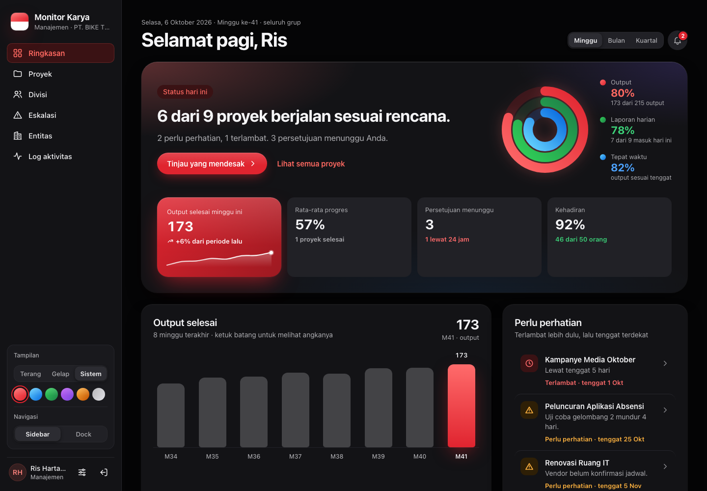 | 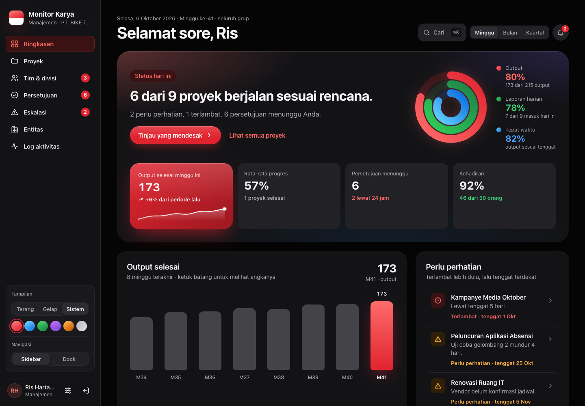 | 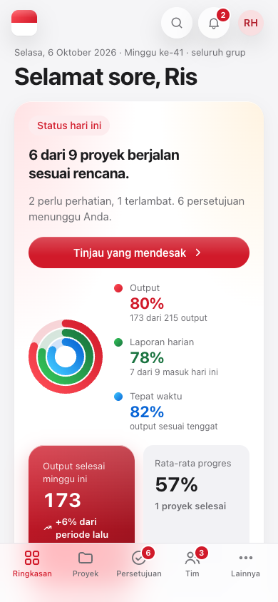 |


Isi layar:

- **Periode** Minggu, Bulan, atau Kuartal.
- **Cincin:** Output, Laporan harian, Tepat waktu.
- **KPI:** Output selesai, Rata-rata progres, Persetujuan menunggu ("x lewat 24 jam"), Kehadiran.
- **Kartu:**
  - Output selesai: batang 8 periode. Bila belum ada output, kartu memakai laporan harian.
  - Perlu perhatian: terlambat dulu, lalu tenggat terdekat.
  - Kinerja divisi: divisi bernama sama digabung lintas PT.
  - Persetujuan menunggu: materi, anggaran, cuti, pengajuan proyek, usulan tenggat.
  - Kehadiran hari ini (Hadir / Terlambat / Izin-cuti).
- Auditor melihat "Keputusan terbuka". Klik eskalasi membawa auditor ke Log aktivitas, karena auditor tidak punya tab Eskalasi.
- Peran grup mendapat satu bagian khusus di bawah kartu persetujuan (`GroupRolePanel`, [peran-grup.md](peran-grup.md)):

| SDM & GA | TI | Auditor |
| --- | --- | --- |
|  | 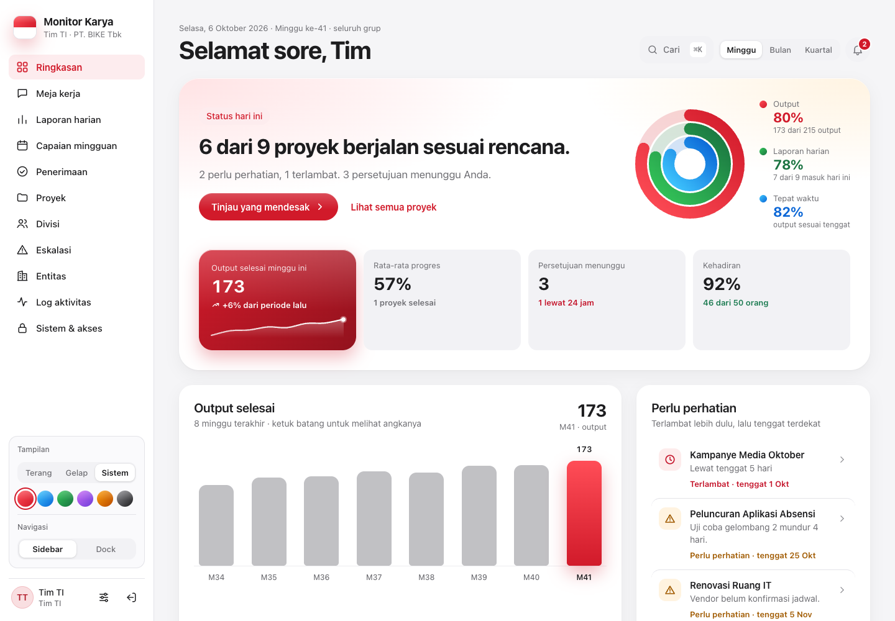 | 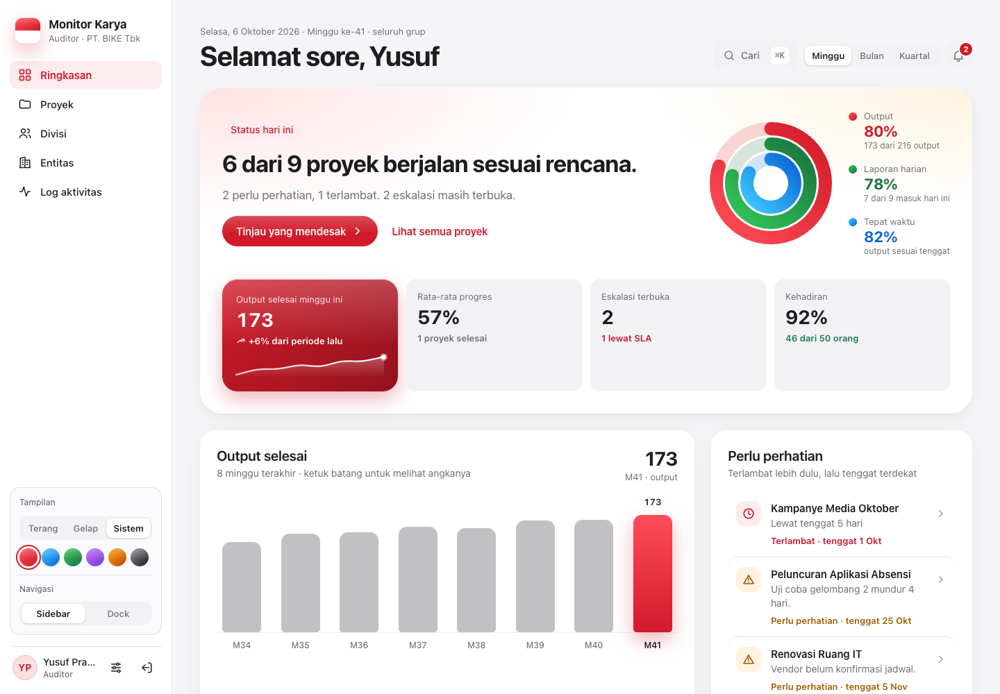 |

## Endpoint

| Metode & path | Parameter | Jawaban | Izin |
| --- | --- | --- | --- |
| `GET /api/my-dashboard` | — | `{ kind: 'PIC' \| 'KADIV' \| 'ADMIN' \| 'OVERSIGHT', … }` | semua peran; isi sesuai peran |
| `GET /api/ringkasan` | — | Status proyek, kepatuhan per PT, tren 8 minggu, keputusan menunggu, aktivitas, `reportWeek`, `divisions[]`, `outputs`, `deadlineProposals`, `attendance`, `viewer` | peran pemantau; cakupan entitas pemanggil |
| `POST /api/ringkasan/laporan-dibaca` | `{ weeklyReportId }` | tanda dibaca (idempoten) | Manajemen, Direktur entitas, SDM & GA, Super Admin; laporan harus sudah diserahkan dan dalam cakupan, selain itu 404 |
| `DELETE /api/ringkasan/laporan-dibaca` | `{ weeklyReportId }` | batal tanda (toast "Urungkan") | sama |
| `GET /api/nav-badges` | — | PIC: `daily-input` (laporan hari ini belum terkirim; kosong setelah tenggat dan di hari libur) dan `dashboard` (catatan belum dibaca). Pengawas: `approvals`, `escalations`, `divisions` (laporan mingguan belum dibaca) | semua |
| `GET /api/system/grup` | — | panel peran grup (`SDM` / `TEKNIS` / `AUDIT`) | SDM & GA, TI, Super Admin, Auditor |
| `GET /api/search?q=` | — | palet ⌘K: proyek, divisi, laporan mingguan, orang dalam cakupan | semua |
| `GET /api/dashboard`, `/api/kpi-trends`, `/api/compliance-map`, `/api/management-charts` | `?scopeEntityId=` | Agregat lama (KPI, tren 6 bulan, peta kepatuhan, 6 grafik) | cakupan entitas; peran berlingkup tidak bisa melebar |

Bacaan tabel baru di `/api/ringkasan` (Output, DeadlineProposal, WeeklyReportRead, WeeklyDivisionSummary, WeeklyReportComment, ProjectReview, ApprovalRequest, kolom `divisionId`, Attendance) dijaga. Bila migrasinya belum diterapkan, bagian itu kosong dan sisa ringkasan tetap tampil.

## Berkas kode utama

- [`src/components/views/dashboard-view.tsx`](../../src/components/views/dashboard-view.tsx), [`role-dashboards.tsx`](../../src/components/views/role-dashboards.tsx), [`dash-common.tsx`](../../src/components/views/dash-common.tsx) (`DashHeader`, `ProjectSheet`, timeline)
- [`src/components/views/oversight-dashboard.tsx`](../../src/components/views/oversight-dashboard.tsx), [`src/components/oversight/`](../../src/components/oversight/) (`director-dashboard`, `management-dashboard`, `weekly-reports`, `deadline-decisions`, `types`)
- [`src/components/kadiv/`](../../src/components/kadiv/), [`src/components/admin/`](../../src/components/admin/), [`src/components/pic/`](../../src/components/pic/)
- [`src/app/api/my-dashboard/route.ts`](../../src/app/api/my-dashboard/route.ts), [`src/app/api/ringkasan/route.ts`](../../src/app/api/ringkasan/route.ts), [`src/app/api/ringkasan/laporan-dibaca/route.ts`](../../src/app/api/ringkasan/laporan-dibaca/route.ts)

## Catatan terbuka

- `views/management-charts.tsx`, `dashboard/compliance-treemap.tsx`, dan `dashboard/kpi-trend-chart.tsx` sudah dipindah ke desain baru, tetapi belum dipakai layar mana pun. API-nya masih ada.
- Selesai sejak pemetaan pertama: ringkasan mingguan untuk Direktur (F2-KADIV), "Ingatkan" satu divisi untuk minggu yang tampil (F1-B), `timelineFrame` memakai WIB (F1-D).
- Delta "Rata-rata progres +n poin" Manajemen belum ada karena riwayat progres mingguan tidak disimpan.
- Subjudul kartu "Keputusan terbuka" Auditor masih menyebut jenis persetujuan yang tidak ia lihat.
