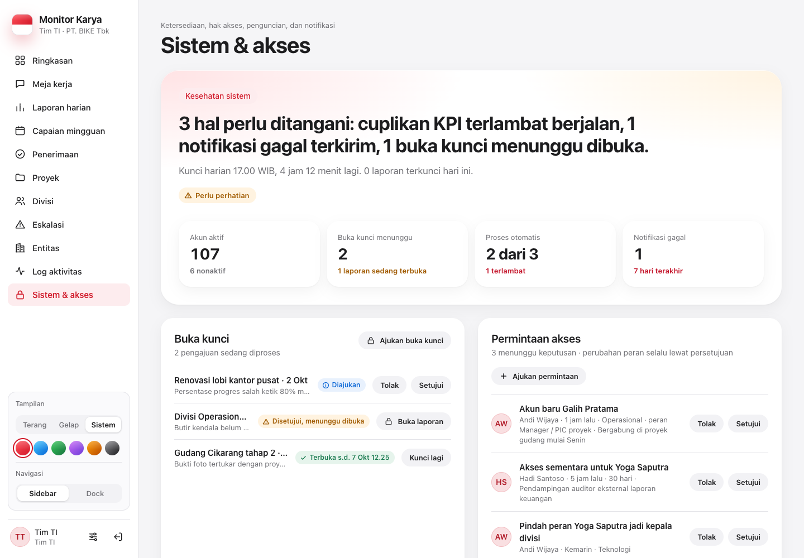
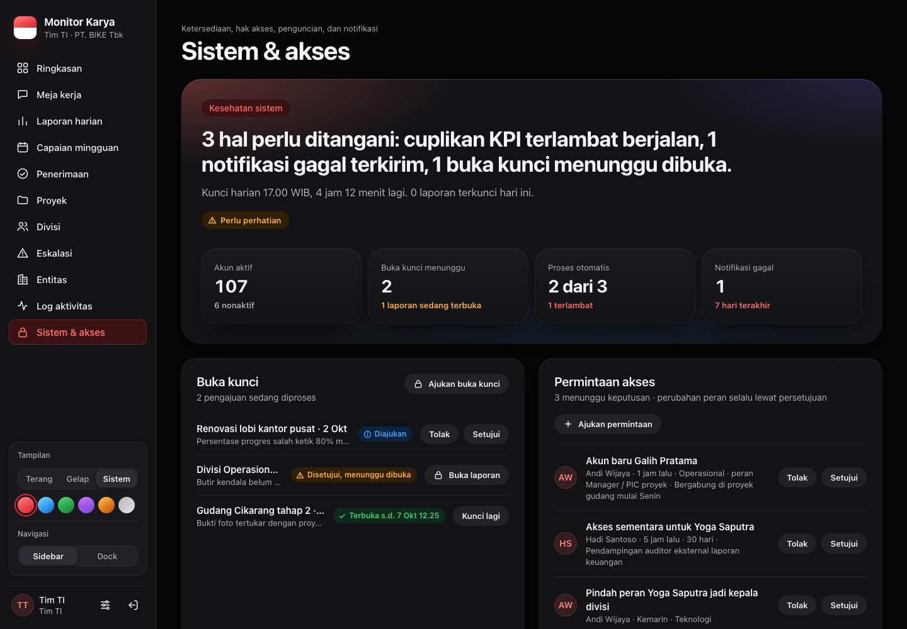

# Sistem & akses

[← Indeks](README.md) · Spesifikasi: [`07-ti.md`](../design/peran/07-ti.md)

## Tujuan

Konsol pengelola sistem. Layar ini menjawab apakah sistem sehat: siapa punya akses, apakah mesin kunci dan notifikasi berjalan, dan berapa banyak data di sistem. Kalimat pembukanya "Sistem sehat", atau daftar masalah yang ditemukan.

## Siapa memakai

TI dan Super Admin (`users:manage`). Peran lain mendapat 403 "Konsol sistem hanya untuk Tim TI dan Super Admin".

| Desktop terang | Desktop gelap |
| --- | --- |
|  |  |

## Isi layar

Urutan sejak [F2-GRUP]. Rinciannya ada di [peran-grup.md](peran-grup.md).

1. **Hero.**
   - Jawaban "Sistem sehat, …" atau daftar masalah. Masalah yang dihitung: proses otomatis terlambat, notifikasi gagal 7 hari, akun tanpa kata sandi, dan buka kunci yang menunggu dibuka.
   - 4 `StatTile`: Akun aktif · Buka kunci menunggu · Proses otomatis · Notifikasi gagal.
2. **Antrean.** `UnlockCard` (setujui, tolak, buka laporan, kunci lagi) dan `AccessRequestsCard`.
3. **Proses otomatis.**
   - Jalan terakhir `reminder-rules`, `remind-divisions`, dan `kpi-snapshot`, dibaca dari `AuditLog` dan `ReminderRule.lastRunAt`.
   - Status ditampilkan dengan `StatusBadge`: Berjalan / Terlambat / Belum tercatat.
   - Jadwalnya ada di `deploy/app-vps/cron.sh`.
4. **Mekanisme penguncian.** Kunci harian, serah dan kunci mingguan, serta laporan yang sedang dibuka.
5. **Pengingat otomatis per perusahaan.** `ReminderMatrixCard`: ringkasan sakelar per PT, lalu 4 sakelar PT terpilih. Memakai `PATCH /api/admin/reminder-rules` dengan `entityId`, dan setiap perubahan bisa diurungkan lewat toast.
6. **Kesehatan akun.** Aktif, nonaktif, belum pernah masuk, wajib ganti kata sandi, tanpa kata sandi.
7. **Hak akses per peran.** Jumlah akun per peran beserta kapabilitasnya, dari `ROLE_CAPABILITIES`.
8. **Volume data, aktivitas terbaru, dan 25 akun terakhir aktif.**

Loading memakai `DashboardSkeleton`. Galat memakai `ErrorNote` dengan "Coba lagi".

## Endpoint

| Metode & path | Parameter | Jawaban | Izin |
| --- | --- | --- | --- |
| `GET /api/system/grup` | — | panel Ringkasan peran grup (`SDM` / `TEKNIS` / `AUDIT`), lihat [peran-grup.md](peran-grup.md) | DIREKTUR_SDM_GA, TI, SUPERADMIN, AUDITOR |
| `GET /api/system` | — | `technical` (buka kunci, permintaan akses, proses otomatis, pengingat, akun), `reminders` (sakelar per PT), `access` (akun & kapabilitas per peran), `locking` (`dailyCutoff`, `dailyLockAt`, `dailyCountdown`, `dailyLocked`, laporan terkunci, buka kunci tertunda), `notifications` (terkirim/gagal), `data` (hitungan), aktivitas terbaru, akun | `users:manage` |
| `GET /api/roles` | — | direktori akun per peran dengan label | hanya peran grup |
| `GET /api/notifications` | `?inbox=1` → 30 pesan terakhir + jumlah belum dibaca (lonceng); tanpa `inbox` → log pengiriman berhalaman (`channel`, `status`, `template`) | pesan/log | hanya milik akun itu, untuk semua peran (F1-C) |
| `PATCH /api/notifications` | `{ ids?: string[], all?: true }` | tandai dibaca | hanya pesan milik sendiri |

## Berkas kode utama

- [`src/components/views/system-view.tsx`](../../src/components/views/system-view.tsx), CSS [`app/css/admin-sistem.css`](../../src/app/css/admin-sistem.css)
- [`src/app/api/system/route.ts`](../../src/app/api/system/route.ts), [`src/app/api/system/grup/route.ts`](../../src/app/api/system/grup/route.ts), [`src/lib/system-status.ts`](../../src/lib/system-status.ts), [`src/app/api/roles/route.ts`](../../src/app/api/roles/route.ts), [`src/app/api/notifications/route.ts`](../../src/app/api/notifications/route.ts)

## Catatan terbuka

- Selesai: `/api/roles` memakai sentence case (F1-D); `GET /api/notifications` hanya milik sendiri (F1-C); tombol per baris di Permintaan akses sekunder (F4-B).
- "Ajukan permintaan" di kartu Permintaan akses tampil untuk TI, tetapi formulirnya memuat `/api/companies` yang menolak TI (403).
- Jadwal cron dipasang manusia di crontab VPS (`deploy/app-vps/cron.sh`). Sampai dipasang, kartu Proses otomatis menulis "Belum tercatat".
- Data contoh `/pratinjau` untuk `/api/system` ada di `src/components/preview/mock-group.ts` ([F2-GRUP]).
