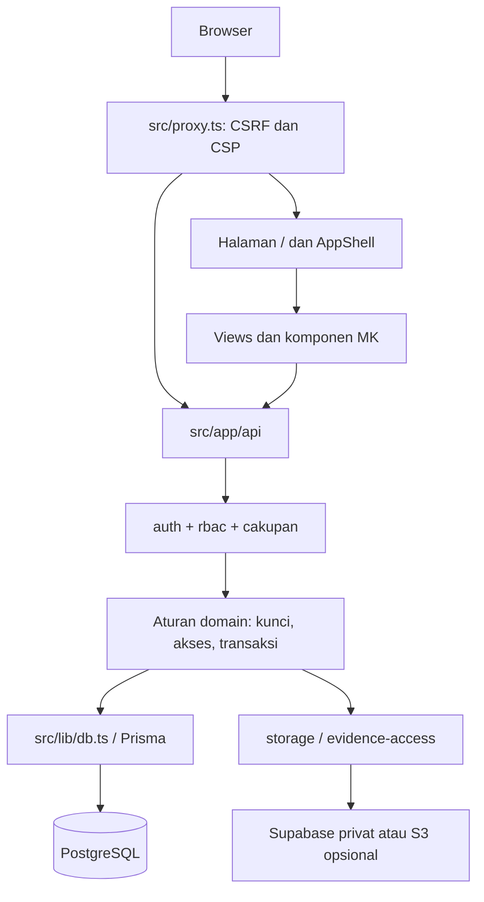

# Struktur dan peta perubahan

Stack: TypeScript, Next App Router 16.3.8 pada baseline teruji, React 19, Prisma 6.19.3, PostgreSQL 17, Tailwind 4, Vitest. Versi instalasi pasti mengikuti `package-lock.json`, bukan hanya rentang pada manifest.

```text
src/app/                  halaman Next dan route API
src/app/page.tsx           baca sesi → ganti sandi/login bila perlu → AppShell
src/app/login/             login, ganti sandi, aktivasi
src/app/pratinjau/         demonstrasi peran, khusus dev
src/proxy.ts              CSP/nonce, CSRF, batas body, larangan preview produksi
src/components/app-shell.tsx  penghubung aplikasi dan kerangka
src/components/shell.tsx   navigasi, konten, profil
src/components/dock.tsx    alternatif navigasi
src/components/views/     layar menurut tab
src/components/mk/        komponen sistem desain
src/components/preview/   data/API tiruan demo; bukan backend produksi
src/lib/                  aturan domain, auth, data, perhitungan
prisma/                   schema dan migrasi SQL
scripts/                  alat lokal, akun, seed, pengujian
 tests/                   api, lib, cx, e2e-lokal dan stub
 design-system/           sumber token dan komponen desain
 deploy/                  Docker/VPS/Caddy/cron/backup/WireGuard
 vendor/braces/           patch dependensi, sumber dan suite regresi
 docs/                    fitur, desain, histori dan serah terima
```



Diagram adalah gambaran konseptual; untuk setiap route periksa implementasi guard aktual. Prisma memakai singleton dev di `src/lib/db.ts`. Sesi dibaca per permintaan; halaman utama `force-dynamic`.

| Jika mengubah… | Mulai dari… |
|---|---|
| Hak akses atau menu | `src/lib/rbac.ts`, `auth.ts`, route sasaran; `ROLE_TABS` dan kapabilitas berbeda |
| Login/logout/sandi | `src/lib/auth.ts`, `password.ts`, `password-policy.ts`, `api/auth/**`, `api/profile/password` |
| Akun dan persetujuan akses | `account-desk.ts`, `accounts.ts`, `access-requests.ts`, `account-activation.ts`, `companies/`, `admin/` |
| Laporan harian/multi-proyek | `views/daily-input-view.tsx`, `daily-rollup.ts`, `lock.ts`, `api/daily-input`, `api/tasks` |
| Bukti | `evidence-access.ts`, `storage.ts`, `storage-s3.ts`, `api/evidence/**` |
| Buka kunci dan Urungkan | `unlock-requests.ts`, `undo.ts`, `undo-client.ts`, API masing-masing |
| Kepala divisi/mingguan | `kadiv.ts`, `kadiv-math.ts`, `api/kadiv/**`, `api/weekly-reports/**`, `kadiv/` |
| Angka Admin | `admin-compliance.ts`, `admin-compliance-server.ts`, `daily-intake.ts`, `api/admin/**` |
| Dashboard pengawas/grup | `oversight*.ts`, `group-panel.ts`, `project-status.ts`, `oversight/`, `group/` |
| KPI | `kpi-math.ts`, `kpi-snapshot.ts`; jangan mengganti bobot tanpa keputusan |
| Tampilan dan transisi | `tampilan.ts`, `tampilan-boot.ts`, `nav-transition.ts`, `src/app/mk-modules.css` |
| Operasional | `operational-health.ts`, `cron-auth.ts`, `api/health/**`, `api/cron/**`, `deploy/` |

Peta endpoint dan model lengkap pada [inventaris](10-INVENTARIS-KODE.md). Dokumen rinci fitur: [matriks fungsi peran](../fitur/matriks-fungsi-peran.md). Inventaris keberadaan berkas tidak membuktikan setiap fitur telah teruji produksi.
